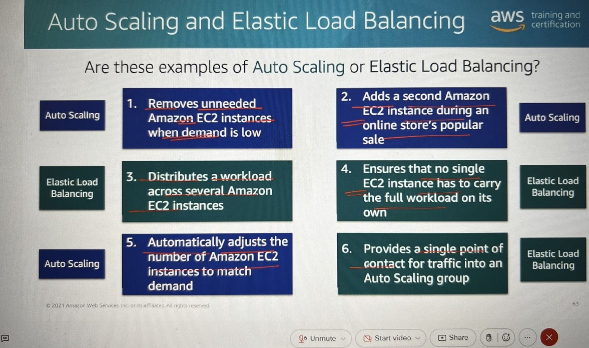

# AWS Cloud Practitioner Essentials

## Module 1: Introduction to Amazon Web Services

- What is cloud computing? (IMP)
  - The on-demand delivery of IT resources and applications through the internet with pay-as-you-go pricing
- What is another name for on-premises deployment?
  - Private cloud deployment
- How does the scale of cloud computing help you to save costs?
  - The aggregated cloud usage from a large number of customers results in lower pay-as-you-go prices

### Cloud computing deployment models

- **Cloud-based deployment**
  - Run all parts of the application in the cloud
  - Migrate existing applications to the cloud
  - Design and build new applications in the cloud
- **On-premises deployment**
  - Use virtualisation and resource management tools to deploy resources
  - Use application management and virtualisation technologies to increase the resource usage
- **Hybrid deployment**
  - Connect cloud-based resources to on-premises infrastructure
  - Integrated cloud-based resources with legacy IT applications

### Benefits of cloud computing

- Trade upfront expense for variable expense
- Stop spending money to run and maintain data centres
- Stop guessing capacity
- Benefit from massive economies of scale
- Increase speed and agility
- Go global in minutes

## Module 2: Compute in the Cloud

### Notes:

#### Hypervisor

- Engine to run virtual machine
- Responsible for isolating virtual machines from each other
- One EC2 instance is not aware of other EC2 instances running on the same host
- Responsible for sharing underlying resources with virtual machine instances
- This idea of sharing underlying hardware between virtual machines is called **Multitenancy**

#### Serverbased Application

- Ex: EC2 instances
- Install OS, patches etc.
- Website code can also written in this

#### Serverless Application

- Only website code will be deployed
- Underlying resources will be manged by AWS
- Ex: Lambda

### EC2(Elastic Compute Cloud)

#### EC2 instance types

- **General Purpose**
  - Balances compute, memory and networking resources
  - Suitable for a broad range of workloads like webservers, code repositories
- **Compute Optimized**
  - Offers high-performance processors
  - Ideal for compute intensive applications like Gaming servers, Scientific modeling, High performance computing (HPC) and batch processing workloads
- **Memory Optimized**
  - Delivers fast performcne for memory-intensive workloads
  - Well suited for high memory-intensive applications such as databases
- **Accelerated Computing**
  - Uses hardware accelarators to expedite data processing
  - Ideal for application streaming and graphics workloads
  - Used for floting point number calculations, Graphics processing, Data pattern matching
- **Storage Optimized**
  - High-performance for locally stored data
  - Offers low latency and high input/output oprations per second (IOPS)
  - Suitable for workloads such as distributed file systems and data warehousing applications (OLAP)

#### EC2 billing options

- On-Demand (Minimum 1 minute; charges per second after that)
  - No upfront costs or minimum contracts
  - Ideal for short-term, irregular workloads
- Reserved (24/7)
  - Provides a billing discount over On-Demand pricing
  - Requires a 1-year(partial upfront) or 3-year(all upfront) term commitment (No 2-year commitment)
  - Upto 72% of savings (maximum savings in 3 years)
  - Only EC2 can have reserved
  - You cannot move from EC2 to Serverless or Containers
- Compute Savings Plans
  - Offer upto 66% savings over On-Demand costs for a consistent amount of compute usage
  - Require a 1-year or 3-year term commitment
  - You can move from EC2 to Serverless or Containers (Verification needed)
- Spot
  - Ideal for workloads with flexible start and end times
  - Offers savings over On-Demand prices
  - Will get 2 minutes to save the work before the session gets terminated
  - Discount upto 90%
  - Good for stateless applications
- Dedicated Instance
  - An EC2 instance that runs in a VPC on hardware for a single customer
  - Higher cost compared to statndard Amazon EC2 instances
- Dedicated Host
  - A physical server with EC2 instance capacity for a single customer
  - Most expensive Amazon EC2 option
  - If you have your own licence you can use this in Dedicated Host only - Bring Your Own Licences (BYOL)

#### EC2 auto scaling benefits

- Scaling In - Reducing
- Scaling Out - Increasing
- Auto Scaling Groups (ASG) - Automatically scale out and sclae in the resources to a defined number of resources when in need
- Difference of Scale Up and Scale Out
  - Add more CPU or more RAM - Scale Up (Vertical Scaling)
  - Creating extra instances - Scale Out (Horizontal Scaling)
  - AWS recommended is Scale Out; Scaling Up is disruptive concept as it need restarting the system.

#### Elastic Load Balancing (ELB) benefits

- Automatically distributes traffic accross multiple resources
- Provides a single point of contact for your Auto Scaling Group

### Load balancing uses

### Difference between Amazon SNS and Amazon SQS

- Simple Queing Service (SQS)
  - Send store and receive messages between software components
  - Queue messages without requiring other services to be available
  - Also means Decoupling, Loose coupling
- Simple Notification Service (SNS)
  - Messages arepublished to topics
  - Subscribers immediately receive messages for their topics

### AWS Lambda

- Run code without provisioning or managing servers
- Pay only for compute time while code is running
- Use other AWS services to automatically trigger code
- Downside of this is it can run maximum upto 15 mins or 900 seconds
- Charge in milliseconds
- You can keep Lambda warm but if it not does a cold start
- Service level aggreement for Lambda - [https://aws.amazon.com.lambda/sla/](https://aws.amazon.com.lambda/sla/)

### Container services

- Docker (Containers)
- Kubernetes to manage multiple containers
- Two Options to manage containers in AWS
  - Elastic Kubernetes Engine (EKS)
    - Run and scale Kubernetes applications
    - Readily update applications with new features
    - If you have technical skills
    - If you have already have Kubernetes in on-premise
    - Where do containers live?
      - Fargate (serverless container offering)
      - or EC2 instance
  - Elastic Container Service (ECS)
    - Run and scale containorized applications
    - Use simple API calls to control Docker-enabled aplications
    - If you are starting from sratch
    - Where do containers live?
      - Fargate (serverless container offering)
      - or EC2 instance

### AWS Fargate

- Run serverless containers with Amazon ECS or Amazon EKS
- Pay only for the resources you use

## Global Infrastructure and Reliability

- Availability Zones

  - One or more physical datacenters in one availability zone
  - Datacenters within the availability zones are redundant
  - These servers within availability zones are in certain proximity
  - There will be multiple availability zones in a region at 100KM or more KM away
  - There will be minimum 2 availability zones within a region
  - But almost all region in AWS has 3 or more availability zones
  - These availbility zones are connected by high speed fiber network owned by AWS
  - 1 Region will be in one country for compliance purpose
  - Recommended to design application in atleast 2 availability zones

- Amazon CloudFront

  - Content Delivery Network for AWS
  - It caches the application so that can be delivered fast
  - CloudFront can be found in Edge Locations
  - Edge Locations are very small data centers which host CouldFront.

- AWS Outposts

  - If you need more fast, use 42U Rack from AWS
  - It an be used as an extention of AWS cloud

- How to interact with AWS
  - GUI
  - AWS CLI
  - SDKs

## Networking

- Virtual Private Cloud (VPC)

  - Enables you to launch resources in a virtual network that you define
  - A subnet is a section in a VPC in which you can place groups of isolated resources
  - A subnet can be public (EC2 instances) or private (Databases)
  - People from the internet can access public subnet
  - Internet Gateway (Router) enable the subnet to connect to internet
  - How to reach private subnet if you want to migrate the database from on-premise?
    - VPN (Virtual Private Network) over internet
    - Site to site VPN or gateway VPN is a device at both end to do encryption
    - Disadvantage is only 400MB of speed can be acheived using VPN
    - Direct connect is a physical connection to AWS through your service provider
    - Direct connect can reach 100GB of speed
    - Direct connect can take time to up and running as it requires physical setups

- Security Groups

  - NACL - Network Access Control List
    - First line of defence
    - This is for whole subnet
    - It is a virtual firewall for a subnet
    - Network ACLs perform stateless packet filtering
    - Before a packet can exit a subnet, it must be checked against the outbound rules
    - It will not remember previous decisions
  - Security Groups
    - Second line of defence
    - It is a virtual firewall for an Amazon EC2 instance
    - By default a security group denies all inbound trafiic and allows all outbound traffic
    - Security groups perform stateful packet filtering
    - They remember previous decisions that were made for incoming packets

- DNS
  - Domain Name Server
  - Route 53 is managed DNS service from AWS
  - DNS use port 53; thats the reson the name came like this

## Module 5: Storage and Databases

### Storage Types

#### Block Storage

- Files are seperated into equal-sized pieces(blocks) of data
- Used for applications that run on Amazon EC2 instances (Volume which is attached to EC2 instance)

##### Instance Store

- Like a cache
- All the data will be deleted when the instance is stopped or terminated

##### EBS (Elastic Block Storage) Service

- Data will remain even the instance is stopped or terminated
- EBS Snapshots
  - All the data is backed up
  - Only data that has changed since the most recent snapshot is backed up

#### Object Storage

- Consists of data, metadata and a key
- Used specially for social media
- Supports WORM (Write Once Read Many)
- Supports archiving

##### S3 - Simple Storage Service

- Stores in buckets
- S3 Standard
  - Designed for frequently accessed data
  - Stores data in a minumum of three Availability Zones
  - Most expensive bucket
- S3 Standard-IA
  - Ideal for infrequently accessed data
  - Similar to S3 standard but has a lower storage price and higher retrieval price
- S3 One Zone-IA
  - Stores data in a single availability zone
  - Has a lower price than S3 Standard-IA
- ## S3 Inteligent-Tiering

#### File Storage

- Elastic File Storage (EFS) - Only for linux servers (NFS protocol)
- FSX (File Storage ) - For windows (SMB or CIFS protocal)
- Share file between EC2 instances

### Databases

- Self Managed (Rehost)
  - On Cloud you have EC2 instance
  - DBA need to patch OS, install DB engine, storage, backups
- Fully Managed (Replatform)

  - RDS (Relational Database Service)
  - Automatically create DB engine and EC2 instance, patches, install DB engine
  - High availability (Multiple Zones can be selected)
  - Auto Scale
  - Auto backup

- Amazon Aurora

  - Enterprise level performance and low price
  - Two flavour
    - Backward compatible with PostgreSQL (3x times faster)
    - Backward compatible with MySQL (5x times faster)

- DynamoDB

  - Serverless, NoSQL database

- AWS Database Migration Service (DMS)

- Additional database service
  - Amazon Redshift
    - Query and analyze data across a data warehouse
    - Can run third party databases also
  - Amazon DocumentDB
    - Run MongoDB workloads in a document database service
  - Amazon Neptune
    - Run applications that use highly
  - Amazon QLDB (Ledger database)
  - Amazon Managed Blockchain
    - Run a decentralized ledger database
  - Amazon ElastiCache

## Security

### AWS Identity and Access Management (IAM)

- Seperate IAM user for each individual (For Auditing)
- Attaching policy to the IAM group is recommended than attaching it to IAM user
- IAM role - temporary access
  - Ex: single day access for DBA
- Recommended not to use root user

#### AWS Organizations

#### Compliance

- PCI Compliance - to Process payment
- AWS Artifact to get compliance report (IMP)

#### Application Security

- AWS WAF (Web Application Firewall)
- SQL injection -> controlled through AWS WAF
- Dos and DDoS Attack
  - Bring the service/server down by continually loading the server with requests
  - Amazon Sheild used to protect it
- KMS
  - Data is at rest - KMS used here for encryption
  - Data is in motion - https, ssh

## Monitoring and Analytics

### CloudWatch

- Can combine with SNS to receive notifications by email or sms

### CloudTrail

- For Auditing

### AWS Trusted Advisor

- Can

## Module 8: Pricing and Support

### Always Free

- Ex: 1 million lambda request
-

### 12 Months Free

- Ex: EC2 instance 750 hours per month, S3 - 5GB in new account creation
-

### Trials

### Billing

#### Consolidated billing

- For organization accounts

## Module 9: Migration and Innovation

### AWS Cloud Adoption Framework (AWS CAF)

#### Phases

1. Assess
   - Check the customer readiness
   - MRA(Migration Readiness Assessment) workshop - Mandatory
   - Will do CAF in this stage
   - CAF is set of questions in every perspective
2. Mobilize
   - Deep discovery
   - What is the migration stategy that I will use
3. Migrate & Modernize
   - Real migration

## AWS Certified Cloud Practitioner Basics

-
