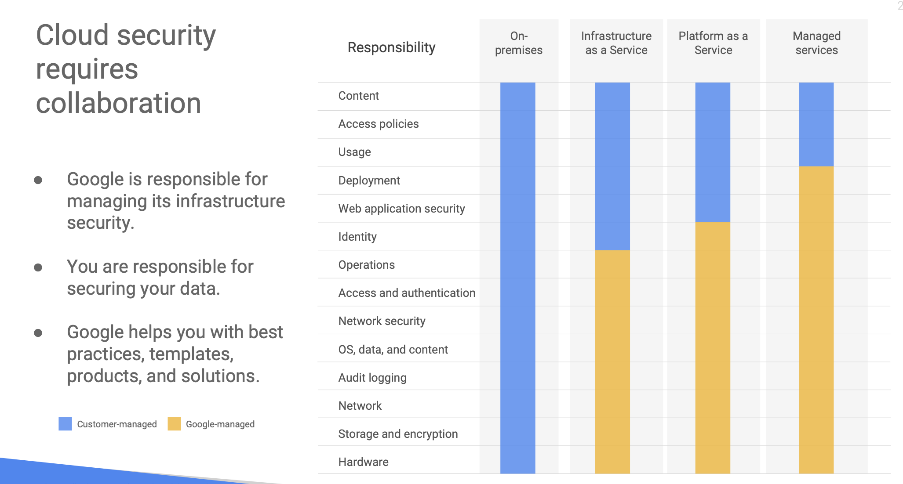
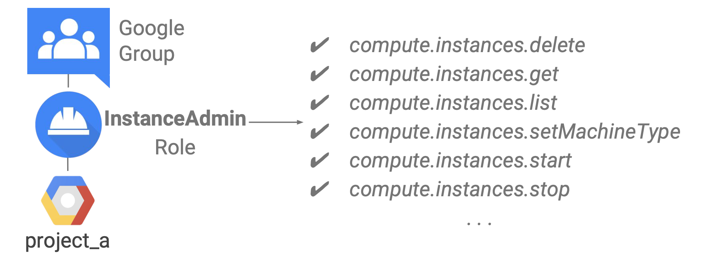

[Module 2 PDF](files\file-module-2_en.pdf)

## Cloud security requires collaboration



## Resource hierarchy levels define trust boundaries


### Organization

- The organization node is the root node for Google Cloud resources.
- When you get a new organization node, it lets anyone in the domain create projects and billing accounts, just as they could before. That’s to avoid surprises and disruption. But it’d be a great first step with a new organization node to decide who on your team really should be able to do those things like organization policy administrator, project creator role etc.
- Once you have an organization node, you can create folders underneath it and put projects in.


#### how do you get an organization node?

- In part the answer depends on whether your company is also a G Suite customer. If you have a G Suite domain, GCP projects will automatically belong to your organization node. Otherwise, you can use Google Cloud Identity to create one.

### Folder

- The resources in a folder inherit IAM policies assigned to the folder.
- A folder can contain projects, other folders, or a combination of both. You can use folders to group projects under an organization in a hierarchy. For example, your organization might contain multiple departments, each with its own set of GCP resources. Folders allows you to group these resources on a per-department basis

### Project

- All Google Cloud Platform resources belong to a Google Cloud Platform Console project.
- Each project is a separate compartment, and each resource belongs to exactly one.
- The Cloud Resource Manager provides methods that you can use to programmatically manage your projects in Google Cloud Platform. With this API, you do the following:
  - Get a list of all projects associated with an account.
  - Create new projects.
  - Update existing projects.
  - Delete projects.
  - Undelete, or recover, projects that you don't want to delete.
- You can access Cloud Resource Manager in either of the following ways:
  - Through the RPC API
  - Through the REST API

#### Projects have three identifying attributes


## Google Cloud Identity and Access Management

- Google Cloud Identity and Access Management defines `WHO` `CAN DO WHAT` `ON WHICH RESOURCE`

### WHO

- The “who” part of an IAM policy can be a Google account, a Google group, a service account, or an entire G Suite or Cloud Identity domain.


- Many new GCP customers get started by logging into the GCP console with a Gmail account. To collaborate with their teammates, they use Google Groups to gather together people who are in the same role. This approach is easy to get started with, but its disadvantage is that your team’s identities are not centrally managed. For example, if someone leaves your organization, there is no centralized way to remove their access to your cloud resources immediately.
- GCP customers who are also G Suite customers can define GCP policies in terms of G Suite users and groups. This way, when someone leaves your organization, an administrator can immediately disable their account and remove them from groups using the Google Admin Console.
- GCP customers who are not G Suite customers can get these same capabilities through Cloud Identity.
- Cloud Identity lets you manage users and groups using the Google Admin Console, but you do not pay for or receive G Suite’s collaboration products such as Gmail, Docs, Drive, and Calendar.
- Cloud Identity is available in a free and a premium edition. The premium edition adds capabilities for mobile device management.

#### What if you already have a different corporate directory?

- Using Google Cloud Directory Sync, your administrators can log in and manage GCP resources using the same usernames and passwords they already use.
- This tool synchronizes users and groups from your existing Active Directory or LDAP system with the users and groups in your Cloud Identity domain.
- The synchronization is one-way only; no information in your Active Directory or LDAP map is modified.
- Google Cloud Directory Sync is designed to run scheduled synchronizations without supervision, after its synchronization rules are set up.


### CAN DO WHAT

- The “can do what” part is defined by an IAM role. An IAM role is a collection of permissions. Most of the time, to do any meaningful operations, you need more than 1 permission. For example, to manage instances in a project, you need to create, delete, start, stop and change an instance. So the permissions are grouped together into a role to make them easier to manage.


### ON WHICH RESOURCE

- When you give a user, group, or service account a role on a specific element of the resource hierarchy, the resulting policy applies to the element you chose, as well as to elements below it in the hierarchy.

### There are three types of IAM roles

- **Primitive** - Primitive roles are broad. You apply them to a GCP project, and they affect all resources in that project.
- IAM primitive roles offer fixed, coarse-grained levels of access
  

- **Predefined** - GCP services offers their own sets of predefined roles, and they define where those roles can be applied.
- IAM predefined roles apply to a particular GCP service in a project
- IAM predefined roles offer more fine-grained permissions on particular services
  

- **Custom** - For example, maybe I want to define an “instanceOperator” role, to allow some users to stop and start Compute Engine virtual machines but not reconfigure them. Custom roles allow me to do that.
- IAM custom roles let you define a precise set of permissions
- If you decide to use custom roles, you’ll need to manage the permissions that make them up. Some companies decide they’d rather stick with the predefined roles.
- Custom roles can only be used at the project or organization levels. They can’t be used at the folder level.
  

## Service Accounts

- What if you want to give permissions to a Compute Engine virtual machine rather than to a person? That’s what service accounts are for.
- For instance, maybe you have an application running in a virtual machine that needs to store data in Google Cloud Storage. But you don’t want to let just anyone on the Internet have access to that data; only that virtual machine. So you’d create a service account to authenticate your VM to Cloud Storage.
- Service accounts are named with an email address, but instead of passwords they use cryptographic keys to access resources.
- You can assign a predefined or custom IAM role to the service account.
- Google manages keys for Compute Engine and App Engine.
- It provide an identity for carrying out _server-to-server_ interactions in a project
- It can be used to _authenticate_ from one service to another
- It can be used to _control privileges_ used by resources. So that applications can perform actions on behalf of authenticated end users

## There are four ways to interact with GCP


### Google Cloud Platform Console

- Centralized console for all project data
- Developer tools
  - Cloud Source Repositories
    - Git version control
    - View debugging information alongside your code
    - Source editor
  - Cloud Shell
    - Command-line access directly from your browser
- Test Lab (mobile app testing)
- Access to product APIs
- Manage and create projects

### Google Cloud SDK

- The Google Cloud SDK is a set of tools that you can use to manage resources and applications hosted on Google Cloud Platform.
- These include the gcloud tool, which provides the main command-line interface for Google Cloud Platform products and services, as well as gsutil and bq.
- All of the tools are located under the bin directory.
- Cloud Shell provides the following:
  - A temporary Compute Engine virtual machine instance running a Debian-based Linux operating system
  - Command-line access to the instance from a web browser using terminal windows in the Cloud Platform Console
  - 5 GB of persistent disk storage per user, mounted as your $HOME directory in Cloud Shell sessions across projects and instances
  - Google Cloud SDK and other tools pre-installed on the Compute Engine instance
  - Language support, including SDKs, libraries, runtime environments and compilers for Java, Go, Python, Node.js, PHP and Ruby
  - Web preview functionality, which allows you to preview web applications running on the Cloud Shell instance through a secure proxy
  - Built-in authorization for access to projects and resources
- You can use Cloud Shell to:

  - Create and manage Google Compute Engine instances.
  - Create and access Google Cloud SQL databases.
  - Manage Google Cloud Storage data.
  - Interact with hosted or remote Git repositories, including Google Cloud Source Repositories.
  - Build and deploy Google App Engine applications.

### RESTful APIs

- APIs are what’s called “RESTful”; in other words, they follow the “Representational state transfer” paradigm. In a broad sense, that means that your code can use Google services in much the same way that web browsers talk to web servers.
- The APIs name resources in GCP with URLs.
- Your code can pass information to the APIs using JSON, which is a very popular way of passing textual information over the Web.
- And there’s an open system, OAuth2, for user login and access control.
- The GCP Console includes a tool called the **APIs Explorer** that helps you learn about the APIs interactively. It lets you see what APIs are available, and in what versions. These APIs expect parameters, and documentation on them is built-in. You can try the APIs interactively, even with user authentication.
- Use client libraries to control GCP resources from within your code
- There are two kinds of libraries. The **Cloud Client libraries** are Google Cloud’s latest and recommended libraries for its APIs. They adopt the native styles and idioms of each language. On the other hand, sometimes a Cloud Client library doesn’t support the newest services and features. In that case, you can use the **Google API Client library** for your desired languages. These libraries are designed for generality and completeness. It is Open source and Support various languages such as Java, Python, JavaScript, PHP, .NET, Go, Node.js, Ruby, Objective-C, Dart

### Cloud Console Mobile App

- The mobile app allows you to start, stop, and SSH into Compute Engine instances, and to see logs from each instance.
- You can stop and start Cloud SQL instances.
- You can also administer applications deployed on Google App Engine, by viewing errors, rolling back deployments, and changing traffic splitting.
- You can also get up-to-date billing information for your projects and get billing alerts for projects that are going over budget.
- You can set up customizable graphs showing key metrics such as CPU usage, network usage, requests per second, and server errors.
- The mobile app also offers alerts and incident management.

## Cloud Marketplace

- Google Cloud Marketplace lets you quickly deploy functional software packages that run on Google Cloud Platform. You can easily start up a familiar software package without having to manually configure the software, virtual machine instances, storage, or network settings.
- Many software packages in Cloud Marketplace are free. The only costs to deploy these solutions are the normal usage fees for Google Cloud Platform resources. Estimated costs are based on the minimum recommended instance and storage configuration. The estimate does not include networking costs. You can modify the instance and storage configuration when you deploy the configuration.
- Google Cloud Platform updates the images for these software packages to fix critical issues and vulnerabilities, but doesn't update software that you have already deployed.
- Some Cloud Marketplace images assess usage fees, particularly those published by third parties and containing commercially licensed software. If an image does incur a usage fee, the fee appears on your monthly Google Cloud Platform invoice as a separate line item.

## Quiz

1. True or False: If a Google Cloud IAM policy gives you Owner permissions at the project level, your access to a resource in the project may be restricted by a more restrictive policy on that resource.
   - False: Policies are a union of the parent and the resource. If a parent policy is less restrictive, it overrides a more restrictive resource policy.
2. True or False: All Google Cloud Platform resources are associated with a project.
   - True: All Google Cloud Platform resources are associated with a project.
3. Service accounts are used to provide which of the following?
   - [ ] Authentication between Google Cloud Platform services
   - [ ] Key generation and rotation when used with App Engine and Compute Engine
   - [ ] A way to restrict the actions a resource (such as a VM) can perform
   - [ ] A way to allow users to act with service account permissions
   - [x] All of the above
4. Which of these values is globally unique, permanent, and unchangeable, but chosen by the customer?
   - [ ] The project number
   - [ ] The project's billing credit-card number
   - [ ] The project name
   - [x] The project ID
5. Consider a single hierarchy of GCP resources. Which of these situations is possible? (Choose all that are correct. Choose 3 responses.)
   - [x] There is an organization node, and there are no folders.
   - [x] There is an organization node, and there is at least one folder.
   - [ ] There is no organization node, but there is at least one folder.
   - [ ] There are two or more organization nodes
   - [x] There is no organization node, and there are no folders.
6. What is the difference between IAM primitive roles and IAM predefined roles?
   - [ ] Primitive roles only apply to the owner of the GCP project. Predefined roles can be associated with any user.
   - [ ] Primitive roles can only be granted to single users. Predefined roles can be associated with a group.
   - [ ] Primitive roles only allow viewing, creating, and deleting resources. Predefined roles allow any modification.
   - [ ] Primitive roles are changeable once assigned. Predefined roles can never be changed.
   - [x] Primitive roles affect all resources in a GCP project. Predefined roles apply to a particular service in a project.
7. _True or False_: In Google Cloud IAM: if a policy applied at the project level gives you Owner permissions, your access to an individual resource in that project might be restricted to View permission if someone applies a more restrictive policy directly to that resource.
   - [x] False
   - [ ] True
8. How do GCP customers and Google Cloud Platform divide responsibility for security?
   - [ ] All aspects of security are the customer's responsibility.
   - [ ] All aspects of security are Google's responsibility.
   - [ ] Google takes care of the higher parts of the stack, and customers are responsible for the lower parts.
   - [x] Google takes care of the lower parts of the stack, and customers are responsible for the higher parts.
9. Service accounts are used to provide which of the following? (Choose all that are correct. Choose 3 responses.)
   - [x] A way to restrict the actions a resource (such as a VM) can perform
   - [x] A way to allow users to act with service account permissions
   - [ ] A set of predefined permissions
   - [x] Authentication between Google Cloud Platform services
10. Which statement is true about billing for solutions deployed using Cloud Marketplace (formerly known as Cloud Launcher)?
    - [ ] Cloud Marketplace solutions are always free.
    - [ ] After a trial period, each Cloud Marketplace solution assesses a fixed recurring monthly fee.
    - [ ] You pay only for the underlying GCP resources you use; Google pays the license fees for commercially licensed software.
    - [x] You pay only for the underlying GCP resources you use, with the possible addition of extra fees for commercially licensed software.
11. _True or False_: All Google Cloud Platform resources are associated with a project.
    - [ ] False
    - [x] True
12. True or false: Google manages every aspect of Google Cloud Platform customers' security.
    - [ ] True
    - [x] False
13. Your company has two GCP projects, and you want them to share policies. What is the less error-prone way to set this up?
    - [ ] Duplicate all the policies on one project onto the other.
    - [x] Place both projects into a folder, and define the policies on the folder.
14. Choose the correct completion: Services and APIs are enabled on a per-\***\*\_\_\*\*** basis.
    - [ ] Billing account
    - [x] Project
    - [ ] Folder
    - [ ] Organization

## Lab

Deploy a virtual development environment using Google Cloud Marketplace.

1. Deploy a Bitnami LAMP stack to Compute Engine using Cloud Marketplace.
2. Verify the deployment.

### Use Cloud Marketplace to deploy a LAMP stack

- In the GCP Console, on the Navigation menu (Navigation menu icon), click Marketplace.
- In the search bar, type LAMP.
- In the search results, click LAMP Packaged by Bitnami.
- If you choose another LAMP stack, such as the Google Click to Deploy offering, the lab instructions will not work as expected.
- On the LAMP page, click Launch.
- If this is your first time using Compute Engine, the Compute Engine API must be initialized before you can continue.
- For Zone, select the deployment zone that Qwiklabs assigned to you.
- Leave the remaining settings as their defaults.
- If you are prompted to accept the GCP Marketplace Terms of Service, do so.
- Click Deploy.
- If a Welcome to Deployment Manager message appears, click Close to dismiss it.
- The status of the deployment appears in the console window: lampstack-1 is being deployed. When the deployment of the infrastructure is complete, the status changes to lampstack-1 has been deployed.
- After the software is installed, a summary of the details for the instance, including the site address, is displayed.

### Verify your deployment- When the deployment is complete, click the Site address link in the right pane. (If the website is not responding, wait 30 seconds and try again.) If you see a redirection notice, click on that link to view your new site.

- Alternatively, you can click Visit the site in the Get started with LAMP Packaged by Bitnami section of the page. A new browser tab displays a congratulations message. This page confirms that, as part of the LAMP stack, the Apache HTTP Server is running.
- Close the congratulations browser tab.
- On the GCP Console, under Get started with LAMP Packaged by Bitnami, click SSH.
- In a new window, a secure login shell session on your virtual machine appears.
- In the just-created SSH window, to change the current working directory to /opt/bitnami, execute the following
- command:

```bash
cd /opt/bitnami
```

- To copy the phpinfo.php script from the installation directory to a publicly accessible location under the web server document root, execute the following command:

```bash
sudo sh -c 'echo "<?php phpinfo(); ?>" > apache2/htdocs/phpinfo.php'
```

- The phpinfo.php script displays your PHP configuration. It is often used to verify a new PHP installation.
- To close the SSH window, execute the following command:

```bash
exit
```

- Open a new browser tab.
- Type the following URL, and replace SITE_ADDRESS with the URL in the Site address field in the right pane of the lampstack page.

```bash
http://SITE_ADDRESS/phpinfo.php
```

- A summary of the PHP configuration of your server is displayed.
- Close the phpinfo tab
