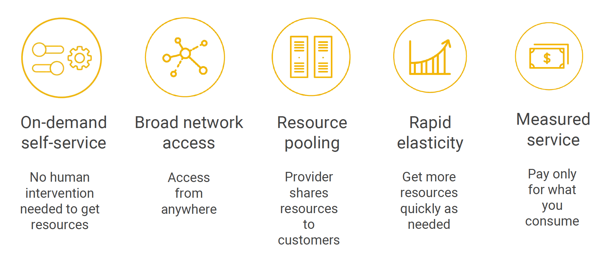
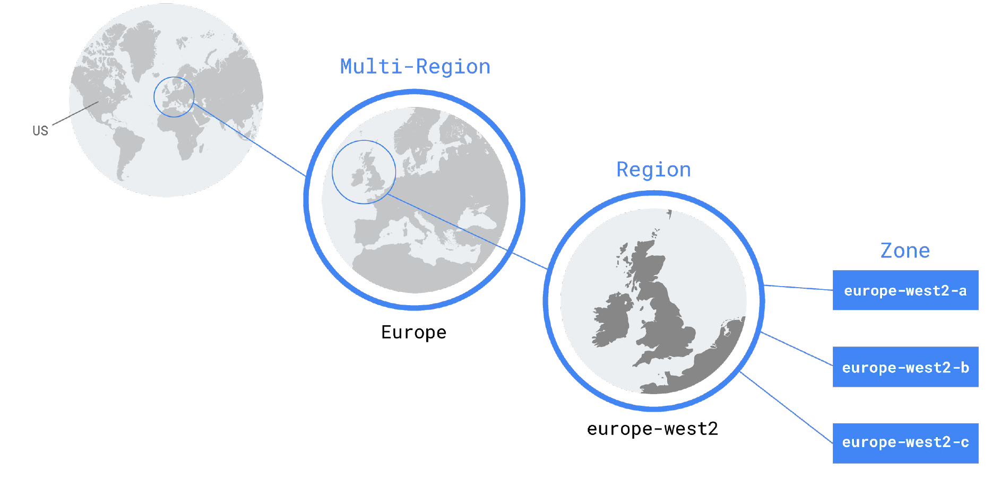
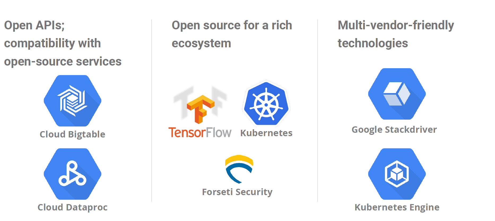

[Module 1 PDF](files\file-module-1_en.pdf)

## What is Cloud Computing?

- Cloud computing has five fundamental attributes, according to the definition of cloud computing proposed by the United States National Institute of Standards and Technology.

## How did we get here? Where are we going?

- The first wave of the trend towards cloud computing was colocation. Colocation gave users the financial efficiency of renting physical space, instead of investing in data center real estate.
- The second wave, share similarities with the private data centers and colocation facilities of decades past. The components of virtualized data centers match the physical building blocks of hosted computing—servers, CPUs, disks, load balancers, and so on—but now they are virtual devices.
- The Third wave - Google switched to a container-based architecture—a fully automated, elastic third-wave cloud that consists of a combination of automated services and scalable data. Services automatically provision and configure the infrastructure used to run applications.

## GCP computing architectures meet you where you are

## Google Cloud Platform is organized into regions and zones

- Regions are independent geographic areas that consist of zones.
- A zone is a deployment area for Google Cloud Platform resources within a region
- Think of a zone as a single failure domain within a region. In order to deploy fault-tolerant applications with high availability, you should deploy your applications across multiple zones in a region to help protect against unexpected failures.
- To protect against the loss of an entire region due to natural disaster, you should have a disaster recovery plan and know how to bring up your application in the unlikely event that your primary region is lost.
- Google Cloud Platform's services and resources can be zonal, regional, or managed by Google across multiple regions.

### Zonal resources

- Zonal resources operate within a single zone. If a zone becomes unavailable, all of the zonal resources in that zone are unavailable until service is restored.
- Google Compute Engine VM instance resides within a specific zone.

### Regional resources

- Regional resources are deployed with redundancy within a region. This gives them higher availability relative to zonal resources.

### Multi-regional resources

- A few Google Cloud Platform services are managed by Google to be redundant and distributed within and across regions. These services optimize availability, performance, and resource efficiency. As a result, these services require a trade-off on either latency or the consistency model. These trade-offs are documented on a product-specific basis.
- The following services have one or more multi-regional deployments in addition to any regional deployments:
  - Google App Engine and its features
  - Google Cloud Datastore
  - Google Cloud Storage
  - Google BigQuery

## Google offers customer-friendly pricing

- Google was the first major cloud provider to deliver per-second billing for its Infrastructure-as-a-Service compute offering, Google Compute Engine.
- Per-second billing is offered for users of
  - Compute Engine
  - Kubernetes Engine (container infrastructure as a service)
  - Cloud Dataproc (the open-source Big Data system Hadoop as a service)
  - App Engine flexible environment VMs (a Platform as a Service).
- Google Compute Engine offers automatically applied sustained-use discounts, which are automatic discounts that you get for running a virtual-machine instance for a significant portion of the billing month. Specifically, when you run an instance for more than 25% of a month, Compute Engine automatically gives you a discount for every incremental minute you use for that instance.

## Open APIs and open source mean customers can leave

- Google gives customers the ability to run their applications elsewhere if Google becomes no longer the best provider for their needs.

## Security is designed into Google’s technical infrastructure

## Google Cloud Platform services

## Quiz

1. Name some of Google Cloud Platform’s pricing innovations
   - Sub-hour billing
   - Sustained-use discounts
   - Compute Engine custom machine types
2. Name some benefits of using Google Cloud Platform other than its pricing.
   - Commitment to environmental responsibility
   - Commitment to open-source technologies
   - Robust infrastructure
