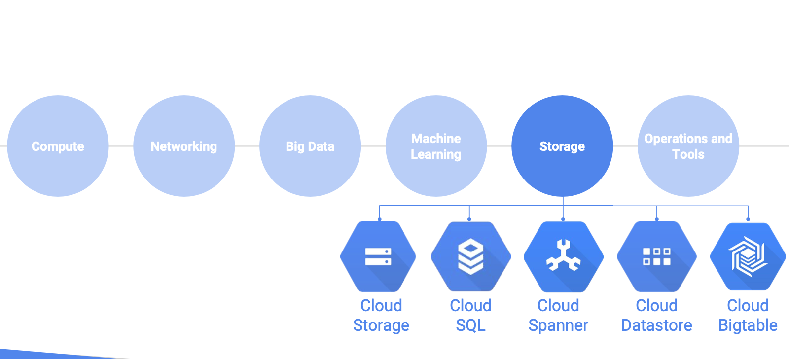

[Module 4 PDF](files\file-module-4_en.pdf)

## Cloud Storage

- High performance, internet-scale
- Simple administration
  - Does not require capacity management
- Data encryption at rest
- Data encryption in transit by default from Google to endpoint
- Online and offline import services are available
- Google Cloud Storage offers developers and IT organizations durable and highly available object storage. It assesses no minimum fee; you pay only for what you use. Prior provisioning of capacity isn’t necessary.
- What’s object storage?
  - It’s not the same as file storage, in which you manage your data as a hierarchy of folders.
  - It’s not the same as block storage, in which your operating system manages your data as chunks of disk.
  - Instead, object storage means this: you say to your storage, “Here, keep this arbitrary sequence of bytes,” and the storage lets you address it with a unique key. In Google Cloud Storage and in other systems, these unique keys are in the form of URLs, which means object storage interacts well with web technologies.
- Google Cloud Storage always encrypts your data on the server side, before it is written to disk, at no additional charge.
- Data traveling between a customer’s device and Google is encrypted by default using HTTPS/TLS (Transport Layer Security).
- In fact, Google was the first major cloud provider to enable HTTPS/TLS by default.
- Google Cloud Storage is not a file system, although it can be accessed as one via third-party tools such as **Cloud Storage FUSE**.
- The storage objects offered by Google Cloud Storage are “immutable,” which means that you do not edit them in place, but instead create a new version.
- Google Cloud Storage’s primary use is whenever binary large-object storage is needed: online content, backup and archiving, storage of intermediate results in processing workflows, and more.
- **Offline Media Import/Export** is a third-party solution that allows you to load data into Google Cloud Storage by sending your physical media, such as hard disk drives (HDDs), tapes, and USB flash drives, to a third-party service provider who uploads data on your behalf.
- Offline Media Import/Export is helpful if you’re limited to a slow, unreliable, or expensive internet connection.
- Offline import is available through third-party providers:
  https://cloud.google.com/storage/docs/offline-media-import-export
- **Cloud Storage Transfer Service** enables you to import large amounts of online data into Google Cloud Storage quickly and cost-effectively.
- To use Cloud Storage Transfer Service, you set up a transfer from a data source to _data sink_.
- Data sources can be an Amazon Simple Storage Service (Amazon S3) bucket, an HTTP/HTTPS location, or another Google Cloud Storage bucket.
- **Data sinks** are always a Google Cloud Storage bucket.
- Example uses of Cloud Storage Transfer Service include:
  - Backing up data to a Google Cloud Storage bucket from other storage providers.
  - Moving data from a Standard Storage bucket to a Nearline Storage bucket to lower your storage costs.
- Your Cloud Storage files are organized into buckets.
- When you create a bucket: you give it a globally-unique name; you specify a geographic location where the bucket and its contents are stored; and you choose a default storage class. Pick a location that minimizes latency for your users. For example, if most of your users are in Europe, you probably want to pick a European location: a GCP region in Europe, or else the EU multi-region.
- There are several ways to control users’ access to your objects and buckets. For most purposes, Cloud IAM is sufficient. Roles are inherited from project to bucket to object.
- If you need finer control, you can create **access control lists** (“ACLs”) that offer finer control, ACLs define who has access to your buckets and objects, as well as what level of access they have.
- Each ACL consists of two pieces of information: A scope, which defines who can perform the specified actions (for example, a specific user or group of users). And a permission, which defines what actions can be performed (for example, read or write).
- Remember that Cloud Storage objects are immutable. You can turn on object versioning on your buckets if you want. If you do, Cloud Storage keeps a history of modifications--that is, overwrites or deletes--of all objects in the bucket. You can list the archived versions of an object, restore an object to an older state, or permanently delete a version, as needed.
- If you don’t turn on object versioning, new always overwrites old.
- Cloud Storage also offers lifecycle management policies. For example, you could tell Cloud Storage to delete objects older than 365 days, or to delete objects created before January 1, 2013; or to keep only the 3 most recent versions of each object in a bucket that has versioning enabled.

### Types of Storage Classes

- Cloud Storage lets you choose among four different types of storage classes: Regional, Multi-regional, Nearline and Coldline.
- Multi-regional and Regional are high-performance object storage,
- whereas Nearline and Coldline are backup and archival storage.
- All of the storage classes are accessed in analogous ways using the Cloud Storage API, and they all offer millisecond access times.
- **Regional Storage** lets you store your data in a specific GCP region, us-central1, europe-west1 or asia-east1. It’s cheaper than multi-regional storage, but it offers less redundancy.
- **Multi-Regional Storage** costs a bit more, but it’s geo-redundant. That means you pick a broad geographical location, like United States, the European Union, or Asia, and Cloud Storage stores your data in at least two geographic locations separated by at least 160 kilometers.
- Multi-Regional Storage is appropriate for storing frequently accessed storing data: website content, interactive workloads, or data that’s part of mobile and gaming applications.
- People use regional storage, on the other hand, to store data close to their Compute Engine virtual machines or their Kubernetes Engine clusters. That gives better performance for data-intensive computations.
- **Nearline storage** is a low-cost, highly durable storage service for storing infrequently accessed data.
- This storage class is a better choice than Multi-Regional Storage or Regional Storage in scenarios where you plan to read or modify your data on average once a month or less. For example, if you want to continuously add files to Cloud Storage and plan to access those files once a month for analysis, Nearline Storage is a great choice.
- **Coldline Storage** is a very-low-cost, highly durable storage service for data archiving, online backup, and disaster recovery.
- Coldline Storage is the best choice for data that you plan to access at most once a year, due to its slightly lower availability, 90-day minimum storage duration, costs for data access, and higher per-operation costs. For example, if you want to archive data or have access in the event of a disaster recovery event.
- The availability of these storage classes varies, with multi-regional having the highest availability of 99.95%, followed by regional with 99.9% and nearline and coldline with 99.0%.
- As for pricing, all storage classes incur a cost per gigabyte of data stored per month, with multi-regional having the highest storage price and coldline the lowest storage price. Egress and data transfer charges may also apply.
- In addition to those charges, Nearline storage also incurs an access fee per gigabyte of data read, and Coldline storage incurs a higher fee per gigabyte of data read.

### Ways to bring data to Cloud Storage

- Many customers simply use **gsutil**, which is the Cloud Storage command from the Cloud SDK.
- You can also move data in with a drag and drop in the GCP Console, if you use the Google Chrome browser.
- But what if you have to upload terabytes or even petabytes of data? Google Cloud Platform offers the online Storage Transfer Service and the offline Transfer Appliance to help.
- The **Storage Transfer Service** lets you schedule and manage batch transfers to Cloud Storage from another cloud provider, from a different Cloud Storage region, or from an HTTP(S) endpoint.
- The **Transfer Appliance** is a rackable, high-capacity storage server that you lease from Google Cloud.
- You simply connect it to your network, load it with data, and then ship it to an upload facility where the data is uploaded to Cloud Storage.
- The service enables you to securely transfer up to a petabyte of data on a single appliance. As of this recording, it’s still beta, and it’s not available everywhere, so check the website for details.

### Cloud Storage works with other GCP services

- There are other ways of getting your data into Cloud Storage, as this storage option is tightly integrated with many of the Google Cloud Platform products and services.
- For example, you can import and export tables from and to BigQuery, as well as Cloud SQL.
- You can also store App Engine logs, Cloud Datastore backups, and objects used by App Engine applications like images.
- Cloud Storage can also store instance startup scripts, Compute Engine images, and objects used by Compute Engine applications.
- In short, Cloud Storage is often the ingestion point for data being moved into the cloud, and is frequently the long-term storage location for data.

## Cloud Bigtable

- Fully managed NoSQL, wide-column database service for terabyte applications
- Integrated
  - Accessed using HBase API
  - Native compatibility with big data, Hadoop ecosystems
- Cloud Bigtable is Google's NoSQL big data database service. It's the same database that powers many core Google services, including Search, Analytics, Maps, and Gmail.
- What does NoSQL mean? Here is an informal comparison against traditional relational databases built to support SQL queries.
  - A relational database offers you tables in which every row has the same set of columns, and the database engine enforces that rule, and other rules you specify for each table: the “database schema.” A rigorously enforced, infrequently changing schema helps many applications maintain data integrity.
  - But some applications call for a much more flexible approach.
  - For these applications, not all rows might need to have the same columns, and in fact the database might be designed to take advantage of that by sparsely populating the rows. That’s part of what makes a NoSQL database what it is.
- Cloud Bigtable is offered as a fully managed service, which means that you spend your time developing valuable applications instead of configuring and tuning your database for performance and scalability. In addition, Google’s own Bigtable operations team monitors the service to ensure that issues are addressed quickly.
- Cloud Bigtable is ideal for applications that need very high throughput and scalability for non-structured key/value data, where each value is typically no larger than 10 MB.
- Cloud Bigtable also excels as a storage engine for batch MapReduce operations, stream processing/analytics, and machine-learning applications.
- You can use Cloud Bigtable to store and query all of the following types of data:
  - Marketing data, such as purchase histories and customer preferences
  - Financial data, such as transaction histories, stock prices, and currency exchange rates
  - Internet of Things data, such as usage reports from energy meters and home appliances
  - Time-series data, such as CPU and memory usage over time for multiple servers
- Cloud Bigtable is offered through the same open source API as HBase, the native Hadoop database. This enables portability of applications between HBase and Bigtable.

### Why choose BigTable

- Customers frequently choose Bigtable if the data is:
  - **Big** - Large quantities (>1 TB) of semi-structured or structured data
  - **Fast** - Data is high throughput or rapidly changing
  - **NoSQL** - Transactions, strong relational semantics not required
  - **Time series** - Data is time-series or has natural semantic ordering
  - **Big data** - You run asynchronous batch or real-time processing on the data
  - **Machine learning** - You run machine learning algorithms on the data
- Bigtable is designed to handle massive workloads at consistent low latency and high throughput, so it's a great choice for both operational and analytical applications, including IoT, user analytics, and financial data analysis.

### Bigtable Access Patterns

- From an **application API** perspective, data can be read from and written to Cloud Bigtable through a data service layer like Managed VMs, the HBase REST Server, or a Java Server using the HBase client. Typically this will be to serve data to applications, dashboards, and data services.
- Data can also be **streamed** in through a variety of popular stream processing frameworks like Cloud Dataflow Streaming, Spark Streaming, and Storm.
- If streaming is not an option, data can also be read from and written to Cloud Bigtable through **batch processes** like Hadoop MapReduce, Dataflow, or Spark. Often, summarized or newly calculated data is written back to Cloud Bigtable or to a downstream database.

## Cloud SQL

- Offers MySQL and PostgreSQL databases as a service
- Automatic replication
- Managed backups
- Vertical scaling (read and write)
- Horizontal scaling (read)
- Google security
- Cloud SQL is an easy-to-use service that delivers fully managed relational databases.
- Cloud SQL lets you hand off to Google the mundane, but necessary and often time-consuming tasks—like applying patches and updates, managing backups, and configuring replications—so you can put your focus on building great applications.
- Every Cloud SQL instance includes a network firewall, allowing you to control network access to your database instance by granting access.
- Cloud SQL is easy to use: it doesn't require any software installation or maintenance.
- Easily scale up to 64 processor cores and more than 100 GB of RAM. Quickly scale out with read replicas.

**Automatic replication**

- Google Cloud SQL supports the following read replica scenarios:
  - Cloud SQL instances replicating from a Cloud SQL master instance. Replicas are other instances in the same project and location as the master instance. This feature is in Beta.
  - Cloud SQL instances replicating from an external master instance. The master instance is external to Google Cloud SQL. For example, it can be outside the Google network or in a Google Compute Engine instance. This feature is in Beta.
  - External MySQL instances replicating from a Cloud SQL master instance. External replicas are in hosting environments, outside of Cloud SQL.

**Managed backups**

- Cloud SQL takes care of securely storing your backed-up data and makes it easy for you to restore from a backup and perform a point-in-time recovery to a specific state of an instance.
- Cloud SQL retains up to 7 backups for each instance, which is included in the cost of your instance.

- Cloud SQL customer data is encrypted when on Google's internal networks and when stored in database tables, temporary files, and backups.
- (MySQL instances are available in either First Generation or Second Generation. Google recommends the use of Second Generation instances for most use cases. First Generation instances are recommended primarily when MySQL 5.5 compatibility is required. Also, First Generation instances may be cost-effective for infrequently used or test/dev database instances, because of their available Per-Use billing plan and the available ON DEMAND activation policy, which causes your instance to automatically shut itself off after 15 minutes of inactivity.)
- Another benefit of Cloud SQL instances is that they are accessible by other GCP services and even external services. You can use Cloud SQL with App Engine using standard drivers like Connector/J for Java or MySQLdb for Python.
- You can authorize Compute Engine instances to access Cloud SQL instances and configure the Cloud SQL instance to be in the same zone as your virtual machine.
- Cloud SQL also supports other applications and tools that you might be used to, like SQL Workbench, Toad and other external applications using standard MySQL drivers.

## Cloud Spanner

- Cloud Spanner supports:
  - Automatic replication
  - Strong global consistency
  - Managed instances with high availability
  - SQL (ANSI 2011 with extensions)
- Cloud Spanner supports strong consistency, including strongly consistent secondary indexes, SQL, and managed instances with high availability through synchronous and built-in data replication. Battle tested by Google’s own mission-critical applications and services, Spanner powers Google’s $80 billion business.
- Cloud Spanner is especially suited for applications requiring:
  - A SQL RDBMS, with joins and secondary indexes
  - Built-in high availability
  - Strong global consistency
  - Database sizes exceeding ~2 TB
  - Many IOPS (Tens of thousands of reads/writes per second or more)

## Cloud Datastore

- NoSQL designed for application backends
- Fully managed
  - Uses a distributed architecture to automatically manage scaling
- Built-in redundancy
- Supports ACID transactions
- Cloud Datastore is a highly-scalable NoSQL database for your applications.
- Like Cloud Bigtable, there is no need for you to provision database instances.
- Cloud Datastore uses a distributed architecture to automatically manage scaling.
- Your queries scale with the size of your result set, not the size of your data set.
- Cloud Datastore runs in Google data centers, which use redundancy to minimize impact from points of failure.
- Your application can still use Cloud Datastore when the service receives a planned upgrade.
- The total size of Cloud Datastore databases can grow to terabytes and more.

### Google Cloud Datastore: benefits

- Schemaless access
  - No need to think about underlying data structure
- Local development tools
- Includes a free daily quota
- Access from anywhere through a RESTful interface
- Cloud Datastore features:
  - **Atomic transactions** - Datastore can execute a set of operations where either all succeed, or none occur.
  - **High availability of reads and writes** - Datastore runs in Google data centers, which use redundancy to minimize impact from points of failure.
  - **Massive scalability with high performance** - Datastore uses a distributed architecture to automatically manage scaling. Datastore uses a mix of indexes and query constraints so your queries scale with the size of your result set, not the size of your data set.
  - **Flexible storage and querying of data** - Datastore maps naturally to object-oriented and scripting languages and is exposed to applications through multiple clients. It also provides a SQL-like query language.
  - **Balance of strong and eventual consistency** - Datastore ensures that entity lookups and ancestor queries always receive strongly consistent data. All other queries are eventually consistent. The consistency models allow your application to deliver a great user experience while handling large amounts of data and users.
  - **Encryption at rest** - Datastore automatically encrypts all data before it is written to disk and automatically decrypts the data when read by an authorized user.
  - **Fully managed with no planned downtime** - Google handles the administration of the Datastore service so you can focus on your application. Your application can still use Datastore when the service receives a planned upgrade.

- Consider using Cloud Datastore, if you need to store structured objects, or if you require support for transactions and SQL-like queries. This storage services provides terabytes of capacity with a maximum unit size of 1 MB per entity.
- Consider using Cloud Bigtable, if you need to store a large amount of structured objects. Cloud Bigtable does not support SQL queries, nor does it support multi-row transactions. This storage service provides petabytes of capacity with a maximum unit size of 10 MB per cell and 100 MB per row.
- Consider using Cloud Storage, if you need to store immutable blobs larger than 10 MB, such as large images or movies. This storage service provides petabytes of capacity with a maximum unit size of 5 TB per object.
- Consider using Cloud SQL or Cloud Spanner if you need full SQL support for an online transaction processing system. Cloud SQL provides up to 10,230 GB, depending on machine type, while Cloud Spanner provides petabytes. If Cloud SQL does not fit your requirements because you need horizontal scalability, not just through read replicas, consider using Cloud Spanner.
- We didn’t cover BigQuery in this module as it sits on the edge between data storage and data processing. The usual reason to store data in BigQuery is to use its big data analysis and interactive querying capabilities. You would not want to use BigQuery, for example, as the backing store for an online application.

- Considering the technical differentiators of the different storage services helps some people decide which storage service to choose, others like to consider use cases.
- Cloud Datastore is best for semi-structured application data that is used in App Engine applications.
- Bigtable is best for analytical data with heavy read and write events, like AdTech, financial or IoT data.
- Cloud Storage is best for structured and unstructured binary or object data, like images, large media files and backups.
- Cloud SQL is best for web frameworks and existing applications, like storing user credentials and customer orders.
- Cloud Spanner is best for large-scale database applications that are larger than 2 TB. For example, for financial trading and e-commerce use cases.
- depending on your application you might use one or several of these services to get the job done.

## Quiz

1. Your application transcodes large video files. Which storage service should you consider first?
   - Google Cloud Storage
2. You stream huge amounts of data from devices with sensors. Which storage service should you consider first?
   - Google Cloud Bigtable
3. True or false: Cloud Storage is well suited to providing the root file system of a Linux virtual machine.
   - [ ] True
   - [x] False
4. Your Cloud Storage objects live in buckets. Which of these characteristics do you define on a per-bucket basis? Choose all that are correct (3 correct answers).
   - [ ] An encryption-at-rest setting (on or off)
   - [ ] A default file type for the objects in the bucket
   - [x] A default storage class
   - [x] A globally-unique name
   - [x] A geographic location
5. Why would a customer consider the Coldline storage class?
   - [ ] To use the Coldline Storage API.
   - [ ] To improve security.
   - [x] To save money on storing infrequently accessed data.
   - [ ] To save money on storing frequently accessed data.
6. Some developers think of Cloud Bigtable as a persistent hashtable. What does that mean?
   - [ ] Each item in the database consists of exactly the same fields, and can be looked up based on a variety of keys.
   - [x] Each item in the database can be sparsely populated, and is looked up with a single key.
7. True or false: Each table in NoSQL databases such as Cloud Bigtable has a single schema that is enforced by the database engine itself.
   - [x] False
   - [ ] True
         NoSQL databases such as Cloud Bigtable are suitable when all items in the database needn't have their integrity checked by a database schema. Why not? Maybe you want your database items to contain variable fields, or maybe because you simply want your application to manage database integrity.
8. Which database service offers transactional consistency at global scale?
   - [x] Cloud Spanner.
   - [ ] Cloud SQL.
9. Which database service presents a MySQL or PostgreSQL interface to clients?
   - [ ] Cloud Spanner.
   - [x] Cloud SQL.
         Each Cloud SQL database is configured at creation time for either MySQL or PostgreSQL. Cloud Spanner uses ANSI SQL 2011 with extensions.
10. Which database service can scale to higher database sizes?
    - [x] Cloud Spanner.
    - [ ] Cloud SQL.
          Cloud Spanner can scale to petabyte database sizes, while Cloud SQL is limited by the size of the database instances you choose. At the time this quiz was created, the maximum was 10,230 GB.

## Lab

- In this lab you will create a Google Cloud Storage bucket and place an image in it. You’ll also configure an application running in Google Compute Engine to use a database managed by Google Cloud SQL and to reference the image in the Cloud Storage bucket.
  - Create a Cloud Storage bucket and place an image into it
  - Create a Cloud SQL instance and configure it
  - Connect to a Cloud SQL instance from a web server
  - Use an image stored in a Cloud Storage bucket in a web page
