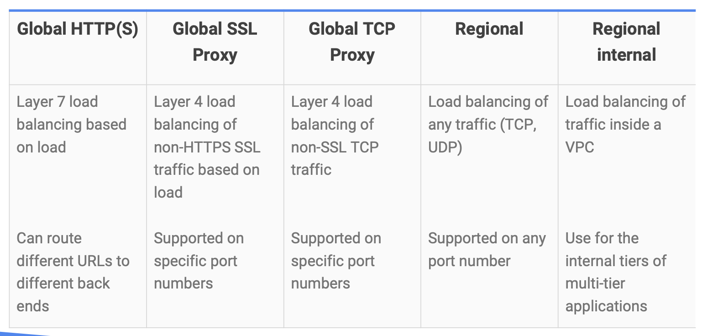

[Module 3 PDF](files\file-module-3_en.pdf)

## Virtual Private Cloud (VPC) Networking

- Your VPC networks connect your Google Cloud Platform resources to each other and to the internet.
- Google Cloud VPC networks are global; subnets are regional
- Subnets can span the zones that make up a region. You can have resources in different zones on the same subnet.
  
- You can dynamically increase the size of a subnet in a custom network by expanding the range of IP addresses allocated to it. Doing that doesn’t affect already configured VMs.

## Compute Engine

- Compute Engine lets you create and run virtual machines on Google infrastructure.
- You can create a virtual machine instance by using the Google Cloud Platform Console or the gcloud command-line tool.
- You can choose two kinds of persistent storage standard or ssd
- If your application needs high performance scratch space you can attach a local ssd but be sure to store data of permanent value somewhere else because local ssd's content doesn't last past when the vm terminates that's why the other kinds are called persistent disks
- Compute Engine bills by the second for use of virtual machines, with a one-minute minimum. And discounts apply automatically to virtual machines that run for substantial fractions of a month. For each VM that you run for more than 25% of a month, Compute Engine automatically gives you a discount for every incremental minute. You can get up to a 30% net discount for VMs that run the entire month.
- Compute Engine offers the ability to purchase committed use contracts in return for deeply discounted prices for VM usage. These discounts are known as **committed use discounts**. If your workload is stable and predictable, you can purchase a specific amount of vCPUs and memory for up to a 57% discount off of normal prices in return for committing to a usage term of 1 year or 3 years.
- Suppose you have a workload that no human being is sitting around waiting to finish. Say, a batch job analyzing a large dataset. You can save money by choosing **Preemptible VMs** to run the job. A Preemptible VM is different from an ordinary Compute Engine VM in only one respect: you’ve given Compute Engine permission to terminate it if its resources are needed elsewhere. You can save a lot of money with preemptible VMs, although be sure to make your job able to be stopped and restarted.
- You don’t have to select a particular option or machine type to get high throughput between your processing and your persistent disks. That’s the default.
- You can choose the machine properties of your instances, such as the number of virtual CPUs and the amount of memory, by using a set of predefined machine types or by creating your own custom machine types.
- Compute Engine has a feature called **Autoscaling** that lets you add and take away VMs from your application based on load metrics. The other part of making that work is balancing the incoming traffic among the VMs. And Google VPC supports several different kinds of load balancing!

## VPC Capabilities

- Much like physical networks, VPCs have **routing tables**. These are used to forward traffic from one instance to another instance within the same network, even across subnetworks and even between GCP zones, without requiring an external IP address. VPCs’ routing tables are built in; you don’t have to provision or manage a router.
- Another thing you don’t have to provision or manage for GCP: a **firewall**. VPCs give you a global distributed firewall you can control to restrict access to instances, both incoming and outgoing traffic. You can define firewall rules in terms of metadata tags on Compute Engine instances, which is really convenient. For example, you can tag all your web servers with, say, “WEB,” and write a firewall rule saying that traffic on ports 80 or 443 is allowed into all VMs with the “WEB” tag, no matter what their IP address happens to be.
- VPCs belong to GCP projects.
- But what if your company has several GCP projects, and the VPCs need to talk to each other
  - If you simply want to establish a peering relationship between two VPCs, so that they can exchange traffic, configure **VPC Peering** does.
  - If you want to use the full power of IAM to control who and what in one project can interact with a VPC in another, configure **Shared VPC**.

## Cloud Load Balancing

- Virtual machines can autoscale to respond to changing load. But how do your customers get to your application when it might be provided by four VMs one moment and forty VMs at another? **Cloud Load Balancing** is the answer.
- Cloud Load Balancing is a fully distributed, software-defined, managed service for all your traffic. And because the load balancers don’t run in VMs you have to manage, you don’t have to worry about scaling or managing them. You can put Cloud Load Balancing in front of all of your traffic: HTTP(S), other TCP and SSL traffic, and UDP traffic too.
- With Cloud Load Balancing, a single anycast IP front-ends all your backend instances in regions around the world. It provides cross-region load balancing, including automatic multi-region failover, which gently moves traffic in fractions if backends become unhealthy. Cloud Load Balancing reacts quickly to changes in users, traffic, network, backend health, and other related conditions.
- Users get a single, global anycast IP address.
- Traffic goes over the Google backbone from the closest point-of-presence to the user.
- Backends are selected based on load.
- Only healthy backends receive traffic.
- And what if you anticipate a huge spike in demand? Say, your online game is already a hit; do you need to file a support ticket to warn Google of the incoming load? No. No so-called “**pre-warming**” is required.

### Google VPC offers a suite of load-balancing options



- If you need cross-regional load balancing for a Web application, use HTTP(S) load balancing.
- For Secure Sockets Layer traffic that is not HTTP, use the Global SSL Proxy load balancer.
- If it’s other TCP traffic that does not use Secure Sockets Layer, use the Global TCP Proxy load balancer.
- Those two proxy services only work for specific port numbers, and they only work for TCP.
- If you want to load balance UDP traffic, or traffic on any port number, you can still load balance across a GCP region with the Regional load balancer.
- What all those services have in common is that they’re intended for traffic coming into the Google network from the Internet.
- But what if you want to load balance traffic inside your project, say, between the presentation layer and the business layer of your application? For that, use the **Internal load balancer**. It accepts traffic on a GCP internal IP address and load balances it across Compute Engine VMs.

## Cloud DNS

- One of the most famous Google services that people don’t pay for is 8.8.8.8, which provides a public Domain Name Service to the world. DNS is what translates Internet hostnames to addresses
- But what about the Internet hostnames and addresses of applications you build in GCP?
- GCP offers Cloud DNS to help the world find them. It’s a managed DNS service running on the same infrastructure as Google. It has low latency and high availability, and it’s a cost-effective way to make your applications and services available to your users. The DNS information you publish is served from redundant locations around the world.
- Cloud DNS is also programmable. You can publish and manage millions of DNS zones and records using the GCP Console, the command-line interface, or the API.

## Cloud CDN (Content Delivery Network)

- Google has a global system of edge caches. You can use this system to accelerate content delivery in your application using Google Cloud CDN. Your customers will experience lower network latency, the origins of your content will experience reduced load, and you can save money too. Once you've set up HTTP(S) Load Balancing, simply enable Cloud CDN with a single checkbox.
- There are lots of other CDNs out there, of course. If you are already using one, chances are, it is a part of GCP’s CDN Interconnect partner program, and you can continue to use it.

## Google Cloud Platform offers many interconnect options


- Lots of GCP customers want to interconnect their other networks to their Google VPCs. such as on-premises networks or their networks in other clouds. There are many good choices.
- Many customers start with a Virtual Private Network connection over the Internet, using the _IPsec protocol_. To make that dynamic, they use a GCP feature called **Cloud Router**. Cloud Router lets your other networks and your Google VPC exchange route information over the VPN using the _Border Gateway Protocol_. For instance, if you add a new subnet to your Google VPC, your on-premises network will automatically get routes to it.
- But some customers don’t want to use the Internet, either because of security concerns or because they need more reliable bandwidth. They can consider peering with Google using **Direct Peering**. Peering means putting a router in the same public datacenter as a Google point of presence and exchanging traffic. Google has more than 100 points of presence around the world. Customers who aren’t already in a point of presence can contract with a partner in the **Carrier Peering program** to get connected.
- One downside of peering, though, is that it isn’t covered by a _Google Service Level Agreement_. Customers who want the highest uptimes for their interconnection with Google should use **Dedicated Interconnect**, in which customers get one or more direct, private connections to Google. If these connections have topologies that meet Google’s specifications, they can be covered by up to a 99.99% SLA. These connections can be backed up by a VPN for even greater reliability.
- **Partner Interconnect** provides connectivity between your on-premises network and your VPC network through a supported service provider. A Partner Interconnect connection is useful if your data center is in a physical location that can't reach a Dedicated Interconnect colocation facility or if your data needs don't warrant an entire 10 Gbps connection. Depending on your availability needs, you can configure Partner Interconnect to support mission-critical services or applications that can tolerate some downtime. As with Dedicated Interconnect, if these connections have topologies that meet Google’s specifications, they can be covered by up to a 99.99% SLA, but note that Google is not responsible for any aspects of Partner Interconnect provided by the third party service provider nor any issues outside of Google's network.

## Quiz

1.  Name 3 robust networking services available to your applications on Google Cloud Platform.
    - Cloud Virtual Network
    - Cloud Interconnect
    - Cloud DNS
    - Cloud Load Balancing
    - Cloud CDN.
2.  Name 3 Compute Engine pricing features.
    - Per-second billing
    - Custom machine types
    - Preemptible instances.
3.  True or False: Google Cloud Load Balancing lets you balance HTTP traffic across multiple Compute Engine regions.
    - [x] True
    - [ ] False
4.  True or false? In Google Cloud VPCs, subnets have regional scope
    - [x] True
    - [ ] False
5.  True or false: If you increase the size of a subnet in a custom VPC network, the IP addresses of virtual machines already on that subnet might be affected.
    - [ ] True
    - [x] False
6.  True or false: You can create Compute Engine virtual machines from the command line.
    - [ ] False
    - [x] True
7.  What is the main reason customers choose Preemptible VMs?
    - [x] To reduce cost.
    - [ ] To improve performance.
8.  Which statement is true about Google VPC networks and subnets?
    - [ ] Networks and subnets are global
    - [ ] Networks are global; subnets are zonal
    - [x] Networks are global; subnets are regional
    - [ ] Networks are regional; subnets are zonal
9.  An application running in a Compute Engine virtual machine needs high-performance scratch space. Which type of storage meets this need?
    - [ ] Standard persistent
    - [ ] Local standard
    - [x] Local SSD
    - [ ] SSD persistent
10. For which of these interconnect options is a Service Level Agreement available?
    - [ ] VPNs with Cloud Router
    - [ ] Carrier Peering
    - [x] Dedicated Interconnect
    - [ ] Direct Peering
11. A GCP customer wants to load-balance traffic among the back-end VMs that form part of a multi-tier application. Which load-balancing option should this customer choose?
    - [x] The regional internal load balancer
    - [ ] The global SSL proxy
    - [ ] The global TCP proxy
    - [ ] The regional load balancer
    - [ ] The global HTTP(S) load balancer
12. _True or False_: Google Cloud Load Balancing allows you to balance HTTP-based traffic across multiple Compute Engine _regions._
    - [ ] False
    - [x] True
13. How do Compute Engine customers choose between big VMs and many VMs?
    - [ ] Use big VMs for fault tolerance and elasticity; use many VMs for in-memory databases and CPU-intensive analytics
    - [x] Use big VMs for in-memory databases and CPU-intensive analytics; use many VMs for fault tolerance and elasticity
14. Choose an application that would be suitable for running in a Preemptible VM.
    - [ ] A batch job that cannot be checkpointed and restarted
    - [ ] An online relational database
    - [x] A batch job that can be checkpointed and restarted
    - [ ] An interactive website
15. How do VPC routers and firewalls work?
    - [ ] Customers provision virtual machines and run their routers and firewalls in them.
    - [ ] They are managed by Google in virtual machines, which customers may never modify.
    - [x] They are managed by Google as a built-in feature.
    - [ ] They are managed by Google in virtual machines, which customers may tune or turn off.

## Lab

In this lab, you will create virtual machine (VM) instances and connect to them. You will also connect between both instances.

- Create a Compute Engine virtual machine using the Google Cloud Platform Console
- Create a Compute Engine virtual machine using the gcloud command-line interface
- Connect between the two instances

### Create a virtual machine using the Cloud console

- In the Navigation menu (Navigation menu), click Compute Engine > VM instances.
- Click CREATE INSTANCE.
- On the Create an Instance page, for Name, type my-vm-1.
- For Region and Zone, select the region and zone assigned by Google Cloud Skills Boost.
- For Machine type, accept the default.
- For Boot disk, if the Image shown is not Debian GNU/Linux 10 (Buster), click Change and select Debian GNU/Linux 10 (Buster).
- Leave the defaults for Identity and API access unmodified.
- For Firewall, click Allow HTTP traffic.
- Leave all other defaults unmodified.
- To create and launch the VM, click Create.

### Create a virtual machine using the gcloud command line

- In the Cloud console, on the top right toolbar, click the Activate Cloud Shell button (Cloud Shell icon).
- Click Continue.
- To display a list of all the zones in the region to which Google Cloud Skills Boost assigned you, enter this partial command gcloud compute zones list | grep followed by the region that Google Cloud Skills Boost or your instructor assigned you to.
- Your completed command will look like this:

```bash
gcloud compute zones list | grep us-central1
```

- Choose a zone from that list other than the zone to which Google Cloud Skills Boost assigned you. For example, if Google Cloud Skills Boost assigned you to region us-central1 and zone us-central1-a you might choose zone us-central1-b.
- To set your default zone to the one you just chose, enter this partial command gcloud config set compute/zone followed by the zone you chose.
- Your completed command will look like this:

```bash
gcloud config set compute/zone us-central1-b
```

- To create a VM instance called my-vm-2 in that zone, execute this command:

```bash
gcloud compute instances create "my-vm-2" \
--machine-type "n1-standard-1" \
--image-project "debian-cloud" \
--image-family "debian-10" \
--subnet "default"
```

- Note: The VM can take about two minutes to launch and be fully available for use.
- To close the Cloud Shell, execute the following command:

```bash
exit
```

### Connect between VM instances- In the Navigation menu, click Compute Engine > VM instances.

- You will see the two VM instances you created, each in a different zone.
- Notice that the Internal IP addresses of these two instances share the first three bytes in common. They reside on the same subnet in their Google Cloud VPC even though they are in different zones.
- To open a command prompt on the my-vm-2 instance, click SSH in its row in the VM instances list.
- Use the ping command to confirm that my-vm-2 can reach my-vm-1 over the network:

```bash
ping my-vm-1.us-central1-a
```

- Notice that the output of the ping command reveals that the complete hostname of my-vm-1 is my-vm-1.us-central1-a.c.PROJECT_ID.internal, where PROJECT_ID is the name of your Google Cloud Platform project. The Cloud console automatically supplies Domain Name Service (DNS) resolution for the internal IP addresses of VM instances.
- Press Ctrl+C to abort the ping command.
- Return to the Cloud Console tab.
- Click SSH in the my-vm-1 row in the VM instances list.
- At the command prompt on my-vm-1, install the Nginx web server:

```bash
sudo apt-get install nginx-light -y
```

- Use the nano text editor to add a custom message to the homepage of the web server:

```bash
sudo nano /var/www/html/index.nginx-debian.html
```

- Use the arrow keys to move the cursor to the line just below the h1 header. Add text like this, and replace YOUR_NAME with your name:

```bash
Hi from YOUR_NAME
```

- Press Ctrl+O and then press Enter to save your edited file, and then press Ctrl+X to exit the nano text editor.
- Confirm that the web server is serving your new page. At the command prompt on my-vm-1, execute this command:

```bash
curl http://localhost/
```

- The response will be the HTML source of the web server's home page, including your line of custom text.
- Return to the command prompt on my-vm-2
- To confirm that my-vm-2 can reach the web server on my-vm-1, at the command prompt on my-vm-2, execute this command:

```bash
curl http://my-vm-1.us-central1-a/
```

- The response will again be the HTML source of the web server's home page, including your line of custom text.
- In the Navigation menu, click Compute Engine > VM instances.
- Copy the External IP address for my-vm-1 and paste it into the address bar of a new browser tab.
- You will see your web server's home page, including your custom text.
- Note: If you forgot to click Allow HTTP traffic when you created the my-vm-1 VM instance, your attempt to reach your web server's home page will fail. You can add a firewall rule to allow inbound traffic to your instances, although this topic is out of scope for this course.
