## Index


### B-TREE Indexes (Balanced Tree)

```sql
CREATE INDEX index_name
ON table_name(column1[,column2,...])
```


- The index name should be meaningful and includes table alias and column name(s) where possible, along with the suffix \_I such as:

```sql
<table_name>_<column_name>_I
```

- By default, the `CREATE INDEX` statement creates a btree index.
- When you create a new table with a primary key, Oracle automatically creates a new index for the primary key columns.
- Unlike other database systems, Oracle does not automatically create an index for the foreign key columns.

##### DROP INDEX IF EXISTS

```sql
DECLARE index_count INTEGER;
BEGIN
SELECT COUNT(*) INTO index_count
    FROM USER_INDEXES
    WHERE INDEX_NAME = 'index_name';

IF index_count > 0 THEN
    EXECUTE IMMEDIATE 'DROP INDEX index_name';
END IF;
END;
/
```

##### Unique Index

```sql
CREATE UNIQUE INDEX index_name ON
table_name(column1[,column2,...]);
```

##### Specify name for index

- When you define a `PRIMARY KEY` or a `UNIQUE` constraint for a table, Oracle automatically creates a unique index on the primary key or unique key columns to enforce the uniqueness
- SYS_C007876 unique index was created automatically with the generated name.

```sql
CREATE TABLE t2 (
    pk2 INT PRIMARY KEY
        USING INDEX (
            CREATE INDEX t1_pk1_i ON t2 (pk2)
    ),
    c2 INT
);
```

- Instead of generating the index name, Oracle just used the one that we provided during table creation.

#### Function based Index

```sql
CREATE INDEX members_last_name_fi
ON members(UPPER(last_name));
```

##### A function-based index has the following main advantages:

- A function-based index speeds up the query by giving the optimizer more chance to perform an index range scan instead of full index scan. Note that an index range scan has a fast response time when the `WHERE` clause returns fewer than 15% of the rows of a large table.
- A function-based index reduces computation for the database. If you have a query that consists of expression and use this query many times, the database has to calculate the expression each time you execute the query. To avoid these computations, you can create a function-based index that has the exact expression.
- A function-based index helps you perform more flexible sorts. For example, the index expression can call `UPPER()` and `LOWER()` functions for case-insensitive sorts or `NLSSORT()` function for linguistic-based sorts.

##### The following are major disadvantages of function-based indexes:

- The database has to compute the result of the index in every data modification which imposes a performance penalty for every write.
- The function invoked involve in the index expression must be deterministic. It means that for the same input, the function always returns the same result.
- The query optimizer can use a function-based index for cost-based optimization, not for rule-based optimization. Therefore, it does not use a function-based index until you analyze the index itself by invoking either `DBMS_STATS.GATHER_TABLE_STATS` or `DBMS_STATS.GATHER_SCHEMA_STATS`.

### Bitmap Index


- When a column has a few distinct values, we say that this column has low cardinality. Ex: Gender column
- Oracle has a special kind of index for these types of columns which is called a bitmap index.
- A bitmap index is a special kind of database index which uses bitmaps or bit array.
- In a bitmap index, Oracle stores a bitmap for each index key.
- Each index key stores pointers to multiple rows.
- For gender column, It will create two separate bitmaps, one for each gender.
- Oracle uses a mapping function to converts each bit in the bitmap to the corresponding rowid of the table.

```sql
CREATE BITMAP INDEX index_name
ON table_name(column1[,column2,...]);
```

#### When to use Oracle bitmap indexes

- You should use the bitmap index for the columns that have low cardinality. To find the cardinality of a column, you can use the following query:

```sql
SELECT column, COUNT(*)
FROM table_name
GROUP BY column;
```

- A good practice is any column which has less than 100 distinct values can consider for bitmap index.
- Maintaining a bitmap index takes a lot of resources, therefore, bitmap indexes are only good for the read-only tables or tables that have infrequently updates.
- Therefore, you often find bitmap indexes are extensively used in the data warehouse environment.
- Notice that using a bitmap index for a table that has many single row update, especially concurrent single row update will cause a deadlock.

Ex:

```sql
CREATE TABLE bitmap_index_demo(
    id INT GENERATED BY DEFAULT AS IDENTITY,
    active NUMBER NOT NULL,
    PRIMARY KEY(id)
);

CREATE BITMAP INDEX bitmap_index_demo_active_i
ON bitmap_index_demo(active);

```

Open two sessions and repeatedly execute one of the following statements in each session:

```sql
INSERT INTO bitmap_index_demo(active)
VALUES(1);

INSERT INTO bitmap_index_demo(active)
VALUES(0);
```

The following error will occur:

```sql
ORA-00060: deadlock detected while waiting for resource
```

## To build an execution plan the optimizer checks:

- Access paths. Ex: Full table scan, Index scan
- Join methods: These are the ways to join the row sources to build a new row source. Ex: Nested Loop Join, Sort Merge Join
- Join orders: These are the algorithms of optimizer on how to join these row sources logically

## Table Access Paths

### Table Access Full (Full Table Scan)

- Since one block has data from single table, once the server goes to that block (I/O operation), reading the whole block will be faster when you need to return big portion of the table
- If DB_FILE_MULTIBLOCK_READ_COUNT = 1, then it reads only 1 block at a time
- If it is DB_FILE_MULTIBLOCK_READ_COUNT = 4, it reads 4 blocks at a time and it speed up the reading process.
- If we use index here, instead of full table scan, oracle need to jump to different different blocks according to the row id stored in indexes.

#### Reasons for Full Table Scan

- If there is not suitable index
- If the selectivity is low
- If the table is very small
- If full table scan hint is used

### Table Access by ROWID

- Access by ROWID occurs when:
  - ROWID is used in WHERE clause directly
  - By and index scan operation

Note: If we are selecting only the columns which are existing in index, that data will be taken directly from the index and not from table. If we take some other columns also - which are not part of index, it will convert index to ROWID and using ROWID, it will fetch from table.

### Sample Table Scan

## Index Access Paths

### Index Unique Scan

- A single row will be fetched.
- This scan will be performed on primary key or unique index column

### Index Range Scan

- Can be applied to b-tree and bitmap indexes
- Can be applied to unique, non-unique, function-based indexes
- Normally data is stored in ascending order in the indexes. So, it will stop searching for other branches when it finds the last node.
- If the query includes ORDER BY or GROUP BY clauses with indexing columns, range scan no need to do any sort as it is already sorted. Exceptions: if there are NULL values in column, it will do the sorting.

```sql
-- Order by with the indexed column -  sort is processed
SELECT * FROM employees where employee_id > 190 order by email;

-- Order by with the indexed column - no sort is processed
SELECT * FROM employees where employee_id > 190 order by employee_id;
```

- If ORDER BY has DESC keyword, it will read the data in descending order. No need to sort here also.

```sql
-- Index range scan descending
SELECT * FROM employees where department_id > 80 order by department_id desc;
```

- If you are using wildcard before the text or wilcard on both sides, it will not use range scan. If you using wildcard after the text, it will use range scan.

```sql
-- Index range scan with wildcard
SELECT * FROM PRODUCTS WHERE PROD_SUBCATEGORY LIKE 'Accessories%';
SELECT * FROM PRODUCTS WHERE PROD_SUBCATEGORY LIKE '%Accessories';
SELECT * FROM PRODUCTS WHERE PROD_SUBCATEGORY LIKE '%Accessories%';
```

### Index Full Scan

- Optimizer uses index full scan when:
  - All the rows of the table are indexed
  - If there is a ORDER BY or GROUP BY operation with the indexed columns,as index is already sorted it need not to sort it again.
  - For ORDER BY, the order of the sorting should match the order the index is created. Ex: Index created with FIRST_NAME, LAST_NAME and query used order by LAST_NAME, FIRST_NAME, it will not use the index.
  - For GROUP BY this order is not important.
  - Query requires a sort-merge join

```sql
/* Index usage with order by */
SELECT * FROM departments ORDER BY department_id;

/* Index usage with order by, one column of an index - causes index full scan*/
SELECT last_name,first_name FROM employees ORDER BY last_name;

/* Index usage with order by, one column of an index - causes unnecessary sort operation*/
SELECT last_name,first_name FROM employees ORDER BY first_name;

/* Index usage with order by, but with wrong order - causes unnecessary sort operation */
SELECT last_name,first_name FROM employees ORDER BY first_name,last_name;

/* Index usage with order by, with right order of the index - there is no unncessary sort */
SELECT last_name,first_name FROM employees ORDER BY last_name,first_name;

/* Index usage with order by, wit unindexed column - there is no unncessary sort */
SELECT last_name,first_name FROM employees ORDER BY last_name,salary;

/* Index usage order by - when use * , it performed full table scan */
SELECT * FROM employees ORDER BY last_name,first_name;

/* Index usage with group by - using a column with no index leads a full table scan */
SELECT salary,count(*) FROM employees e
WHERE salary IS NOT NULL
GROUP BY salary;

/* Index usage with group by - using indexed columns may lead to a index full scan */
SELECT department_id,count(*) FROM employees e
WHERE department_id IS NOT NULL
GROUP BY department_id;

/* Index usage with group by - using more columns than ONE index has may prevent index full scan */
SELECT department_id,manager_id,count(*) FROM employees e
WHERE department_id IS NOT NULL
GROUP BY department_id, manager_id;

/* Index usage with merge join */
SELECT e.employee_id, e.last_name, e.first_name, e.department_id,
       d.department_name
FROM   employees e, departments d
WHERE  e.department_id = d.department_id;
```

### Index Fast Full Scan

- If the query requires only the columns existing in the index, it uses IFF scan

  | Index Full Scan                        | Index Fast Full Scan                                                |
  | -------------------------------------- | ------------------------------------------------------------------- |
  | IF scan may read from table too        | IFF scan always reads only from the index                           |
  | Reads blocks one by one sequentially   | Reads multiple blocks simultaneously in unordered manner            |
  | Faster than IFF is sorting is there    | Faster than IF Scan if sorting is not there                         |
  | Can be used to eliminate extra sorting | As it is read in unordered manner, it cannot skip sorting if needed |

### Index Skip Scan

- If you dont use the indexed columns on the where clause, the optimizer will not use the indexes
- If any column of a composite index is used as an access predicate, the optimizer will consider index skip scan
- If you use the first column in the composite index as access predicate, it may perform index full scan or index range scan.
- If you use any other column other than the first one, it may use IS scan
- Below screenshot has index of GENDER and AGE column

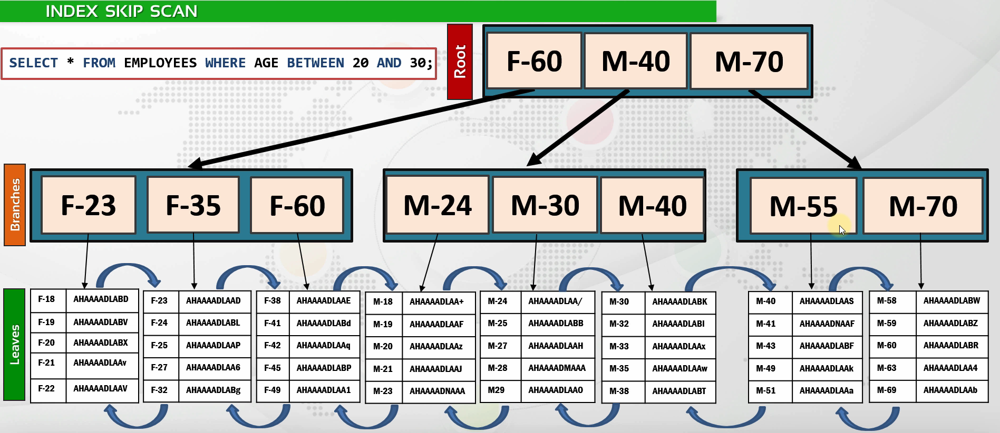

```sql
/*Index skip scan usage with equality operator*/
SELECT * FROM employees WHERE first_name = 'Alex';

/* Index range scan occurs if we use the first column of the index */
SELECT * FROM employees WHERE last_name = 'King';

/* Using index skip scan with adding a new index */
SELECT * FROM employees WHERE salary BETWEEN 6000 AND 7000;
CREATE INDEX dept_sal_ix ON employees (department_id,salary);
DROP INDEX dept_sal_ix;

/* Using index skip scan with adding a new index
   This time the cost increases significantly */
ALTER INDEX customers_yob_bix invisible; -- Disable the index
SELECT * FROM customers WHERE cust_year_of_birth BETWEEN 1989 AND 1990;
CREATE INDEX customers_gen_dob_ix ON customers (cust_gender,cust_year_of_birth);
DROP INDEX customers_gen_dob_ix;
ALTER INDEX customers_yob_bix visible;-- Enable the index
```

### Index Join Scan

- If multiple indexes stores columns of a query, optimizer will join the indexes and read data from them. This is called Index join scan or index hash join scan.
- All the columns in the select clause should be there in the combination of index to perform this
- There is no join limit. More than two indexes can be joined. Mostly optimizer won't join more than two as its cost may increase than other execution plans
- If you put ROWID in the select clause, it will not perform index join scan as it is not there in the column combination.
- In index join scan, we can see a temporary view is created to join these indexes

```sql
/* Index join scan with two indexes */
SELECT employee_id,email FROM employees;

/* Index join scan with two indexes, but with range scan included*/
SELECT last_name,email FROM employees WHERE last_name LIKE 'B%';

/* Index join scan is not performed when we add rowid to the select clause */
SELECT rowid,employee_id,email FROM employees;
```

### Index Organized Tables

### Bitmap Access Paths

## Join Methods

### Nested Loop Join

- Nested loop join is efficient when joining row sources are small or bigger one has an index
- Nested loop is efficient if you need to show some of the rows immediately
- Hash join needs to create Hash table, Sort merge need to sort. So it will take time to return even if there is some rows. Nested loop returns first matching row immediately.
- In this join type, the driving table (External table/ Outer table) is read once and joining table(Inner table) is read for every row of driving table
- Table is the general name, but it is actually a row source
- With USE_NL(table1 table2) hint, table1 doesn't mean that it would be a driving table and table2 would be joining table. For specifying driving table, we need to use LEADING hint also.
- **Oracle Prefetching** : It performs index range scan and prefetch all the row IDs from index. If that index does not have all the required columns, it fetch from table by reading multiple blocks for each row ID instead of reading one block for each row ID


```sql
/* Nested loop join example */
SELECT * FROM employees e JOIN departments d
ON d.department_id = e.department_id
WHERE d.department_id = 60;

/* Even if we change the join order and on clause order, the plan did not change */
SELECT * FROM departments d JOIN employees e
ON e.department_id = d.department_id
WHERE d.department_id = 60;

/* We can use leading hint to change the driving table */
SELECT /*+ leading(e) */ * FROM employees e JOIN departments d
ON d.department_id = e.department_id
WHERE d.department_id = 60;

/* Does not use nested loop without hint */
SELECT * FROM employees e JOIN departments d
ON d.department_id = e.department_id;

/* Using nested loop hint */
SELECT /*+ use_nl(d e) */ * FROM employees e JOIN departments d
ON d.department_id = e.department_id;

/* Nested loop prefetching and double nested loops example */
SELECT e.employee_id,e.last_name,d.department_id,d.department_name
FROM employees e JOIN departments d
ON d.department_id = e.department_id
WHERE d.department_name LIKE 'A%';
```

### Sort Merge Join

- Sort merge join is better than nested loop if table is big and (or) one side is sorted.
- It sorts both row sources
- If the sort exceeds the sort area in PGA, it will write the sorted data into the disc and this increases the cost.
- To reduce this sorting operation cost, optimizer will choose Index Full Scan or Index Range Scan if available; since data in indexes are already sorted.
- Sort is done on joining keys. Ex: If joined by using DEPT_ID then need to sort using DEPT_ID
- In sort merge, there is no driving table or inner table as they are merged
- If row source is already sorted, then there will be no sort key in the execution plan
- Sort merge join is efficient when the join condition is not an equijoin
  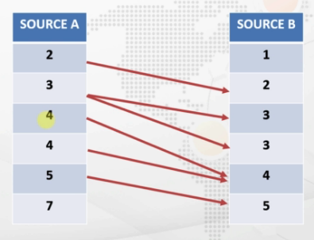

```sql
/* Sort Merge Join example */
SELECT * FROM employees e JOIN departments d
ON d.department_id = e.department_id
WHERE e.last_name like 'K%';

/* Force it to use Nested Loop Join */
SELECT /*+ use_nl(e d) */* FROM employees e JOIN departments d
ON d.department_id = e.department_id
WHERE e.last_name like 'K%';

/* Another Sort Merge Join example */
SELECT * FROM employees e JOIN departments d
ON d.department_id = e.department_id
WHERE d.manager_id > 110;

/* Equality Operator prevented Sort Merge Join */
SELECT * FROM employees e JOIN departments d
ON d.department_id = e.department_id
WHERE d.manager_id = 110;

/* Using Sort Merge Join Hint*/
SELECT /*+ use_merge(e d) */* FROM employees e JOIN departments d
ON d.department_id = e.department_id
WHERE d.manager_id = 110;
```

### Hash Join

- Hash join is better than sort merge join for most cases if both sides are not sorted already
- It creates hash table with the hash function by using the smaller table and joins this hash table with other row sources
- The keys of the second row source is hashed and checked against the hash table. So it will create hash value for each row one by one for the second row source and it will be checked against the hash table.
- If the new hash table not fitting into the memory, optimizer will write the rest of hash table into the disk for some time.
- Full table scan is performed to the table that will be hashed
- Hash join is performed only when an equijoin is used
  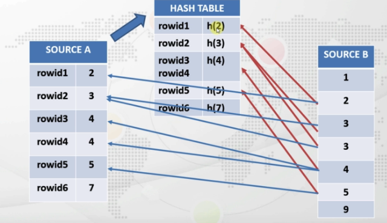

```sql
GRANT select_catalog_role TO hr;
GRANT SELECT ANY DICTIONARY TO hr;

SELECT * FROM employees e, departments d
WHERE d.department_id = e.department_id
AND d.manager_id = 110;

SELECT /*+ use_hash(d e) */ * FROM employees e, departments d
WHERE d.department_id = e.department_id
AND d.manager_id = 110;
```

### Cartesian Join

- Cartesian product is the most costy one. It joins all the rows of one side with all the rows of the other side
- It is mostly done by mistake by forgetting to write the join condition
- **BUFFER(SORT)**: It uses SORT area to store data of one table so it can read the data faster than reading it from disk. It has not sorted. It is just using that SORT memory area.
  

## Index usage to get most performance

- If the selectivity of the predicate is high, using indexes may increase the performance.
- Use indexed columns in your queries clearly
- If possible, select only the indexed columns

```sql
SELECT cust_first_name, cust_last_name, cust_year_of_birth FROM customers
WHERE cust_id = 975; -- It will use index

SELECT cust_first_name, cust_last_name, cust_year_of_birth FROM customers
WHERE cust_id <> 975;-- It will not use index. Not selective enough

SELECT cust_first_name, cust_last_name, cust_year_of_birth FROM customers
WHERE cust_id < 5000;-- It will not use index. More number of rows selected. So it used full table scan

SELECT cust_first_name, cust_last_name FROM customers
WHERE cust_id BETWEEN 100 AND 130; -- Uses index range scan

SELECT E.employee_id, E.last_name, E.job_id, E.manager_id, D.department_name,D.department_id, C.country_name
FROM employees E, departments D, locations L, countries C
WHERE E.department_id = D.department_id
AND D.location_id = L.location_id
AND L.country_id = C.country_id
AND E.employee_id BETWEEN 120 AND 199;

SELECT E.employee_id, E.last_name, E.job_id,E.manager_id, D.department_name,D.department_id, C.country_name
FROM employees E, departments D, locations L, countries C
WHERE E.department_id = D.department_id
AND D.location_id = L.location_id
AND L.country_id = C.country_id
AND E.employee_id BETWEEN 120 AND 199
AND E.department_id IN (50,80); -- Giving an indexed column in WHERE clause will increase the performance. So give as much of filters we can
```

### Concatenation Operator

```sql
SELECT first_name, last_name, department_name
FROM employees
WHERE first_name| |last_name = 'StevenKING';
--This will not use index as there is no index with concatenated values. So it will decrease the performance

SELECT first_name, last_name, department name FROM employees
WHERE first_name = 'Steven'
AND last_name = 'KING'; -- Use like this instead
```

### Arithmetic Operators

```sql
SELECT prod_id,cust_id,time_id FROM sales WHERE time_id+10 = '20-JAN-98'; -- This will not use the index because time_id+10 is not indexed

SELECT prod_id,cust_id,time_id FROM sales WHERE time_id = '10-JAN-98';--Instead of that, we can do arithmetic operations on other side of the operator. So the optimizer can see the indexed column clearly.

SELECT prod_id, cust_id, time_id FROM sales
WHERE time_id = TO_DATE('20-JAN-98', 'DD-MON-RR')-10;-- Also correct
```

### LIKE conditions

```sql
select employee_id, first_name, last_name, salary from employees
where last_name like '%on';--Need to use wildcard operator after the character. This query will not use the index

select employee_id, first_name, last_name, salary from employees
where last_name like '%on%';--This also does not use the index

select employee_id, first_name, last_name, salary from employees
where last_name like 'Ba%';--This will use the index

create index last_name_reverse_index on employees(REVERSE(last_name)); -- One thing you can do to search with wildcard at the begining is to create a reverse index

select employee_id, first_name, last_name, reverse(last_name), salary
from employees
where reverse(last_name) like 'rahh%';--So to use the reversed index, You have to reverse your column value and can use wildcard at the end. (This will ultimately help us to use wildcard at the begining of the original text ie; %hhar)

drop index last_name_reverse_index;
```

### Function on Columns

```sql
create index emp_date_temp_idx on employees (hire_date) compute statistics;

select employee_id, first_name, last_name
from employees where trunc(hire_date,'YEAR') = '01-JAN-2002'; -- This will not use the index as there is no index with TRUNC(HIRE_DATE,'YEAR')

select employee_id, first_name, last_name
from employees where hire_date between '01-JAN-2002' and '31-DEC-2002';--This will use the index

drop index emp_date_temp_idx;

select prod_id,prod_category,prod_subcategory from products
where substr(prod_subcategory,1,2) = 'Po'; -- This will not use index as there is no index with SUBSTR

select prod_id,prod_category,prod_subcategory from products
where prod_subcategory like 'Po%';--This will do the same thing as above query but uses the index. Because there is no function involved in query and index
```

### Using NULL

- B-Tree indexes do not index the null values and this sometimes may suppress the index usages in our queries.
- Ways to handle NULL value based performance loss :
  - Use IS NOT NULL condition in your where clause if you don't need to have the NULL values in the resultset. So this will use the index
  - Add NOT NULL constraint to your columns and insert a specific value for the NULL values. Ex: Instead of inserting NULL, insert 0 or 'X'
  - If reasonable, create a BITMAP index instead of a B-TREE index (BITMAP indexes store the NULL values). But use bitmap only if the cardinality is less

```sql
CREATE TABLE employees_temp AS SELECT * FROM employees;

CREATE INDEX comm_pct_idx ON employees_temp(commission_pct) COMPUTE STATISTICS;

SELECT * FROM employees_temp WHERE commission_pct <> 1; --commission_pct column has NULL values. So it donot use the index

SELECT * FROM employees_temp WHERE commission_pct <> 1 AND commission_pct IS NOT NULL;--Here we excluded NULL values. So it will use the index

SELECT employee_id,commission_pct FROM employees_temp WHERE commission_pct IS NULL;--This will not use the index

SELECT /*+ index(employees_temp comm_pct_idx)*/employee_id,commission_pct
FROM employees_temp WHERE commission_pct IS NULL; --Optimizer donot use the index even if you put hints as there is no value for NULL in index

UPDATE employees_temp SET commission_pct = 0 WHERE commission_pct IS NULL;-- Update NULL with some other value
COMMIT;

SELECT employee_id,commission_pct FROM employees_temp WHERE commission_pct = 0; -- Here, it will use the index

UPDATE employees_temp SET commission_pct = NULL WHERE commission_pct = 0; -- Removed the 0 and made it back to NULL
COMMIT;

DROP INDEX comm_pct_idx;
CREATE BITMAP INDEX comm_pct_idx ON employees_temp(commission_pct) COMPUTE STATISTICS;-- Butmap index indexes NULL values

SELECT employee_id,commission_pct FROM employees_temp WHERE commission_pct IS NULL; -- This also not used the index because the cardinality is high. So it went for full table scan

SELECT /*+ index(employees_temp comm_pct_idx)*/employee_id,commission_pct
FROM employees_temp WHERE commission_pct IS NULL; --Here it will use the index as NULL values are stored in bitmap index; but the cost is high.

DROP TABLE employees_temp;

```

### Using EXISTS instead of IN clause

- If the outer table is big and the subquery is small, using IN might have a better performance.
- If the outer table is small and the inner table is big, using EXISTS might have a better performance.
- EXISTS doesn't work better than IN all the times. It depends.
- NOT EXISTS is not the equivalent of NOT IN. So it cannot be used instead of NOT IN all the times. Especially if there are any null values, the NOT IN will return nothing.
- The new versions of database generally finds the optimum choice between EXISTS and IN. So you might not see any difference in the execution.

- Using IN clause will convert the query like this

```sql
SELECT * FROM T1 WHERE X IN (SELECT X FROM T2);

-- To

SELECT * FROM T1, (SELECT X FROM T2) T2 WHERE T1.X = T2.X); -- Joins every row

```

- Using EXISTS will convert the query something like this

```sql
SELECT * FROM T1 WHERE EXISTS (SELECT X FROM T2 WHERE T1. = T2.X);

--To

FOR X IN (SELECT * FROM T1) LOOP
IF (EXISTS (SELECT X FROM T2)) THEN
OUTPUT THE RECORD
END IF:
END;--Whenever it finds the value, it stops and return it
```

### TRUNCATE instead of DELETE

- TRUNCATE is always faster than the DELETE command (Truncate doesn't generate UNDO data,but delete generates)
- Truncate makes unusable indexes usable again. But delete does not.
- We can truncate a single partition as well.
- TRUNCATE will not trigger any DML triggers. So we cannot track the operations if we are logging DML operations through triggers.

### Data Type Mismatch

- If the data types of the column and compared value don't match, this may suppress the index usage.

```sql
SELECT cust_id, cust_first_name, cust_last_name FROM customers WHERE cust_id = 3228;--This will use the index

SELECT cust_id, cust_first_name, cust_last_name FROM customers WHERE cust_id = '3228';--This will also use the index as well. CUST_ID column is NUMBER datatype. Actually it shouldn't have used the index; but the query is rewritten by the optimizer to increase the performance.

CREATE INDEX cust_postal_code_idx ON customers (cust_postal_code);

SELECT cust_id, cust_first_name, cust_last_name FROM customers WHERE cust_postal_code = 60332;--This has not used the index. Datatype of cust_postal_code is VARCHAR2

SELECT cust_id, cust_first_name, cust_last_name FROM customers WHERE cust_postal_code = '60332';--This used the index

SELECT cust_id, cust_first_name, cust_last_name FROM customers WHERE to_number(cust_postal_code) = 60332;--This increased the cost as it needed to convert all the values in the table to number. Instead convert the value on right side.

DROP INDEX cust_postal_code_idx;
```

### ORDER BY clause

- Order by mostly requires sort operations
- The sort operations are done in PGA or discs (If PGA doesn't have enough memory)
- How to tune the order by clauses?
  - Create or modify B-Tree indexes including the column used in the order by clause. So it will sort the data and store it in index.
  - Increase the PGA size. So it will not use the disk (TEMPSPACE in explan plan). Using disk for sorting will decrease the performance than using memory
  - Query for only the indexed columns in the select clause
  - Restrict the returning rows. If the rows are already available in the index, it will be much faster as it does not need to look in the table.
- BITMAP indexes donot store indexes in sorted order

### MIN & MAX values

- B-Tree indexes increase the performance a lot for the min & max value searches
- To find the min or max value, it needs to read the whole table (if there is no B-Tree index)
- In B-Tree indexes, the rightmost and leftmost leaves have the maximum and minimum values of the indexed column
- If the returning rows are restricted, this time instead of leftmost and rightmost leaves, some other leaves have the min and max values. But again, it doesn't need to read all the rows of the index.
- If the query has multiple aggregate functions or another column, it will perform index full scan or table access full.

```sql
select min(cust_id) from customers; -- Cost is 2
select min(cust_id), max(cust_id) from customers; -- Cost is 33. Because, it needed to read all the index to find min and max value
SELECT MAX(cust_id), MAX(cust_id) FROM customers;-- Here also, cost is 33. Whenever there is multiple aggregate functions, it will use index full scan or full table scan.

select * from
 (select min(cust_id) min_cust from customers) min_customer,
 (select max(cust_id) max_cust from customers) max_customer;-- This reduced the cost to 4. It used the index seperately and joined them.
```

### UNION and UNION ALL

- If they return the same results or if you don't care about the duplicates, you should use UNION ALL instead of UNION for performance (UNION ALL doesn't perform sort)

### Avoid using HAVING clause

- Having clause restricts the rows after they are read. So predicates/filters in the having clause will not be used as access predicates

```sql
select time_id,sum(amount_sold) from sales
group by time_id
having time_id between '01-JAN-01' and '28-FEB-01'; -- Cost is 477

select time_id,sum(amount_sold) from sales
where time_id between '01-JAN-01' and '28-FEB-01'
group by time_id;--Cost is 35

select prod_id,sum(amount_sold) from sales
group by prod_id
having prod_id = 136;--Cost is 477

select prod_id,sum(amount_sold) from sales
where prod_id = 136
group by prod_id;--Cost is 146
```

### Views

- If you don't need to use all the tables in a view for your result, do not use that view on your queries. It is better to use only the tables which you need.
- Don't join the complex views with a table or another view. Views are fetched first then it is joined with the other table. This will reduce the performance
- Avoid performing outer joins to the views
- Be careful on subquery unnesting
- Avoid using views inside of a view

```sql
CREATE OR REPLACE VIEW vw_emp_dept AS
SELECT E.employee_id, E.last_name, E.first_name, E.salary, E.job_id,
    D.department_id, D.department_name, D.location_id, L.state_province
    FROM employees E, departments D , locations L
WHERE E.department_id(+) = D.department_id
AND D.location_id = L.location_id;

SELECT  V.first_name, V.last_name, j.job_title
FROM jobs j, vw_emp_dept V
WHERE j.job_id = 'IT_PROG'
AND V.job_id = j.job_id;-- This view uses a join with department table. But we dont need the department details in our query. It is better to use the Employees table directly here.

select * from vw_emp_dept;

SELECT  E.first_name, E.last_name, j.job_title
FROM employees E, jobs j
WHERE j.job_id = 'IT_PROG'
AND E.job_id = j.job_id;


CREATE OR REPLACE VIEW vw_cust_num_sold AS
SELECT C.cust_id, cust_first_name,cust_last_name, prod_id, COUNT(*) num_sold FROM sales S, customers C
WHERE S.cust_id = C.cust_id
GROUP BY C.cust_id,cust_first_name, cust_last_name, prod_id
ORDER BY num_sold DESC;

SELECT cust_id,prod_name,num_sold
FROM vw_cust_num_sold V, products P
WHERE V.prod_id = P.prod_id
AND V.prod_id = 13;--Selected the columns from all the table used in the view and products table. Here predicates are pushed into the view to increase the performance.
```

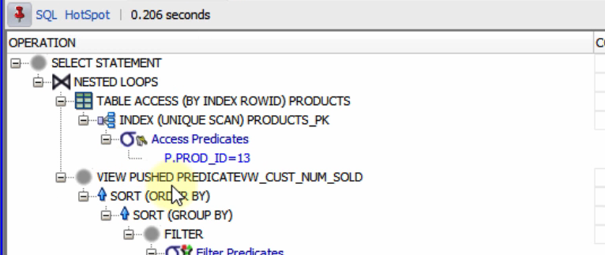
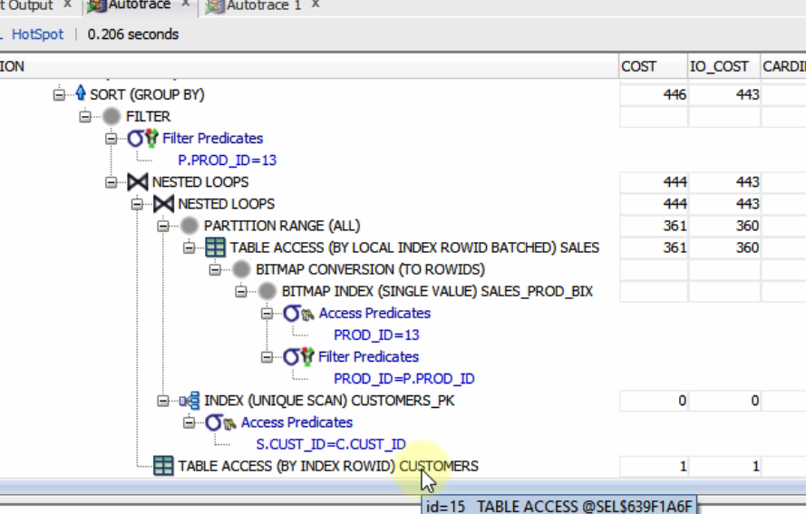

```sql
SELECT cust_id,prod_name,num_sold
FROM vw_cust_num_sold V, products P
WHERE V.prod_id = P.prod_id(+)
AND V.prod_id = 13;--Above query and this one returns same result. But we used an outer join here. Since it is an outer join, optimizer could not push the predicates into the view. Hence reduced the performance.

```


```sql
SELECT C.cust_id, P.prod_name, COUNT(*) num_sold FROM sales S, customers C, products P
WHERE S.cust_id = C.cust_id
AND S.prod_id = P.prod_id(+)
AND P.prod_id = 13
GROUP BY C.cust_id, P.prod_name
ORDER BY num_sold DESC; -- Selected from actual table. This has reduced the cost as it is not reading from View and doing outer join. Doing outer join on view will read unnessasary data from the view and donot use the predicates and index well.

DROP VIEW hr.vw_emp_dept;
DROP VIEW vw_cust_num_sold;

```

### Materialized Views

- Unlike the basic and complex views, materialized views store both the query and the data
- The materialized view data can be refreshed manually or by a PL/SQL job, or by auto-refresh on DMLS
- Materialized view maintenance also is a burden to the database
- We can create indexes, partitions etc, on materialized views (Its table is an ordinary table)
- When query rewrite is enabled in materialized views or in your session, the optimizer may use your materialized view even if you don't query from it. Enabled by default from 11g. So it is better to enable query rewrite option in your materialized view.

```sql
SELECT C.cust_id, cust_first_name,cust_last_name, prod_id, COUNT(*) num_sold FROM sales S, customers C
WHERE S.cust_id = C.cust_id
GROUP BY C.cust_id,cust_first_name, cust_last_name, prod_id
ORDER BY num_sold DESC;--Cost is 11081

CREATE MATERIALIZED VIEW vw_cust_num_sold
ENABLE QUERY REWRITE AS
SELECT C.cust_id, cust_first_name,cust_last_name, prod_id, COUNT(*) num_sold FROM sales S, customers C
WHERE S.cust_id = C.cust_id
GROUP BY C.cust_id,cust_first_name, cust_last_name, prod_id
ORDER BY num_sold DESC;

SELECT * FROM vw_cust_num_sold; --Cost is 323

SELECT cust_id,prod_name,num_sold
FROM vw_cust_num_sold V, products P
WHERE V.prod_id = P.prod_id
AND V.prod_id = 13; -- Cost is 325

SELECT cust_id,prod_name,num_sold
FROM vw_cust_num_sold V, products P
WHERE V.prod_id = P.prod_id(+)
AND V.prod_id = 13; -- Cost is 325 -- Outer join

SELECT C.cust_id, cust_first_name,cust_last_name, prod_id, COUNT(*) num_sold FROM sales S, customers C
WHERE S.cust_id = C.cust_id
AND prod_id = 13
GROUP BY C.cust_id,cust_first_name, cust_last_name, prod_id
ORDER BY num_sold DESC;--Not used MView but original tables. As we written query rewrite, it used the MView instead of original table here to increase the performance. Cost is 325

DROP MATERIALIZED VIEW vw_cust_num_sold;
```


### Avoid commit too much or too less

- Commiting too often will result in ORA-1555 error
- For each DML operations, the database creates UNDO data and REDO data
- Performing commit frequently will not help on performance (REDO and UNDO data is already carried to discs frequently)
- Any changes on the same blocks (which are carried to the redo log files) will be created in redo log buffer again
- Updates and deletes will lock the rows and that will make the other users wait to perform any other operations on these rows
- How often do we need to commit?
  - As soon as we finish the DML operations
  - For some business-specific reasons
  - If you are updating or inserting millions of rows, performing commit after these operations will be the best.
  - If you have any problems with the memory size, increasing the REDO and UNDO size will help you more than committing it often.

### Partition Pruning

- If the query has low selectivity, the optimizer mostly prefers performing full-table scans
- Creating partitioned tables increases the cost for the queries having low selectivity. But better than doing full-table scans
- Selecting from specific partitions is called as `partition pruning`
- How can we prune the partitions?
  - Selecting directly from the partition by using the partition name
  - Adding predicates to the where clause including the partition key (partitioned columns)

```sql
create table sales_temp as select * from sales;--Sales table has partitions. Taking a copy of that table. Partitions will not be copied to the new table.

select sum(amount_sold) from sales_temp where time_id between '01-JAN-01' and '31-DEC-03';--Cost is 1242. Did a full table scan

select sum(amount_sold) from sales where time_id between '01-JAN-01' and '31-DEC-03';--Using PARTITION RANGE (ITERATOR), did a full table scan. That means it read from some of the partitions only. Cost is 463

drop table sales_temp;
```

- Here, optimizer could not decide which partitions to use before running the query. So it witten PARTITION_STOP and PARTITION_START as KEY instead of partition ID. As it has determined which partitions to use while executing, this is called `Dynamic Partitioning`


### BULK COLLECT

- SQL Codes are executed in SQL Engine & PL/SQL Codes are executed in PL/SQL Engine
- Transfer of control between SQL Engine and PL/SQL Engine is called as `CONTEXT SWITCH`
- BULK COLLECT decreases the context switches (It reads multiple rows in one fetch)
- Things to know about BULK COLLECT
  - By default, the bulk collect fetches all the rows in one context switch. It may lead to memory problems
  - We can change the fetch count by using the LIMIT keyword to avoid memory errors
- Implicit cursors use bulk collect by default
- You cannot see executions plans for PL/SQL blocks using DBMS_XPLAN but you can use Trace files with TKPROF to find the execution plan

```sql
DECLARE
CURSOR c1 IS SELECT cust_id, cust_email FROM customers ORDER BY cust_id;
TYPE r_type IS TABLE OF c1%rowtype;
r1 r_type := r_type();
idx PLS_INTEGER := 0;
BEGIN
OPEN c1;
LOOP
idx:=idx+1;
r1.extend;
FETCH c1 INTO r1(idx);
EXIT WHEN c1%notfound;
END LOOP;
CLOSE c1;
END;
/
```

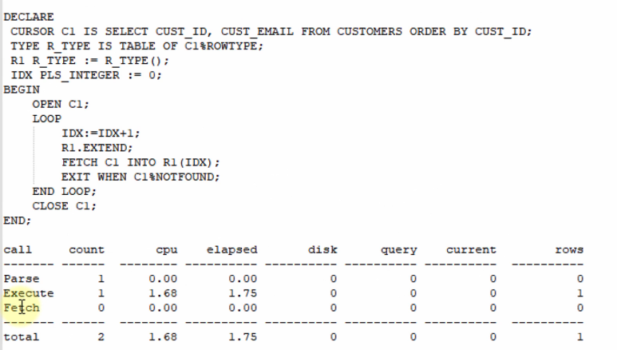
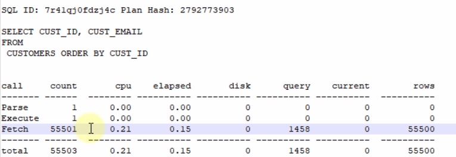

- Fetched 55500 rows and fetch count is 55501. Extra 1 count is to check whether there are any more rows

```sql
DECLARE
CURSOR c2 IS SELECT cust_id, cust_email FROM customers ORDER BY cust_id;
TYPE r_type IS TABLE OF c2%rowtype;
r1 r_type := r_type();
BEGIN
OPEN c2;
FETCH c2 BULK COLLECT INTO r1;
CLOSE c2;
END;
/
```


- In one fetch it returned all 55500 rows

```sql
DECLARE
CURSOR c3 IS SELECT cust_id, cust_email FROM customers ORDER BY cust_id;
TYPE r_type IS TABLE OF c3%rowtype;
r1 r_type := r_type();
BEGIN
OPEN c3;
FETCH c3 BULK COLLECT INTO r1 LIMIT 100;
CLOSE c3;
END;
/
```

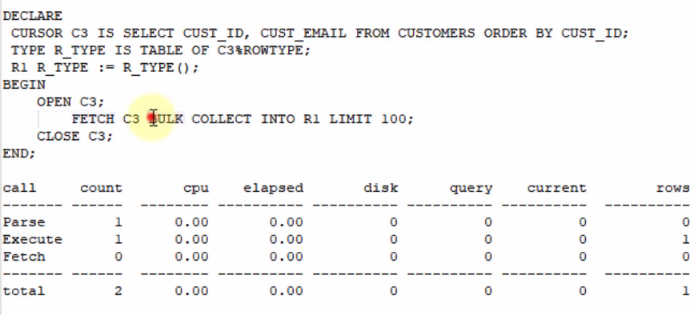
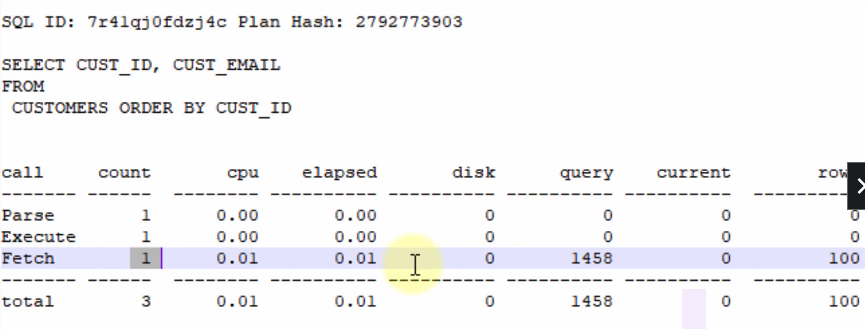

- It read 100 rows in one fetch

```sql
DECLARE
CURSOR c4 IS SELECT cust_id, cust_email FROM customers ORDER BY cust_id;
TYPE r_type IS TABLE OF c4%rowtype;
r1 r_type := r_type();
BEGIN
OPEN c4;
LOOP
FETCH c4 BULK COLLECT INTO r1 LIMIT 100;
EXIT WHEN c4%notfound;
END LOOP;
CLOSE c4;
END;
/
```

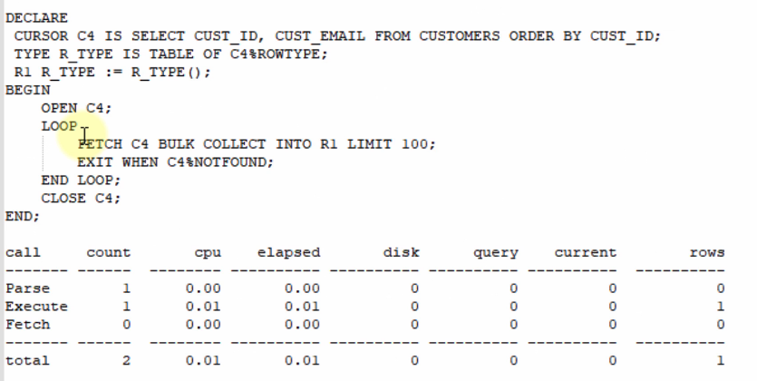
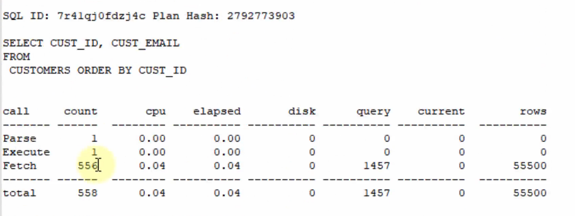

- It fetched for 556 times

```sql
DECLARE
CURSOR c5 IS SELECT cust_id, cust_email FROM customers ORDER BY cust_id;
TYPE r_type IS TABLE OF c5%rowtype;
r1 r_type := r_type();
BEGIN
OPEN c5;
LOOP
FETCH c5 BULK COLLECT INTO r1 LIMIT 1000;
EXIT WHEN c5%notfound;
END LOOP;
CLOSE c5;
END;
/
```

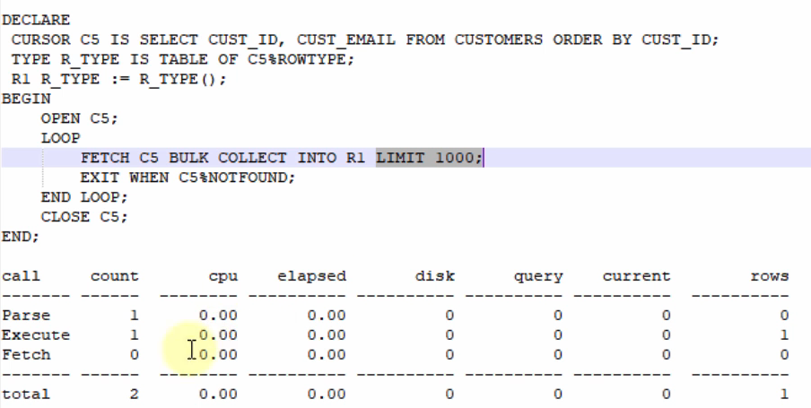


- Fetched for 56 times

```sql
DECLARE
CURSOR c6 IS SELECT cust_id, cust_email FROM customers ORDER BY cust_id;
TYPE r_type IS TABLE OF c6%rowtype;
r1 r_type := r_type();
BEGIN
OPEN c6;
LOOP
FETCH c6 BULK COLLECT INTO r1 LIMIT 100000;
EXIT WHEN c6%notfound;
END LOOP;
CLOSE c6;
END;
/
```

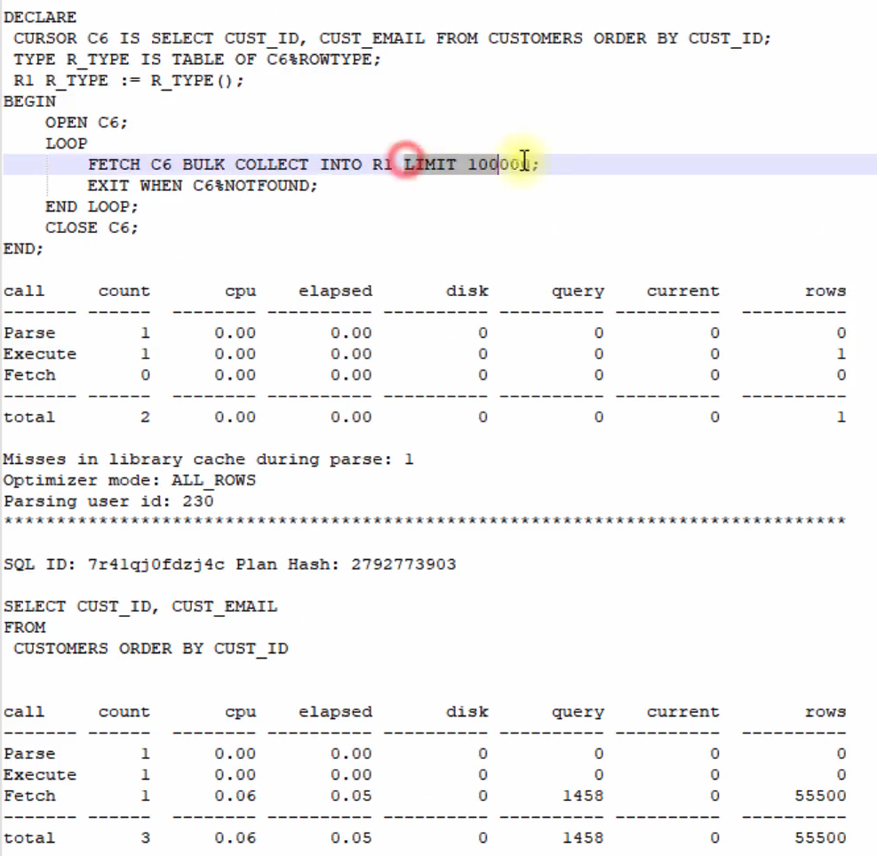

- Results in same as the bulk collect without LIMIT
- Here it showed limiting the rows to 1000 performed better than fetching all rows at once. It can be different in different system and for different queries.

```sql
DECLARE
TYPE r_type IS TABLE OF varchar2(100) index by pls_integer;
r1 r_type;
BEGIN
FOR r2 IN (SELECT cust_id, cust_email FROM customers ORDER BY cust_id) LOOP
r1(r2.cust_id) := r2.cust_email;
END LOOP;
END;
/
```


- This is an implicit cursor.
- By default, implicit cursor limit the rows to 100

### Join Order

- Driving table are read by full scan
- If one table has index and other does not, we should select table with index as inner table
- If both table has index, we should select smaller table as driving table.

```sql
SELECT /*+ ORDERED */P.prod_name,C.cust_first_name,S.amount_sold FROM  customers C, products P, sales S
WHERE S.cust_id = C.cust_id
AND P.prod_id = S.prod_id; -- Cost is 87458
```

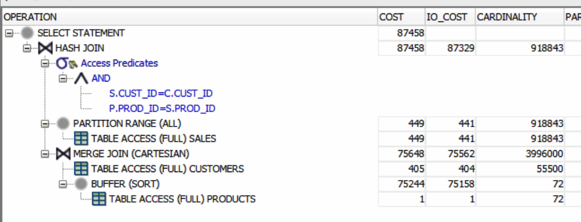

- Customer table as driving table and performed merge join with product table and joined with sales table

```sql
SELECT /*+ ORDERED */P.prod_name,C.cust_first_name,S.amount_sold FROM sales S, customers C, products P
WHERE S.prod_id = P.prod_id
AND S.cust_id = C.cust_id;
```


- Sales table as driving table; taken data from customer table using index column CUST_ID

```sql
SELECT /*+ ORDERED */P.prod_name,C.cust_first_name,S.amount_sold FROM sales S, products P , customers C
WHERE S.prod_id = P.prod_id
AND S.cust_id = C.cust_id;
```


- Sales table as driving table; taken data from product table using index column PROD_ID

```sql
SELECT /*+ ORDERED */P.prod_name,C.cust_first_name,S.amount_sold FROM  products P , sales S, customers C
WHERE S.prod_id = P.prod_id
AND S.cust_id = C.cust_id;
```


- Products table as driving table; taken data from sales table using index column PROD_ID
- Product table is the smaller table here.

### Multitable DML operations

```sql
------------------------ INSERT ALL EXAMPLE -----------------------------

CREATE TABLE it_programmers AS SELECT * FROM employees WHERE 1=2;

CREATE TABLE sales_representatives AS SELECT * FROM employees WHERE 1=2;

--Below 2 queries trying to insert data into new tables using 2 different queries
INSERT INTO it_programmers SELECT * FROM employees WHERE job_id = 'IT_PROG';

INSERT INTO sales_representatives SELECT * FROM employees WHERE job_id = 'SA_REP';
```


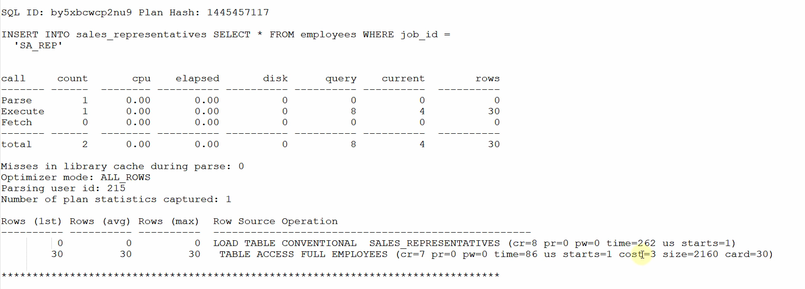

```sql
--Below query does the same thing as above but in a single statement. So instead of reading the employees table multiple times, it read in single time. It will improve the performance.
INSERT ALL
    WHEN job_id = 'IT_PROG' THEN INTO it_programmers
    WHEN job_id = 'SA_REP' THEN INTO sales_representatives
SELECT * FROM employees WHERE job_id IN ('IT_PROG','SA_REP');
```


```sql
-------------------------- MERGE EXAMPLE --------------------------------

CREATE TABLE bonuses (employee_id NUMBER(6,0), bonus NUMBER(8,2), salary NUMBER(8,2), department_id NUMBER(4,0));

INSERT INTO bonuses SELECT employee_id, 1000, salary, department_id FROM employees WHERE ROWNUM < 70;

INSERT INTO bonuses SELECT employee_id, 1000, salary, department_id FROM employees WHERE department_id = 80 AND salary < 10000
AND employee_id NOT IN (SELECT employee_id FROM bonuses);

UPDATE bonuses b SET b.bonus = b.bonus + bonus*0.15
WHERE employee_id IN (SELECT employee_id FROM employees WHERE department_id = 80 AND salary < 10000);

DELETE FROM bonuses WHERE employee_id IN (SELECT employee_id FROM employees WHERE salary >= 10000 OR department_id <> 80);

```


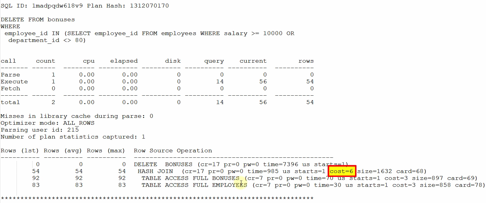

```sql
MERGE INTO bonuses b
   USING (SELECT employee_id, salary, department_id FROM employees) E
   ON (b.employee_id = E.employee_id )
   WHEN MATCHED THEN
     UPDATE SET b.bonus = b.bonus + b.bonus*0.15
     DELETE WHERE (b.salary >= 10000 OR b.department_id != 80)
   WHEN NOT MATCHED THEN
   INSERT (b.employee_id, b.bonus, b.salary, b.department_id)
     VALUES (E.employee_id, 1000 + 1000*0.15, E.salary, E.department_id)
     WHERE (E.salary < 10000 AND E.department_id = 80);

DROP TABLE it_programmers;
DROP TABLE sales_representatives;
DROP TABLE bonuses;
```


- Here lot more recursive cursors are there for merge as there are multiple operations. That is not shown in this screenshot

### Temporary Tables

- From 18C you can create private temporary table.
- Private temporary tables are only visible to your session and the table is dropped once the session ends.
- You should not create temporary table if it is not used for couple of times as creating temporary table also involves cost. So you should be able to justify the creation of temporary table.
- You can consider it like a materialized view; but for a single session

```sql
SELECT P.prod_name,C.cust_first_name,sum(S.amount_sold) sold FROM  products P , sales S, customers C
WHERE S.prod_id = P.prod_id
AND S.cust_id = C.cust_id
group by p.prod_name, c.cust_first_name
having sum(amount_sold) > 10
order by sold; -- Cost: 918

SELECT P.prod_name,C.cust_first_name,sum(S.amount_sold) sold FROM  products P , sales S, customers C
WHERE S.prod_id = P.prod_id
AND S.cust_id = C.cust_id
and p.prod_name like 'DVD-R%'
group by p.prod_name, c.cust_first_name
order by sold;--Cost: 797

SELECT P.prod_name,C.cust_first_name,sum(S.amount_sold) sold FROM  products P , sales S, customers C
WHERE S.prod_id = P.prod_id
AND S.cust_id = C.cust_id
and p.prod_name like 'CD-R%'
group by p.prod_name, c.cust_first_name
order by sold;--Cost: 865

create global temporary table products_sum_sold_amount(prod_name, cust_first_name, sum_amount_sold)
on commit preserve rows as
SELECT P.prod_name,C.cust_first_name,sum(S.amount_sold) sold FROM  products P , sales S, customers C
WHERE S.prod_id = P.prod_id
AND S.cust_id = C.cust_id
group by p.prod_name, c.cust_first_name
order by sold; -- Cost:5964

SELECT prod_name,cust_first_name, sum_amount_sold FROM  products_sum_sold_amount
WHERE sum_amount_sold > 10;--Cost: 110

SELECT prod_name,cust_first_name, sum_amount_sold FROM  products_sum_sold_amount
WHERE prod_name like 'DVD-R%';--Cost: 110

SELECT prod_name,cust_first_name, sum_amount_sold FROM  products_sum_sold_amount
WHERE prod_name like 'CD-R%';--Cost: 110
```

### Combining SQL statements

- Combining similar SQL statement may increase the performance as they need to run only once.

```sql
SELECT MAX(S.amount_sold) max_sold FROM products P , sales S, customers C
WHERE S.prod_id = P.prod_id
AND S.cust_id = C.cust_id
AND P.prod_id = 13;--Cost: 360

SELECT COUNT(S.amount_sold) count_sold FROM products P , sales S, customers C
WHERE S.prod_id = P.prod_id
AND S.cust_id = C.cust_id
AND C.cust_first_name = 'Brant';--Cost: 854

SELECT AVG(S.amount_sold) avg_sold FROM products P , sales S, customers C
WHERE S.prod_id = P.prod_id
AND S.cust_id = C.cust_id
AND P.prod_category = 'Photo';--Cost: 462

SELECT
MAX(decode(P.prod_id,13,S.amount_sold,0)) max_sold,
SUM(decode(C.cust_first_name,'Brant',1,0)) count_sold,
SUM(decode(P.prod_category,'Photo',amount_sold)) / SUM(decode(P.prod_category,'Photo',1)) avg_sold
FROM products P , sales S, customers C
WHERE S.prod_id = P.prod_id
AND S.cust_id = C.cust_id;--Cost: 862
```

### WITH clause

- Like temporary table and materialized view, oracle stores the result of the queries in user's temp space.
- Often interchangeably called CTE (common table expression) or subquery refactoring
- If the result is not very big, it stores the data as a view in memory
- If the result is big, it stores the data in a global temporary table automatically created for that query. It will be slower than memory.

```sql
SELECT prod_name,
    (SELECT SUM(amount_sold) amt_sold FROM sales WHERE prod_id = P.prod_id) / (SELECT COUNT(*) num_prods FROM products)
FROM products P
WHERE P.prod_id IN (SELECT prod_id FROM sales GROUP BY prod_id HAVING SUM(amount_sold) > 100000);--Cost:1251

WITH sum_amount AS
        (SELECT SUM(amount_sold) amt_sold, prod_id FROM sales GROUP BY prod_id),
     num_of_prods AS
        (SELECT COUNT(*) num_prods FROM products)
SELECT prod_name,
    amt_sold / (SELECT num_prods FROM num_of_prods)
FROM products P, sum_amount S
WHERE P.prod_id = S.prod_id
AND amt_sold > 100000;--Cost:481


SELECT DISTINCT S.cust_id,S.prod_id,S.amount_sold,
(SELECT AVG(amount_sold) avg_sold FROM sales s1 WHERE channel_id = 2
        AND S.prod_id = s1.prod_id) avg_sold ,
(SELECT COUNT(s2.amount_sold) amt_sold FROM customers c2, sales s2
        WHERE s2.cust_id = c2.cust_id
              AND c2.cust_marital_status = 'married'
              AND S.cust_id = s2.cust_id
              GROUP BY c2.cust_first_name,c2.cust_last_name,c2.cust_id) amt_sold
FROM  sales S
WHERE S.channel_id = 2
AND S.amount_sold >
    (SELECT AVG(amount_sold) avg_sold FROM sales s1 WHERE channel_id = 2 AND S.prod_id = s1.prod_id)
AND (SELECT COUNT(s2.amount_sold) amt_sold FROM customers c2, sales s2
        WHERE s2.cust_id = c2.cust_id
              AND c2.cust_marital_status = 'married'
              AND S.cust_id = s2.cust_id
              GROUP BY c2.cust_first_name,c2.cust_last_name,c2.cust_id) > 200
ORDER BY cust_id,prod_id;--Cost: 425411


WITH avg_amounts_per_prod AS
        (SELECT AVG(amount_sold) avg_sold, prod_id FROM sales WHERE channel_id = 2 GROUP BY prod_id),
    amounts_sold AS
        (SELECT C.cust_first_name, C.cust_last_name, C.cust_id, COUNT(S.amount_sold) tot_amt_sold FROM customers C, sales S
            WHERE S.cust_id = C.cust_id
                  AND C.cust_marital_status = 'married'
                  GROUP BY C.cust_first_name,C.cust_last_name,C.cust_id)
SELECT DISTINCT S.cust_id,S.prod_id,S.amount_sold,
(SELECT avg_sold FROM avg_amounts_per_prod A WHERE A.prod_id = S.prod_id) avg_sold,
(SELECT tot_amt_sold FROM amounts_sold T WHERE T.cust_id = S.cust_id)
FROM  sales S
WHERE S.channel_id = 2
AND S.amount_sold > (SELECT avg_sold FROM avg_amounts_per_prod A WHERE A.prod_id = S.prod_id)
AND (SELECT tot_amt_sold FROM amounts_sold T WHERE T.cust_id = S.cust_id) > 200
ORDER BY cust_id,prod_id;--Cost: 5804
```

- Temporary tables created for WITH clause
  

### Analytical Functions

```sql
select e1.employee_id, e1.first_name, e1.last_name,
       e1.department_id, e1.salary, e3.next_sal, e2.avg_sal
from employees e1,
    (select department_id, round(avg(salary),2) as avg_sal from employees
     group by department_id) e2,
    (select employee_id, salary next_sal from employees) e3
where e1.department_id = e2.department_id(+)
and e1.employee_id+1 = e3.employee_id(+)
order by e1.employee_id;--Cost: 10; Read Employees table 3 times

select employee_id, first_name, last_name, department_id, salary,
       lead(salary,1) over (order by employee_id) next_sal,
       round(avg(salary) over (partition by department_id),2) as avg_sal
from employees
order by employee_id;--Cost: 4; Read Employees table once
```
