## SELECT AS OF Clause

```sql
SELECT * FROM table_name
AS OF TIMESTAMP(SYSTIMESTAMP-INTERVAL '1' MINUTE);
```

## Modes of Locking

### Exclusive Lock

- If a lock is acquired on a data item to perform a write operation, then it is an exclusive lock

### Shared Lock

- Read locks are shared because no data value is being changed

## Hard parse vs. soft parse

### Hard parse (Library cache miss)

- If a session executes an SQL statement that does not exist in the shared pool, then Oracle has to do a hard parse.
- Oracle must then:
  - Allocate memory for the statement from the shared pool.
  - Check the statement syntactically
  - Check if the user trying to execute the statement has the necessary rights to execute it
- A hard parse is expensive in both terms of CPU used and number of shared pool latch and library cache latch it needs to acquire and release. It should be avoided whenever possible.

### Soft parse (Library cache hit)

- If a session executes an SQL statement that exists in the shared pool and there is a version of the statement that can be used, then this is referred to as a soft parse.


### Optimization


- By default, optimizor need to find best plan under a second.

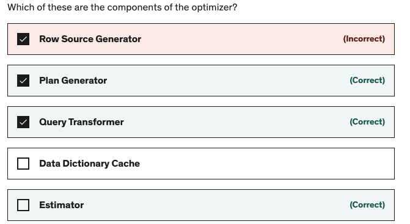

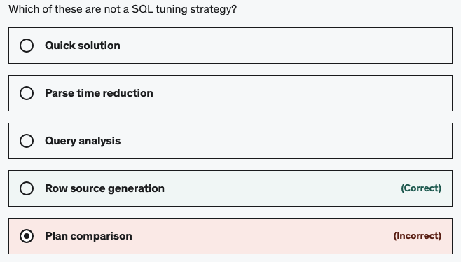

#### Query transformer

- Query transformer transforms the query into a better performing one but semantically equivalent of it.
- If the transform isn't better, it uses the original one.
- Time restriction and old statistics may lead wrong plan creation

##### Methods of query transforming

- **OR Expansion**: Using OR in query will prevent index usages

```sql
SELECT * FROM SALES WHERE PROD_ID = 14 or PROMO_ID = 33;
```

- This will be transformed into

```sql
SELECT * FROM SALES WHERE PROD_ID = 14
UNION ALL
SELECT * FROM SALES WHERE PROMO_ID = 33 AND PROD_ID <> 14;
```

- Then optimizer check cost of both original and transformed one and takes the one which has lower cost.

- **Subquery Unnesting**: The optimizer transforms a nested query into a join statement

```sql
SELECT * FROM SALES WHERE CUST_ID IN
    (SELECT CUST_ID FROM CUSTOMERS);
```

- This will be transformed into

```sql
SELECT * FROM SALES, CUSTOMERS
WHERE SALES.CUST_ID = CUSTOMERS.CUST_ID;
```

- Here, if there is any index in CUST_ID, it will use that and it is not taking all the data from CUSTOMERS into memory to check CUST_ID

- **Other Methods**: Complex View Merging, IN to EXISTS, Filter Pushdown etc.

#### Selectivity and Cardinality


- If selectivity is close to 0 -> high selectivity (Less rows) Ex: Last Name column
- If selectivity is close to 1 -> low selectivity (big proportion of rows) Ex: gender column.
- Selectivity affects the estimates in I/O cost
- Selectivity affects the sort costs
- If the index is not selective, its cost might be higher than reading the whole table (Ex: Btree Index on Gender column).
- For low selectivity columns, Bitmap indexes are better and for high selectivity, btree indexes are better


- Cardinality is used to determine join, sort and filter costs
- Incorrect selectivity and cardinality results in incorrect plan cost estimation

- **Example**

```sql
SELECT * FROM SALES WHERE PROMO_ID = 999;
```

- Sales table has total 918843 rows
- Above query returned 887837 rows

```sql
SELECT * FROM SALES WHERE PROMO_ID = 33;
```

- Above query returned 2074 rows
- Suppose PROMO_ID column has 4 distinct values
- Oracle does not know the actual number of resulting rows before executing. So, it takes an estimation of rows using distinct values for the column in WHERE clause. It will assume 1/NUM_DISTINCT rows will return in the result.
- Selectivity = 1/4 = 25% of total rows
- Cardinality = 918843 \* 1/4

```sql
SELECT COLUMN_NAME, NUM_DISTINCT FROM DBA_TAB_COLUMNS
WHERE TABLE_NAME = 'SALES';
```

- So this is considered as low selectivity and go for full table scan.
- But in our table, PROMO_ID = 33 has very less number of records
- So the optimization plan selected by Oracle will not be efficient

```sql
SELECT * FROM SALES
WHERE CUST_ID = 100001
AND PROMO_ID = 999
AND CHANNEL_ID = 9;
```

- Distinct value for CUST_ID is 7059 and CHANNEL_ID is 4
- Then the selectivity becomes
  

#### Cost


- To estimate the cost, the estimator used:
  - Disk I/O
  - CPU usage
  - Memory usage

#### Row Source Generator

- Row source is an area that we get the row set (Table, View, Result of join or groups)
- Row source generator proceduces a row source tree (A collection of row sources)
- Row source tree shows:
  - Execution order
  - Access methods
  - Join methonds
  - Data operations (filter, sort, ...)

### Identical Statements

- A statement is identical to another statement, if there is absolutely no difference between the letters. For example select x from y and SELECT X FROM Y are not identical, although they clearly do the same thing.
- Even if two statements are identical, this doesn't mean they are shareable. In order for two identical statements to be shareable, the following must be true
  - Object names must resolve the same actual objects
  - The optimizer goal is the same
  - Types and length of bind variables is similar
  - The NLS environment is the same

### Versions of statements

- If two statements are identical but not shareable, they have different versions of the statement. High version counts for sqlstatements should be avoided. The number of versions for a statement can be found in v$sqlarea:

```sql
SELECT SQL_TEXT FROM V$SQLAREA WHERE VERSION_COUNT > 1;
```

### Parent and Child Cursors

- For each SQL statement that you execute, Oracle engine will generate two cursors: parent and child cursor.
- Two cursors are generated because, there could be differences like there can be different bind variables or two different schema or different literals etc in same SQL statement.
- The parent cursor will hold the SQL statement and the child cursor will hold the information related to the differences.
- This makes the child cursor as deciding factor as to SQL statement to go for hard or soft parse.

### Parameter cursor_sharing

- The parameter cursor_sharing affects the behavior of un-identical sql statements. As of 9i, valid values for this parameter are: exact, force and similar.

```sql
ALTER SYSTEM SET CURSOR_SHARING='EXACT';
ALTER SYSTEM FLUSH SHARED_POOL;
SHO PARAMETER CURSOR_SHARING
```

- **EXACT**:Only allows statements with identical text to share the same cursor.
- **FORCE**:the requirement for two statements to be identical is relaxed: statements that differ in some literals, but are otherwise identical, are regarded as identical statements (and can share a cursor. So, the following two statements might be considered identical: select x from f where a='foo' and select x from f where a='bar'.
- Sometimes, this is too much of a relaxation because a user might actually want two statements to be different (as they might have a different execution plan). This can be avoided with `SIMILAR`
- **SIMILAR**: Statements that differ in literals are consider identical unless the execution plan is different for the statements..
- If you set `CURSOR_SHARING`, then Oracle recommends the `FORCE` setting unless you are in a DSS environment. `FORCE` limits the growth of child cursors that can occur when the setting is `SIMILAR`.

```sql
DROP TABLE TEST PURGE;
CREATE TABLE TEST (ID1 NUMBER, ID2 NUMBER, TXT CHAR(1000));
INSERT INTO TEST VALUES (1,1, 'one');

BEGIN
    FOR I IN 1..1000 LOOP
        INSERT INTO TEST VALUES (2,2, 'two');
        INSERT INTO TEST VALUES (3,3, 'three');
    END LOOP;
END;
/
INSERT INTO TEST SELECT * FROM TEST WHERE ID1=3;
COMMIT;
CREATE INDEX TEST_IDX1 ON TEST(ID1);
CREATE INDEX TEST_IDX2 ON TEST(ID2);
```

```sql
SELECT ID1,ID2, COUNT(*)
FROM TEST
GROUP BY ID1,ID2;

--Parent Cursor
COL SQL_TEXT FOR A30 WORD_WRAPPED

SELECT SQL_TEXT , SQL_ID, VERSION_COUNT, HASH_VALUE,PLAN_HASH_VALUE
FROM V$SQLAREA
WHERE UPPER(SQL_TEXT) LIKE 'SELECT COUNT(*) FROM TEST%'
    AND UPPER(SQL_TEXT) NOT LIKE '%HASH%';

--Child Cursor
COL CHILD_NUMBER FOR 99

SELECT SQL_TEXT, SQL_ID, CHILD_NUMBER CHILD#, HASH_VALUE, PLAN_HASH_VALUE
FROM V$SQL
WHERE UPPER(SQL_TEXT) LIKE 'SELECT COUNT(*) FROM TEST%'
    AND UPPER(SQL_TEXT) NOT LIKE '%HASH%';
```

### CURSOR_SHARING = EXACT

- Two statements are identical if they are textually identical (All bind variable and value in where clause are same). This is as is described above
- Causes maximum memory usage in library cache as two cursors –one parent and one child cursor are created for each distinct value of the bind variable.
- Gives best performance as optimizer creates different execution plan for each value of the bind variable.
- If histogram on a column is created with only one bucket, i.e. it does not know about the skew in data, only one child cursor will be created. If histogram is created on a column with >1 buckets i.e. it knows about skew in data in that column, it will create one child cursor for each statement even of the execution plan is same

### CURSOR_SHARING = SIMILAR reduces the number of parent cursors

- If there is skew (data is not evenly distributed. "Shuffled") in data
  - If histogram on the column containing skewed data is there
    - multiple child cursors may be created –one for each value of the bind variable
  - else (histogram is not available)
    - only one child cursor will be created
- else (Data is not skewed)
  - only one child cursor will be created.
- Reduces memory usage in library cache as only one parent cursor is created .

- If data is not skewed or the optimizer is not aware of the skew (without histogram), optimizer peeks at the value of the bind variable on the first execution of the statement and that plan is used for all the values of the bind variable.
- Thus only one child cursor is created resulting in minimum memory usage by child cursors.
- In this case performance will be affected if there is skew in the data.

- If data is skewed and the optimizer is aware of the skew (with histogram), multiple child cursor are created –one for each distinct value of the bind variable.
- In this case performance will be the best as optimizer creates different execution plan for each value of the bind variable.
- But in this case we will have multiple child cursors created for the same execution plan.

### CURSOR_SHARING = FORCE IN 10g

```sql
ALTER SYSTEM SET OPTIMIZER_FEATURES_ENABLE='10.2.0.3';
```

- Causes minimum memory usage in library cache as only one parent cursor and only one child cursor are created .
- In this case performance will be affected if there is skew in the data.

### CURSOR_SHARING = FORCE IN 11g (ADAPTIVE CURSOR SHARING)

```sql
ALTER SYSTEM SET OPTIMIZER_FEATURES_ENABLE='11.2.0.1';
```

- Reduces memory usage in library cache as only one parent cursor and only one child cursor are created .
- If data is not skewed or the optimizer is not aware of the skew, optimizer peeks at the value of the bind variable on the first execution of the statement and that plan is used for all the values of the bind variable.
- Thus only one child cursor is created resulting in minimum memory usage by child cursors.
- In this case performance will be affected if there is skew in the data. (same scenario as cursor_sharing=similar )

- If data is skewed and the optimizer is aware of the skew, multiple child cursor are created for different values of the bind variable –one for each distinct execution plan .
- In this case performance will be the best as optimizer creates different execution plans for different values of the bind variable.
- But in this case we will have only child cursor created for the same execution plan thereby resulting in optimum memory usage by child cursors

### Histograms

- A histogram is a special type of column statistic that provides more detailed information about the data distribution in a table column.
- By default, Oracle collects general information about column data such as high value, low value, number of distinct values, but does not always collect information about the distribution of data within column.
- A histogram sorts values into "buckets," as you might sort coins into buckets.
- If the data is data is unevenly distributed, the optimizer might need a histogram to determine best plan.
- **Height-Balanced Histograms**:The columns are divided into buckets so that each bucket contains approximately the same number of rows.
- **Frequency Histograms**: Each value of the column corresponds to a single bucket of the histogram. Each bucket contains the number of occurrences of this single value. Oracle automatically creates frequency histograms if the number of distinct values is less than or equal to the number of histogram buckets specified (maximum buckets is 254).

```sql
SELECT COLUMN_NAME, NUM_DISTINCT, NUM_BUCKETS, HISTOGRAM FROM DBA_TAB_COL_STATISTICS
WHERE TABLE_NAME = 'EMPLOYEES';
```

| COLUMN_NAME | NUM_DISTINCT | NUM_BUCKETS | HISTOGRAM |
| ----------- | ------------ | ----------- | --------- |
| EMPLOYEE_ID | 107          | 1           | NONE      |
| FIRST_NAME  | 91           | 1           | NONE      |
| LAST_NAME   | 102          | 102         | FREQUENCY |

```sql
SELECT ENDPOINT_NUMBER, ENDPOINT_VALUE
FROM DBA_TAB_HISTOGRAMS
WHERE TABLE_NAME = 'EMPLOYEES'
ORDER BY ENDPOINT_NUMBER;
```

| ENDPOINT_NUMBER | ENDPOINT_VALUE      |
| --------------- | ------------------- |
| 0               | 0.1                 |
| 0               | 100                 |
| 0               | 3.39535255630759E35 |
| 1               | 206                 |
| 1               | 10                  |
| 1               | 4.53868230530328E35 |

### METHOD_OPT

```sql
FOR ALL [INDEXED] [HIDDEN] COLUMNS SIZE [SIZE_CLAUSE] FOR COLUMNS SIZE SIZE_VALUE COLUMN_NAME
```

- The default, `FOR ALL COLUMNS`, will collects base column statistics for all of the columns (including hidden columns) in the table.
- `FOR ALL INDEXED COLUMNS` limits base column gathering to only those columns that are included in an index.
- `FOR ALL HIDDEN COLUMNS` limits base column statistics gathering to only the virtual columns that have been created on a table.
- The SIZE part of the `METHOD_OPT`
  - `AUTO` means Oracle will automatically determines the columns that need histograms based on the column usage information (SYS.COL_USAGE$), and the presence of a data skew.
  - An integer value indicates that a histogram will be created with at most the specified number of buckets. Must be in the range [1,254].
  - `SIZE` 1 means no histogram will be created.
  - `REPEAT` ensures a histogram will only be created for any column that already has one. This will limit the maximum number of buckets used for the newly created histograms.
  - `SKEWONLY` automatically creates a histogram on any column that shows a skew in its data distribution.

```sql
BEGIN DBMS_STATS.GATHER_TABLE_STATS('SH', 'SALES',
    METHOD_OPT => 'FOR ALL COLUMNS SIZE 1 FOR COLUMNS SIZE 254 CUST_ID'); --Histogram created for CUST_ID column and not for any other columns
END;
------
BEGIN
    DBMS_STATS.DELETE_COLUMN_STATS('SH', 'SALES', 'PROD_ID'); --Delete statistics
END;
------
BEGIN
    DBMS_STATS.GATHER_TABLE_STATS('SH', 'SALES',
        METHOD_OPT => 'FOR COLUMNS SIZE 254 CUST_ID TIME_ID CHANNEL_ID PROMO_ID'); --Histogram created for CUST_ID, TIME_ID, CHANNEL_ID, PROMO_ID columns
END;
------
EXEC DBMS_STATS.GATHER_TABLE_STATS(OWNNAME => 'HR',-
    TABNAME => 'TEST',-
    ESTIMATE_PERCENT =>NULL,-
    METHOD_OPT => 'FOR COLUMNS SIZE 1 ID1');
------
EXEC DBMS_STATS.GATHER_TABLE_STATS(OWNNAME => 'HR',-
    TABNAME => 'TEST',-
    ESTIMATE_PERCENT =>NULL,-
    CASCADE => TRUE,-
    METHOD_OPT => 'FOR COLUMNS SIZE 4 ID2');
```

### Bind Peeking

- Bind peeking or bind variable peeking, is when a query uses bind variable, the optimizer must select the best plan without the presence of literals in the SQL text.
- This plan might not be efficient for different bind variables.
- Oracle 11g Adaptive Cursor Sharing attempts to resolve this issue created by bind peeking.
- In this, if the optimizer detects that a SQL might perform better with different execution plans when provided with different bind variables, it will mark the SQL as bind sensitive cursor.
- So different execution plans are created for different bind variables.
- Bind aware cursors are bind sensitive cursors which are eligible to use different plans for different bind values.
- After a cursor has been made bind aware, the optimizer chooses plans for future executions based on the bind variable and its selective estimate.
- If the database marks the cursor as bind aware, then the next time, it generates new plan for new bind variable and marks the original cursor generated for the statement as not sharable (IS_SHAREABLE = N in V$SQL) and the cursor is no longer will be useable and will be among the first to be expired out of the shared SQL area.

## Performance Tuning Tools

### Generate Statistics

- Oracle generate statistics automatically when it is idle
- **System Statistics**:
  - Used by the optimizer to estimate I/O and CPU costs
  - System statistics are not calculated on daily basis as they are not changing. But DBA need to schedule this activity to gather system statistics regularly
  - Based on the CPU and I/O speed Oracle can generate different execution plans
  - If you have made any changes in hardware, you have to re-generate system statistics
  - The workload of the database also affects the system statistics. So, it should be gathered during a normal workload

```sql
EXEC DBMS_STATS.GATHER_SYSTEM_STATS('START');
EXEC DBMS_STATS.GATHER_SYSTEM_STATS('NOWORKLOAD');
EXEC DBMS_STATS.GATHER_SYSTEM_STATS;

SELECT * FROM SYS.AUX_STATS$;
```

- **Optimizer Statistics**:
  - Can be gathered manually or automatically

```sql
ANALYZE TABLE <table_name> COMPUTE STATISTICS; -- Old method

--New method
EXEC DBMS_STATS.GATHER_DATABASE_STATS; -- All objects in a database
EXEC DBMS_STATS.GATHER_DICTIONARY_STATS; -- Gather ststistics for dictionary schemas like SYS and SYSTEM schemas
EXEC DBMS_STATS.GATHER_SCHEMA_STATS(OWNNAME => 'HR'); -- Only for a specific schema
EXEC DBMS_STATS.GATHER_TABLE_STATS(OWNNAME => 'HR', TABNAME => 'SALES', CASCADE => TRUE); --Only for a specific table; Cascade: It will generate statistics for all the indexes associated with that table too. Recommended TRUE
EXEC DBMS_STATS.GATHER_INDEX_STATS; -- For a specific index
```

- Statistics are stored in different different views
  - DBA_TABLES --Table statistics
  - DBA_TAB_STATISTICS --Table statistics
  - DBA_TAB_COL_STATISTICS --Table column statistics
  - DBA_INDEXES --Index statistics
  - DBA_CLUSTERS --Cluster statistics
  - DBA_TAB_PARTITIONS --Partitions statistics
  - DBA_IND_PARTITIONS --Partition Index statistics
  - DBA_PART_COL_STATISTICS --Partition column statistics

### Explain Plan

```sql
EXPLAIN PLAN FOR <query>;
```

- It will generates the explain plan into PLAN_TABLE

```sql
SELECT * FROM TABLE(DBMS_XPLAN.DISPLAY()); -- To make it more readable
```

- HASH value: When a query is run, a hash value is created for it and store that hash value and the execution plan as key-value pair in library cache

```sql
EXPLAIN PLAN SET STATEMENT_ID = 'MD_ID' FOR SELECT * FROM EMPLOYEES WHERE EMPLOYEE_ID = 100; -- Name/ID for the explain plan

EXPLAIN PLAN SET STATEMENT_ID = 'MD_ID' INTO MYPLANTABLE FOR SELECT * FROM EMPLOYEES WHERE EMPLOYEE_ID = 100; -- Store plan to another table than PLAN_TABLE; Not useable
```

### Autotrace

- This will show the execution plan

```sql
SET AUTOTRACE ON; --It will return statistics and explan pan

SET AUTOTRACE ON [EXPLAIN|STATISTICS]; -- EXPLAN: return rows and Explain Plan; STATISTICS: return rows and statistics

SET AUTOTRACE TRACE[ONLY] ON [EXPLAIN|STATISTICS]; -- ONLY is for semantic purpose; TRACE and TRACEONLY is same; This will show Explain plan or Statistics without rows

SET AUTOTRACE OFF; -- Turn it off

SHOW AUTOTRACE; -- See whether it is ON or OFF

SELECT * FROM V$MYSTAT;
```

- Autotrace will also use PLAN_TABLE

### V$SQL_PLAN

- It is a dynamic performance view
- **V$SQLAREA** : Has statistics of each SQL. Memory usage of the query when it is executed
- **V$SQL_WORKAREA** : shows hash join area, sort area etc
- **V$SQL** : Costs, parse counts, execution counts, logical and physicals reads, writes etc.
- **V$SQL_PLAN** : Execution plans of queries including estimated statistics for each row source

```sql
SELECT * FROM TABLE(DBMS_XPLAN.DISPLAY_CURSOR('5d456sds45er4f5')); -- To view the execution plan; Give SQL ID
```

- To find SQL ID we can check in V$SQL
- If it is difficult to find your query from V$SQL, while executing, add some comment inside the query and search for it

```sql
SELECT /*my query*/ * FROM SALES;

SELECT * FROM V$SQL WHERE SQL_TEXT LIKE '%my query%'
```

- **V$SQL_PLAN_STATISTICS** : Normally statistics level is set to TYPICAL. If you set it to ALL, this view will have some additional execution statistics
- **V$SQL_PLAN_STATISTICS_ALL** : side by side comparision of optimizer estimates and actual execution statistics for the row sources

### How to read Explain Plan

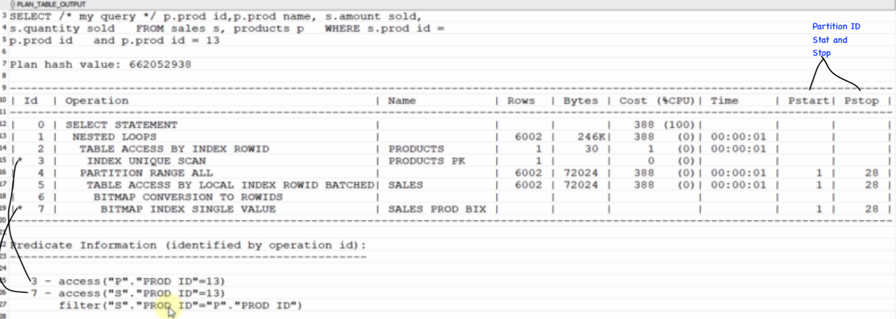


### Execution Plan:

- It is the sequence of steps that the optimizer determines how to execute a SQL statement. Using Explain plan command, you can identify the execution plan oracle applies to a particular SQL statement.
- Execution plan is more reliable than explain plan. Because, explain plan is created based on estimates and the explain plan modified on execution based on real time statistics is called execution plan.
- Explain plan and Execution plan can be same or different depending upon the real time statistics

```sql
EXPLAIN PLAN
    [SET STATEMENT_ID = 'statement_id'] [INTO table_name]
    FOR SELECT * FROM employees;

SELECT * FROM PLAN_TABLE; --PLAN_TABLE is a Global Temporary table. Users cannot see the plans inserted by other sessions.

--Below query will show execution plan without considering the affects of bind variables used in the query.
SELECT * FROM TABLE(DBMS_XPLAN.DISPLAY);--for better formatted output -like a report

--To see actual execution plan used by the database
GRANT SELECT ON v_$session TO hr;
GRANT SELECT ON v_$sql_plan_statistics_all to hr;
GRANT SELECT ON v_$sql_plan to hr;
GRANT SELECT ON v_$sql to hr;

SELECT * FROM V$SQL WHERE LOWER(SQL_TEXT) LIKE 'SELECT * FROM EMPLOYEES %';
--SQL ID: 1XTYZRSTP37SU
--CHILD NUMBER: 0

SELECT * FROM TABLE(DBMS_XPLAN.DISPLAY_CURSOR('1XTYZRSTP37SU',0));

--We can access these dynamic performance views individually by:
SELECT * FROM v$session;
select * from v$sql_plan_statistics_all;
select * from v$sql_plan;
select * from v$sql;
```

```sql
EXPLAIN PLAN FOR
SELECT * FROM members
WHERE last_name = 'Harse';
```

```sql
SELECT PLAN_TABLE_OUTPUT
FROM TABLE(DBMS_XPLAN.DISPLAY());
```

## Query Optimization

### Rule Based Optimizer (RBO)

- Predefined set of conditions to determine what plan it is going to use. Default optimization is Rule based.

### Cost Based Optimizer(CBO)

- Pick up a plan according to least cost.

```sql
SQL> SET AUTOTRACE ON
--If any error comes, that mean, PLAN_TABLE is not defined.
--utlxplan.sql will create schema for this PLAN_TABLE
SQL> SET TIMING ON
--To turn on time elapsed
```

## Table Compression

- Oracle 9i onward allows whole tables or individual table partitions to be compressed to reduce disk space requirements.

```sql
CREATE TABLE test_tab (
    id NUMBER(10) NOT NULL,
    description VARCHAR2(100) NOT NULL,
    created_date DATE NOT NULL,
    created_by VARCHAR2(50) NOT NULL,
    updated_date DATE ,
    updated_by VARCHAR2(50)
)COMPRESS;
```

```sql
CREATE TABLE test_tab (
    id NUMBER(10) NOT NULL,
    description VARCHAR2(100) NOT NULL,
    created_date DATE NOT NULL,
    created_by VARCHAR2(50) NOT NULL,
    updated_date DATE ,
    updated_by VARCHAR2(50)
)COMPRESS
PARTITION BY RANGE (created_date) (
PARTITION test_tab_q1 VALUES LESS THAN (TO_DATE('01/04/2003', 'DD/MM/YYYY')),
PARTITION test_tab_q2 VALUES LESS THAN (MAXVALUE) --Default partition
);
```

```sql
ALTER TABLE test_tab NOCOMPRESS;
ALTER TABLE test_tab COMPRESS; --Basic Compression
ALTER TABLE test_tab COMPRESS FOR ALL OPERATIONS; --Advanced Compression
```

- Advanced compression enables table for all operations including DML with minimal performance loss. Advanced compression is a licensed feature.
- This doesn't affect the compression of existing data, but will affect the compression of new data that is loaded by direct path loads. If you want to compress existing data, you must perform a move operation, so the data gets compressed during the copy.

```sql
ALTER TABLE test_tab MOVE NOCOMPRESS;
ALTER TABLE test_tab MOVE COMPRESS;
```

- A similar action could be performed for an individual partition of a partitioned table.

```sql
ALTER TABLE test_tab MOVE PARTITION test_tab_q2 COMPRESS;
ALTER TABLE test_tab MOVE PARTITION test_tab_q2 NOCOMPRESS;
```

- If you use the keyword `MOVE` and there are indexes on the table, those indexes will become corrupt.
- This corruption occurs because you’re changing the row location in the table when you proactively compress the data.
- To fix this problem, after a `MOVE` compression action, rebuild the indexes.
- This is one reason you may choose to compress the data for future operations now and then move it later when you can incur downtime to rebuild the indexes.

```sql
SELECT compression, compress_for FROM USER_TABLES WHERE table_name = 'TEST_TAB';

SELECT partition_name, compression, compress_for FROM USER_TAB_PARTITIONS
WHERE table_name = 'TEST_TAB' ORDER BY 1;
```

```sql
SELECT SEGMENT_NAME, BYTES FROM USER_SEGMENTS WHERE SEGMENT_NAME = 'EMP'; --To check size of table
```

## Partitioning an existing table

- Create a new partition table with same structure of the table which you want to partition.
- The `DBMS_REDEFINITION` package provides an interface to perform an online redefinition of tables.

```sql
BEGIN
    DBMS_REDEFINITION.CAN_REDEF_TABLE('DEVIROTR', 'IRD_TXN_DTS_AUD'); --Determines if a given table can be redefined online
END;

BEGIN
    DBMS_REDEFINITION.START_REDEF_TABLE( --Initiates the redefinition process
        UNAME => 'DEVIROTR', --Schema name
        ORIG_TABLE => 'IRD_TXN_DTS_AUD', --Original Table
        INT_TABLE => 'IRD_TXN_DTS_AUD_P'); --Temporary table created with partition
END;

BEGIN
    DBMS_REDEFINITION.SYNC_INTERIM_TABLE( --Keeps the interim table synchronized with the original table
        UNAME => 'DEVIROTR', ORIG_TABLE => 'IRD_TXN_DTS_AUD',
        INT_TABLE => 'IRD_TXN_DTS_AUD_P');
END;

BEGIN
    DBMS_REDEFINITION.FINISH_REDEF_TABLE( --Completes the redefinition process
        UNAME => 'DEVIROTR', ORIG_TABLE => 'IRD_TXN_DTS_AUD',
        INT_TABLE => 'IRD_TXN_DTS_AUD_P');
END;

BEGIN
    DBMS_REDEFINITION.ABORT_REDEF_TABLE( --Cleans up errors that occur during the redefinition process and removes all temporary objects created by the reorganization process
        UNAME => 'DEVIROTR', ORIG_TABLE => 'IRD_TXN_DTS_AUD',
        INT_TABLE => 'IRD_TXN_DTS_AUD_P');
END;

BEGIN
    DBMS_STATS.GATHER_TABLE_STATS('DEVIROTR', 'IRD_TXN_DTS_AUD', CASCADE => TRUE, GRANULARITY=>'ALL'); --Gather statitstics for new table
END;

ALTER TABLE DEVIROTR.IRD_TXN_DTS_AUD ENABLE ROW MOVEMENT; --If any row is updated, ROW MOVEMENT enables that row to be moved to its corresponding partition.
```

## Split Partition

- `SPLIT PARTITION` command to divide a single partition into two partitions, and redistribute the partitions contents between the new partitions

### Splitting Range Partitions

```sql
ALTER TABLE IRD_TXN_DTS_AUD SPLIT PARTITION "PMAX" AT
    (TO_DATE('01/01/2021','DD/MM/YYYY')) INTO (PARTITION "2020", PARTITION "PMAX"); --Suppose PMAX is the default partition name and we want to move the data from default partition to different partition. 2020 will receive the rows that meet the subpartitioning constraints specified (Rows LESS THAN 01/01/2021) and PMAX will receive the rows are not directed to 2020.
```

### Splitting List Partitions

```sql
ALTER TABLE IRD_TXN_DTS_AUD SPLIT PARTITION "PMAX" VALUES
    (10,20,30) INTO (PARTITION "2020", PARTITION "PMAX");'
```

### Splitting Hash Partitions

- `SPLIT PARTITION` command cannot add a partition to a `HASH` partitioned table.
- There is no upper limit to the number of partitions that a table may have.

## Oracle Partitions

- Partitioning allows tables, indexes and index-organized tables to be subdivided into smaller pieces, enabling these database objects to be managed and accessed at a finer level of granularity (Indexing will be ineffective for large amount of data).
- Partition pruningis the act of eliminating, or ignoring partitions that are irrelevant to the SQL statements' selection criteria
- Mainly used in data warehousing area (More `SELECT` less DML)

### List Partition

- Enables rows to be allocated to partitions based on nominated lists of values
- This is similar but more flexible than range partitioning and enables non-adjacent partition key rows to be stored in the same partition. Ex: partition based on sales region; US sales, Mumbai sales; department wise

```sql
CREATE TABLE table_name (deptno NUMBER(4), dname VARCHAR2(20))
    PARTITION BY LIST(deptno)
    (PARTITION p1 VALUES ('10'), --PARTITION "2018" VALUES ('10'), --It will throw error ("invalid partition name") if we try to give partition name starting with number without quotes
    PARTITION p2 VALUES ('20'), --PARTITION "2019" VALUES ('20'),
    PARTITION p3 VALUES ('30'), --PARTITION "2020" VALUES ('30'),
    PARTITION p4 VALUES ('40'), --PARTITION "2021" VALUES ('40')
    PARTITION region_null VALUES (NULL), --NULL values
    PARTITION region_unknown VALUES (DEFAULT) --Default values
)ENABLE ROW MOVEMENT;
----
SELECT * FROM table_name PARTITION(p1);
```

### Hash Partition

- Allocates rows based on a mathematical hash function. This helps to ensure that each partition is of the same but tends to reduce the possibility of partition elimination for range scans.
- Have to specify number of partitions and oracle will divide the data into partitions using its algorithm.

```sql
CREATE TABLE table_name(empno, sal...)
PARTITION BY HASH(empno)
PARTITIONS 4
ENABLE ROW MOVEMENT;
----
SELECT * FROM table_name;
```

### Range Partition

- Allows rows to be allocated to partitions based on contiguous ranges of the partition key
- Range partition on a time-based column is common because it enables us to quickly purge older data by dropping a partition. Ex: keep only last 3 years of data; delete partition for 2014; Employee ID from 1 to 10,000 -10,000 to 40,000

```sql
CREATE TABLE table_name (empid, sal...)
    PARTITION BY RANGE(sal)
    INTERVAL (1000) --In future if the data is increasing, oracle will create partitions when it reach this interval
    (PARTITION p1 VALUES LESS THAN (1000),
    PARTITION p2 VALUES LESS THAN (2000),
    PARTITION p3 VALUES LESS THAN (3000),
    PARTITION p4 VALUES LESS THAN (4000),
    PARTITION p5 VALUES LESS THAN (MAXVALUE)--default value
)ENABLE ROW MOVEMENT; --inside partition, rows are allowed to move when the value changes. Ex: when the sal increases, that row moves to different partition. Otherwise it won't allow to update sal.
----
SELECT * FROM table_name PARTITION(p1);
```

## Composite Partitioning (Sub-partitioning)

- Doing partitioning inside a partition is called composite partitioning. Ex: Range then hash; Range then list etc.

```sql
CREATE TABLE table_name (empid, sal...)
    PARTITION BY RANGE(hiredate)
    SUBPARTITION BY LIST(deptno)
    (PARTITION p1 VALUES LESS THAN (TO_DATE('01-JAN-1980','dd-MON-yyyy'))
            (SUBPARTITION sp1 VALUES ('10'),
            SUBPARTITION sp2 VALUES ('20'),
            SUBPARTITION sp3 VALUES ('30'),
            SUBPARTITION sp4 VALUES ('40')),
        PARTITION p2 VALUES LESS THAN (TO_DATE('01-JAN-1990','dd-MON-yyyy'))
            (SUBPARTITION sp1 VALUES ('10'),
            SUBPARTITION sp2 VALUES ('20'),
            SUBPARTITION sp3 VALUES ('30'),
            SUBPARTITION sp4 VALUES ('40'))
    )ENABLE ROW MOVEMENT;
```

```sql
ALTER TABLE employee ADD PARTITION p5 VALUES LESS THAN (50);
----
ALTER TABLE employee DROP PARTITION p4;
----
ALTER TABLE employee RENAME PARTITION p3 tp p4;
----
ALTER TABLE employee TRUNCATE PARTITION p4;
----
ALTER TABLE employee SPLIT PARTITION p2 AT(15) INTO (PARTITION p21, PARTITION p22);
----
ALTER TABLE employee EXCHANGE PARTITION p21 WITH TABLE employee2
----
ALTER TABLE employee MOVE PARTITION p21 TABLESPACE SYSAUX;
```

## Oracle Hints

- Hints are used to explicitly instruct the oracle optimizer to use certain execution plan rather than oracle chooses by itself.
- More than one hints can be used at the same time.
- If there are parameters in hint, we use space between the parameters. Comma is not required
- You can use name or alias of the table. If there is an alias, you cannot use the table name.
- Use the hints when you are absolutely sure that the hints lead to a significant performance boost.
- Oracle recommends to use hints sparingly (less), and onlyafter you have collected statistics on the relevant tables and evaluated the optimizer plan without hints using the `EXPLAIN PLAN` statement.

```sql
--Examples

/* A query without a hint. It performs a range scan*/
SELECT employee_id, last_name
  FROM employees e
  WHERE last_name LIKE 'A%';

/* Using a hint to command the optimizer to use FULL TABLE SCAN*/
SELECT /*+ FULL(e) */ employee_id, last_name
  FROM employees e
  WHERE last_name LIKE 'A%';

/* Using the hint with the table name as the parameter*/
SELECT /*+ FULL(employees) */ employee_id, last_name
  FROM employees
  WHERE last_name LIKE 'A%';

/* Using the hint with the table name while we aliased it*/
SELECT /*+ FULL(employees) */ employee_id, last_name
  FROM employees e
  WHERE last_name LIKE 'A%';

/* Using an unreasonable hint. The optimizer will not consider this hint */
SELECT /*+ INDEX(EMP_DEPARTMENT_IX) */ employee_id, last_name
  FROM employees e
  WHERE last_name LIKE 'A%';

/* Using multiple hints. But they aim for the same area. So unreasonable.
   Optimizer picked full table scan as the best choice */
SELECT /*+ INDEX(EMP_NAME_IX) FULL(e)  */ employee_id, last_name
  FROM employees e
  WHERE last_name LIKE 'A%';

/* When we change the order of the hints. But it did not change the Optimizer's decision*/
SELECT /*+ FULL(e) INDEX(EMP_NAME_IX)   */ employee_id, last_name
  FROM employees e
  WHERE last_name LIKE 'A%';

/* There is no hint. To see the execution plan to compare with the next one */
SELECT
  e.department_id, d.department_name,
  MAX(salary), AVG(salary)
FROM employees e, departments d
WHERE e.department_id=e.department_id
GROUP BY e.department_id, d.department_name;

/* Using multiple hints to change the execution plan */
SELECT /*+ LEADING(e d)  INDEX(d DEPT_ID_PK) INDEX(e EMP_DEPARTMENT_IX)*/
  e.department_id, d.department_name,
  MAX(salary), AVG(salary)
FROM employees e, departments d
WHERE e.department_id=e.department_id
GROUP BY e.department_id, d.department_name;

/* Using hints when there are two access paths.*/
SELECT /*+ INDEX(EMP_DEPARTMENT_IX) */ employee_id, last_name
  FROM employees e
  WHERE last_name LIKE 'A%'
  and department_id > 120;

/* When we change the selectivity of last_name search, it did not consider our hint.*/
SELECT /*+ INDEX(EMP_DEPARTMENT_IX) */ employee_id, last_name
  FROM employees e
  WHERE last_name LIKE 'Al%'
  and department_id > 120;

/* Another example with multiple joins, groups etc. But with no hint*/
SELECT customers.cust_first_name, customers.cust_last_name,
  MAX(QUANTITY_SOLD), AVG(QUANTITY_SOLD)
FROM sales, customers
WHERE sales.cust_id=customers.cust_id
GROUP BY customers.cust_first_name, customers.cust_last_name;

/* Performance increase when performing parallel execution hint*/
SELECT /*+ PARALLEL(4) */ customers.cust_first_name, customers.cust_last_name,
  MAX(QUANTITY_SOLD), AVG(QUANTITY_SOLD)
FROM sales, customers
WHERE sales.cust_id=customers.cust_id
GROUP BY customers.cust_first_name, customers.cust_last_name;
```

[Hints Cheet Sheet.pdf](Hints_Sheet.pdf)

### Hints for Optimization Approaches and Goals

| HINT     | DESCRIPTION                                                                                                                                                             |
| -------- | ----------------------------------------------------------------------------------------------------------------------------------------------------------------------- |
| ALL_ROWS | The ALL_ROWS hint explicitly chooses the cost-based approach to optimize a statement block with a goal of best throughput(that is, minimum total resource consumption). |

```sql
SELECT /*+ ALL_ROWS */ * FROM employees; --Cardinality: 107
```

| HINT          | DESCRIPTION                                                                                              |
| ------------- | -------------------------------------------------------------------------------------------------------- |
| FIRST_ROWS(n) | Instructs Oracle to choose the plan that returns the first n rows most efficiently (best response time). |

```sql
SELECT /*+ FIRST_ROWS(10) */ * FROM employees; --Cardinality: 10; All rows will be selected but first 10 rows will be returned most effectively
```

- Oracle ignores `FIRST_ROWS` in all `DELETE` and `UPDATE` statements and in `SELECT` statement blocks that include sorts and/or groupings, as it needs to fetch all relevant data anyway.

### Hints for Access Paths

#### Cluster Index

- An table cluster that uses an index to locate data. The cluster index is a B-tree index on the cluster key.

#### Cluster Scan

- A cluster is a schema object that contains data from one or more tables, all of which have one or more columns in common.
- Oracle Database stores together all the rows from all the tables that share the same cluster key.
- In an indexed table cluster, Oracle Database first obtains the rowid of one of the selected rows by scanning the cluster index.
- Oracle Database then locates the rows based on this rowid.

#### Hash Scan

- The database uses a hash scan to locate rows in a hash cluster based on a hash value.In a hash cluster, all rows with the same hash value are stored in the same data block.
- Oracle Database first obtains the hash value by applying a hash function to a cluster key value specified by the statement, and then scans the data blocks containing rows with that hash value.

### Hints for Join Operation

#### Hashing

- Hashing is the process of converting an input of any length into a fixed size string of text using an algorithm (hash function).
- Hashing is used to index and retrieve items in a database because it is faster to find the item using the shorter hashed key than to find it using the original value.
- It can be also used for encrypting password and data.

#### Nested Loop Join

- A Nested Loops join works in the same way as nested loops.
- One of the joining tables is designated as the outer table (small table) and another one as the inner table (large table).
- For each row of the outer table, all the rows from the inner table are matched one by one if the row matches it is included in the result-set otherwise it is ignored.

#### Merge Join

- Merge join requires both inputs to be sorted.
- Because the rows are pre-sorted, a Merge join immediately begins the matching process.
- It reads a row from one input and compares it with the row of another input.
- If the rows match, that matched row is considered in the result-set.

#### To alter the degree of parallelism of a table

```sql
ALTER TABLE employees PARALLEL 4;
```

#### Hash Join

- A Hash join is performed in two phases; the Build phase (small table) and the Probe phase(large table).
- During the build phase, joining keys of all the rows of the build table are scanned.
- Hashes are generated and placed in an in-memory hash table.
- No rows are returned until this point. During the probe phase, joining keys of each row of the probe table are scanned.
- Again hashes are generated (using the same hash function as above) and compared against the corresponding hash table for a match.
- A Hash function requires significant amount of CPU cycles to generate hashes and memory resources to store the hash table

| HINT          | DESCRIPTION                                                                                                                                                                                                                                                                                                                                                                                                                                                                                                                          |
| ------------- | ------------------------------------------------------------------------------------------------------------------------------------------------------------------------------------------------------------------------------------------------------------------------------------------------------------------------------------------------------------------------------------------------------------------------------------------------------------------------------------------------------------------------------------ |
| FULL          | The FULL hint explicitly chooses a full table scan for the specified table. `SELECT /*+ FULL */ * FROM employees; `                                                                                                                                                                                                                                                                                                                                                                                                                  |
| ROW_ID        | The ROWID hint explicitly chooses a table scan by rowid for the specified table. `SELECT /*+ROWID(employees)*/ * FROM employees WHERE rowid > 'AAAAtkAABAAAFNTAAA'; `                                                                                                                                                                                                                                                                                                                                                                |
| CLUSTER       | The CLUSTER hint explicitly chooses a cluster scan to access the specified table. It applies only to clustered objects. ```SELECT /*+ CLUSTER */ employees.last_name, department_id FROM employees, departments WHERE department_id = 10 AND employees.department_id = departments.department_id; `                                                                                                                                                                                                                                  |
| HASH          | The HASH hint explicitly chooses a hash scan to access the specified table. It applies only to tables stored in a cluster. ` /_+ HASH (table_name) _/ ```                                                                                                                                                                                                                                                                                                                                                                            |
| INDEX         | The INDEX hint explicitly chooses an index scan for the specified table. If a list of indexes specified, the optimizer chooses the one with lowest cost. If no index is specified, then the optimizer chooses the available index for the table with the lowest cost. You can use the INDEX hint for domain, B-tree, bitmap, and bitmap join indexes. However, Oracle recommends using INDEX_COMBINE rather than INDEX for bitmap indexes, because it is a more versatile hint. `SELECT /*+ INDEX(e,emp_dept_idx) */ * FROM emp e; ` |
| INDEX_ASC     | The INDEX_ASC hint explicitly chooses to scan the index entries in ascending order of their indexed values.                                                                                                                                                                                                                                                                                                                                                                                                                          |
| INDEX_DESC    | The INDEX_DESC hint explicitly chooses to scan the index entries in descending order of their indexed values. In a partitioned index, the results are in descending order within each partition.                                                                                                                                                                                                                                                                                                                                     |
| INDEX_COMBINE | The INDEX_COMBINE hint explicitly chooses a bitmap access path for the table. If no indexes are given as arguments for the INDEX_COMBINE hint, then the optimizer uses whatever Boolean combination of bitmap indexes has the best cost estimate for the table. If certain indexes are given as arguments, then the optimizer tries to use some Boolean combination of those particular bitmap indexes.                                                                                                                              |
| NO_INDEX      | The NO_INDEX hint explicitly disallows a set of indexes for the specified table. `SELECT /*+ NO_INDEX(emp emp_dept_idx) */ * FROM emp, dept WHERE emp.deptno = dept.deptno; `                                                                                                                                                                                                                                                                                                                                                        |

| HINTS             | DESCRIPTION                                                                                                                                                                                                                                                                                                                                         |
| ----------------- | --------------------------------------------------------------------------------------------------------------------------------------------------------------------------------------------------------------------------------------------------------------------------------------------------------------------------------------------------- |
| USE_HASH          | The USE_HASH hint causes Oracle to join each specified table with another row source, using a hash join. `SELECT /*+ USE_HASH(employees departments)*/ * FROM employees, departments WHERE employees.department_id = departments.department_id; `                                                                                                   |
| USE_MERGE         | The USE_MERGE hint causes Oracle to join each specified table with another row source, using a sort-merge join. `SELECT /*+USE_MERGE(employees departments)*/ * FROM employees, departments WHERE employees.department_id = departments.department_id; `                                                                                            |
| USE_NL            | The USE_NL hint causes Oracle to join each specified table to another row source with a nested loops join, using the specified table as the inner table. `SELECT /*+USE_NL(employees departments)*/ * FROM employees, departments WHERE employees.department_id = departments.department_id; `                                                      |
| USE_NL_WITH_INDEX | The USE_NL_WITH_INDEX hint instructs the optimizer to join specified table to another row source with a nested loops join, using the specified table as the inner table and will use index `SELECT /*+ USE_NL_WITH_INDEX(e emp_department_idx) */ FROM employees e,departments d WHERE e.department_id = d.department_id and e.department_id= 40; ` |
| NO_USE_NL         | It instructs the optimizer to not to use nested loop joins when joining each specified table to another row source using the specified table as the inner table. `SELECT /*+NO_USE_NL(employees departments)*/ * FROM employees, departments WHERE employees.department_id = departments.department_id; `                                           |
| NO_USE_HASH       | It instructs the optimizer to not to use hash join. `SELECT /*+ NO_USE_HASH(employees departments)*/ * FROM employees, departments WHERE employees.department_id = departments.department_id; `                                                                                                                                                     |
| NO_USE_MERGE      | It instructs the optimizer to not to use sort merge join . `SELECT /*+NO_USE_MERGE(employees departments)*/ * FROM employees, departments WHERE employees.department_id = departments.department_id; `                                                                                                                                              |

### Hints for Join Orders

| HINTS   | DESCRIPTION                                                                                                                                                                                                                                                                                                                                                                                                                                                                                               |
| ------- | --------------------------------------------------------------------------------------------------------------------------------------------------------------------------------------------------------------------------------------------------------------------------------------------------------------------------------------------------------------------------------------------------------------------------------------------------------------------------------------------------------- |
| LEADING | The LEADING hint causes Oracle to use the specified table as the first table in the join order. If you specify two or more LEADING hints on different tables, then all of them are ignored. If you specify the ORDERED hint, then it overrides all LEADING hints. `SELECT /*+ LEADING(e j) */ * FROM employees e, departments d, job_history j WHERE e.department_id = d.department_id AND e.hire_date = j.hire_date; `                                                                                   |
| ORDERED | The ORDERED hint causes Oracle to join tables in the order in which they appear in the FROM clause. If you omit the ORDERED hint from a SQL statement performing a join, then the optimizer chooses the order in which to join the tables. You might want to use the ORDERED hint to specify a join order if you know something about the number of rows selected from each table that the optimizer does not. Such information lets you choose an inner and outer table better than the optimizer could. |

### Hints for Parallel Execution

- Parallel hint enables a SQL statement to be simultaneously processed by multiple threads or processes.

| HINTS       | DESCRIPTION                                                                                                                                                                                                                                                                                                                                                                                         |
| ----------- | --------------------------------------------------------------------------------------------------------------------------------------------------------------------------------------------------------------------------------------------------------------------------------------------------------------------------------------------------------------------------------------------------- |
| PARALLEL    | The PARALLEL hint lets you specify the desired number of concurrent servers that can be used for a parallel operation. The hint applies to the SELECT, INSERT, UPDATE, and DELETE portions of a statement, as well as to the table scan portion. The database computes the degree of parallelism which can be 2 or greater. `SELECT /*+ PARALLEL */ last_name, first_name, salary FROM employees; ` |
| NO_PARALLEL | The NO_PARALLEL hint overrides a PARALLEL parameter in the DDL that created or altered the table. It uses SERIAL plan. `SELECT /*+ NO_PARALLEL(e) */ FROM employees e; `                                                                                                                                                                                                                            |

## SQL Performance Tuning & Tips

- Check statistics are up to date (STALE)
- Using dynamic statistics
- Rebuilding indexes
- Index-organized tables
- Check query structure
- Check histograms
- Check actual and estimated number of rows. If there is huge difference, then statistics might be out of date. Outdated statistics result in wrong selectivity and wrong execution plan.
- See if cost and logical reads are significantly different. If the difference is huge, then there is a problem.
- Check the datatype and any implicit type conversion happened
- Ensure the OS has enough I/O bandwidth, CPU power and swap space (Swap space is the portion of virtual memory that is on the hard disk, used when RAM is full)
- Operating systems, provide data caches which will consume memory while offering little or no performance benefit for the database. By default, all database I/O goes through the file system cache. On some Linux and UNIX systems, direct I/O is available which will allow the database files to be accessed by bypassing the file system cache. So it can save CPU resources and memory and allows file system cache to be dedicated to non-database activity.
- But in some cases, database does not use the database buffer cache then the direct I/O may yield worst performance than using OS cache.
- Use SQL_TRACE, AWR to find the performance problem.
- Look for wait events.
- Find columns that should be indexed.
- Verify statistics are current (`DBMS_STATS`)
- Determine whether the SQL queries can be improved
- Use `TRUNCATE` instead of `DELETE` if you need to delete whole content of the table
- Use `ROWID` while deleting duplicate rows
- Use frequent `COMMIT` while performing batch transactions; so the temporary space will be released
- Use `COUNT(column_name)` instead of `COUNT(*)` or `COUNT(1)`
- Use `WHERE` clause instead of `HAVING` clause (Except `GROUP BY` function)
- Minimize the lookups in `WHERE` clause queries
- Use multi column `UPDATE` while doing updates (UPDATE employees SET salary = 40000, email='skings' WHERE employee_id = 100;)
- Use `EXISTS` instead of `IN`
- Use `NOT EXISTS` instead of `NOT IN`
- Use `IN` in place of `OR` in `WHERE` clause filter
- Avoid `IS NULL` or `IS NOT NULL` on indexed column
- Use Oracle hints
- Avoid number-to-character conversions because numbers and characters compare differently and lead to performance downgrade.
- Never use `SELECT *` in production code. At some point, someone will come and modify the table or view you’re querying from. You might be fetching more columns than you actually need and it will create unnecessary overhead in the database.
- Use meaningful aliases, use `AS` for defining alias for easy reading
- Create your indexes carefully on all the tables where you have frequent search operations. Avoid index on the tables where you have less number of search operations and more number of insert and update operations.
- A full-table scan occurs when the columns in the `WHERE` clause do not have an index associated with them. You can avoid a full-table scan by creating an index on columns that are used as conditions in the `WHERE` clause of an SQL statement.
- Use pattern matching judiciously. `'LIKE'` queries cause full-table scans
- For queries that are executed on a regular basis, try to use procedures.
- You can optimize bulk data loads by dropping indexes.
- Oracle has many tools for managing SQL statement performance but among them two are very popular. These two tools are −
  - `SQLT`
  - `DBMS_STATS`
  - `SQL Trace`
  - `V$_SQL_PLAN`
  - `DMS_MONITOR`
  - `AWRSQRPT.SQL`
  - `EXPLAIN PLAN` − tool identifies the access path that will be taken when the SQL statement is executed.
  - `TKPROF` −SQL Trace generates a low level trace file that has a complete chronological record of everything a session is doing and waiting for when it “talks” to the database. `TKPROF` on the other hand takes that trace file and aggregates all of the low level details in an easy to read report. This report can then be quickly analyzed to find the root cause of the slow performance.
    Ex: TKPROF input.trc output.prd [options]

```sql
ALTER SYSTEM SET TIMED_STATISTICS = TRUE;
ALTER SESSION SET SQL_TRACE = TRUE;

SELECT COUNT(*) FROM DUAL;

ALTER SESSION SET SQL_TRACE = FALSE;

SELECT VALUE FROM V$DIAG_INFO WHERE NAME = 'Default Trace File';

CMD>TKPROF C:\APP\diag\rdbms\orcl\orcl\trace\orcl_ora_11512.trc E:\orcl_ora_11512.txt;
```

- Inefficient statements are mostly associated with a high number of block visits.
- Both, soft parse and hard parse are counted as parse in tkprof. More specifically, the parse count is incremented when the statement is hashed.
- COUNT (\*) and COUNT(1) -No much difference in performance (just fraction of seconds)

## Plan Stability

- Plan stability relies on preserving execution plans at a point in time when performance is satisfactory.
- In many environments, however, attributes for data types such as dates or order numbers can change rapidly.
- In this cases, permanent use of an execution plan can result in performance degradation over time as the data characteristics change.
- Plan stability preserves execution plans in stored outlines.
- An outline is implemented as a set of optimizer hints that are associated with the SQL statement.
- If the use of the outline is enabled for the statement, then Oracle Database automatically considers the stored hints and tries to generate an execution plan in accordance with those hints.
- Oracle Database can create a public or private stored outline for one or all SQL statements. T
- he optimizer then generates equivalent execution plans from the outlines when you enable the use of stored outlines.

## Optimizer Operators

- These are the operations you see at the operations area in execution plan.
- These operations are performed against row sources to generate the output with optimum performance.

### Result Cache Operator

- Result cache is a memory area in SGA to store the results of queries for some time to increase the performance
- There are two ways to store results in result cache:
  - MANUAL (DEFAULT - needs result_cache hint to store the result of that query in result cache)
  - FORCE (It forces all the query results to be stored in result cache. It is not recommented as it is a limited memory area. no_results_cache hint is used to not to store the output in result cache)
- DBMS_RESULT_CACHE package has statistics, information and some memory managing abilities
- V$RESULT_CACHE_OBJECTS view has the result cache data. You can check whether your query is in result cache using this.
- Table annotations can be used as the default storage option to the result cache. But hint will override table annotations. This also has DEFAULT and FORCE settings.
- Table annotations:

```sql
CREATE TABLE table_name (...) RESULT_CACHE (MODE DEFAULT|FORCE);

ALTER TABLE table_name (...) RESULT_CACHE (MODE DEFAULT|FORCE);
```

- Table annotations can be checked from USER_TABLES

```sql
SELECT RESULT_CACHE FROM USER_TABLES
WHERE TABLE_NAME = 'SALES';
```

- To flush the result cache. It is not recommented to flush it unless you are testing:

```sql
EXEC DBMS_RESULT_CAHCE.FLUSH;
```

- The cost you see in below explain plan is, if the output is not available in result cache then that will be the cost. If it is reading from result cache, then the cost will be very minimal
- SQL developer will show only the first 50 rows when you run a query. In order to store output in result cache, entire data to be fetched. To do that, select all or take count of data.
  

- Even if you change the query a little bit, it will not consider the results from result cache. It need to be exact.

### View Operator

- Every VIEW operator in the operations area does not mean that a view is there in the query
- Each seperate query in a query is pretended as an inline view.
- What is View Merging?
  - View Merging means joining the inner query and the outer for a better performance
- Every query inside the outer query is shown with VIEW operator if they cannot be merged with the outer query.

```sql
SELECT e.first_name, e.last_name, dept_locs_v.street_address,
       dept_locs_v.postal_code
FROM   employees e,
      ( SELECT d.department_id, d.department_name,
               l.street_address, l.postal_code
        FROM   departments d, locations l
        WHERE  d.location_id = l.location_id ) dept_locs_v
WHERE  dept_locs_v.department_id = e.department_id
AND    e.last_name = 'Smith';

```

- Above query is transformed to a join query by the optimizer as shown below.

```sql
select e.first_name, e.last_name, l.street_address, l.postal_code
from employees e, departments d, locations l
where d.location_id = l.location_id
and d.department_id = e.department_id
and e.last_name = 'Smith';
```

- We can use NO_MERGE hint to tell the optimizer no to join the tables. It need to be used for the inner query. If you put that in outer query, it will not work.

```sql
SELECT e.first_name, e.last_name, dept_locs_v.street_address,
       dept_locs_v.postal_code
FROM   employees e,
      ( SELECT /*+ NO_MERGE */ d.department_id, d.department_name,
               l.street_address, l.postal_code
        FROM   departments d, locations l
        WHERE  d.location_id = l.location_id ) dept_locs_v
WHERE  dept_locs_v.department_id = e.department_id
AND    e.last_name = 'Smith';
```


- To execute above query, database needs to read all the rows of the inner query even if there are filter predicates. It will apply the predicated only after reading the entire table. So in order to improve the performance, the predicates from outer table is pushed to inner query to filter it while reading. That is called VIEW PUSHED PREDICATE.
- For the above query, COST is 6 only but the bytes read is 100. So the merging the view is not efficient here.

- Below query will use VIEW without we mentioning NO_MERGE hint because of GROUP BY clause.

```sql
select v.*,d.department_name from (select department_id, sum(salary) SUM_SAL
from employees group by department_id) v, departments d
where v.department_id=d.department_id;
```

- Even if we create a VIEW, it may not use VIEW operator if the view is a simple one. It will merge and shows the result. We can give NO_MERGE hint not to merge and read from VIEW also.

```sql
create view v as select department_id, salary from employees;

select department_id, salary from v;

drop view v;

create view v as select /*+ NO_MERGE */ department_id, salary from employees;

select department_id, salary from v;

select department_id, salary from (select /*+ NO_MERGE */ department_id, salary from employees);

select department_id, salary from employees;

drop view v;

select * from ALL_TAB_MODIFICATIONS;
```

### Clusters

- The main goal of clustering is improving the performance with a different way of storage.
- If two tables are always read together, we can cluster them and store them in same block area. So the cost of joining two tables will be reduced.
- If two tables are always read together and uses equality operator, you can use clusters. Otherwise you may decrease the performance and higher cost if you try to make a full table scan.
  
- You need to know the cluster size accurately to create cluster tables. Otherwise, it will have lot of empty spaces and it may decrease the performance.
- Types of clusters:
  - **Index Clusters**: If two tables have same key, you can create index clusters.
  - It stores cluser keys and place of the cluster.
  - It will not store the rows inside it. So the database reads the whole cluster instead of single row.
  - So the index clusters are useful when it reads multiple rows at the same time.
  - The size of cluster indexes are smaller than regular indexes since they store the keys for multiple rows.
  - **Hash Cluster**: It generates a hash value with cluster key and stores the data with the hash values.
  - It is useful when equality or non-equality operations are performed.
  - **Single table hash clusters**: In this, we can store only one table in a cluster.
  - So, A cluster can have a single table as well
  - It will be faster to read with equality operator. It is much faster then index unique scan. But if you use range scan, it will not be so useful. You can create an index on it so it can be fast on both unique and range scans.
  - **Sorted hash clusters**:It is for reducing the cost of accessing the older data by using the hashing algorithm. Since the data in it is stored in sorted order with the hash key, it will be easy to perform a unique search. If your search is not equality search, it will not work.

```sql
-- Seperate storage is required to store clusters
CREATE CLUSTER emp_dep_cluster (dep_id NUMBER(4,0)) -- dep_id is the Cluster key name. They don't need to be in same name as in the table, but it should have same data type
    TABLESPACE users
    STORAGE (INITIAL 250K     NEXT 50K ) -- If the initail 250K gets full, increase 50K and so on
    HASH IS dep_id HASHKEYS 500; -- Hash Cluster; 500 is the value to specify the maximum unique hash key values that will be used for this cluster

create table emps_clustered (
    employee_id number(6,0) primary key,
    first_name varchar2(20),
    last_name varchar2(25),
    department_id number(4,0)
) cluster emp_dep_cluster (department_id); -- department_id column in table will be used as cluster key

insert into emps_clustered (employee_id,first_name,last_name,department_id)
select employee_id,first_name,last_name,department_id from employees;

create table deps_clustered (
    department_id number(4,0) primary key,
    department_name varchar2(30)
) cluster emp_dep_cluster (department_id);-- department_id column in table will be used as cluster key

insert into deps_clustered (department_id,department_name)
select department_id,department_name from departments;

select employee_id,first_name,department_name from employees e, departments d
where e.department_id = d.department_id
and e.department_id = 80; -- Not clustered tables but same data. Cost is 4

select employee_id,first_name,department_name from emps_clustered e, deps_clustered d
where e.department_id = d.department_id
and e.department_id = 80;-- clustered tables but same data. Cost is 0
```


```sql

select employee_id,first_name,department_name from emps_clustered e, deps_clustered d
where e.department_id = d.department_id
and e.department_id > 80;-- Clustered table using Non quality operator. Cost is 143

select employee_id,first_name,department_name from employees e, departments d
where e.department_id = d.department_id
and e.department_id > 80;-- Non Clustered table using Non quality operator. Cost is 4


select * from emps_clustered;-- Full table scan in clustered table will also reduce the performance. Cost 143

drop table deps_clustered;
drop table emps_clustered;
drop cluster emp_dep_cluster;
```

#### Cluster Indexes

- We can create indexes for clusters
- We cannot create indexes for every clusters
- We can create indexes for the index clusters
- We cannot create indexes for hash-type clusters
- Default cluster type is index cluster
- We cannot make DML operations over the index-clustered tables before the index is created
- Cluster indexes are stored in the index segment
- Cluster indexes store the null values
- Cluster indexes have entries for each cluster key value
- Index Clusters cannot be used without the indexes

```sql
CREATE INDEX emp_dept _index
ON CLUSTER emp_dep_cluster
TABLESPACE USERS
STORAGE (INITIAL 250K NEXT 50);
```

```sql
--Hash Cluster
CREATE CLUSTER emp_dep_cluster (dep_id NUMBER(4,0))
TABLESPACE USERS
STORAGE (INITIAL 250K NEXT 50K )
HASH IS dep_id HASHKEYS 500;

--After dropping Hash cluster, created index cluster
CREATE CLUSTER emp_dep_cluster (dep_id NUMBER(4,0))
TABLESPACE USERS
STORAGE (INITIAL 250K NEXT 50K );

CREATE TABLE emps_clustered (
employee_id NUMBER(6,0) PRIMARY KEY,
first_name VARCHAR2(20),
last_name VARCHAR2(25),
department_id NUMBER(4,0)
) CLUSTER emp_dep_cluster (department_id);

CREATE TABLE deps_clustered (
department_id NUMBER(4,0) PRIMARY KEY,
department_name VARCHAR2(30)
) CLUSTER emp_dep_cluster (department_id);

CREATE INDEX emp_dept_index
ON CLUSTER emp_dep_cluster
TABLESPACE USERS
STORAGE (INITIAL 250K NEXT 50K);

INSERT INTO emps_clustered (employee_id,first_name,last_name,department_id)
SELECT employee_id,first_name,last_name,department_id FROM employees;

INSERT INTO deps_clustered (department_id,department_name)
SELECT department_id,department_name FROM departments;

SELECT employee_id,first_name,department_name FROM emps_clustered E, deps_clustered D
WHERE E.department_id = D.department_id
AND E.department_id = 80;--Hash Cluster : Unique scan; Cost :1
--Index Cluster : Cost 3

SELECT employee_id,first_name,department_name FROM emps_clustered E, deps_clustered D
WHERE E.department_id = D.department_id
AND E.department_id > 80; -- Hash Cluster : Range scan: Cost: 143; Used full table scan
--Index Cluster : Cost: 16

SELECT * FROM emps_clustered;-- Hash Cluster : Cost: 143
--Index Cluster : -- Cost: 9

DROP TABLE deps_clustered;
DROP TABLE emps_clustered;
DROP CLUSTER emp_dep_cluster;
```

### Sort Operators

- Sort operator types:
  - **SORT AGGREGATE operator**: It doesn't make real sort, but shows it as an aggregate sort.
  - If you use COUNT or MIN function, you may see sort aggregate operator in the execution plan
  - **SORT Unique operator**: If the database needs unique values of some set of rows, it can either group these rows and select one from each group or it can sort these rows and remove the duplicates.
  - If it does in the second way, you will see the sort unique operator in execution plan
  - **SORT join operator**: You will see this operator when a sort merge is applied to a row source. The smaller row source is sorted for merging the greater one. But sometimes, it sorts both or the big one.
  - **SORT group by operator**: When you apply a GROUP BY operator, it need to sort the data to seperate the groups easily. So you will see this operator when the row source is grouped for some reason by the database itself or when you use GROUP BY operator.
  - **SORT order by operator**: When you use ORDER BY clause, the database can handle it in two ways:
    - If there is an index and if you need the data ordered by the indexed columns, it gets the data by using the index values. It is faster than the other one.
    - If there is no index or you need the data ordered with a non-indexed column, then it performs and ordering to the row source. Then you will see SORT ORDER BY operator
  - **Hash group by operator**: This operator is used since 10.2 version
  - It mostly takes the place of SORT GROUP BY operator since it is faster than that.
  - However, if your code includes and ORDER BY clause, database tend to use the SORT based GROUP BY instead of HASH based GROUP BY since it needs to sort the data anyway.
  - **Hash unique operator**: Like the HASH GROUP BY, it takes the place of SORT UNIQUE operator. It is faster than the SORT based one.
  - **Buffer sort operator**: If a table need to read multiple time for joins like cartesian join, database takes small tables(not a rule, it can take big table or both tables) and store the data into SORT area. So it can read much faster from there.
  - So there is not sorting operation here. but since the source is stored in SORT area, it shows the BUFFER SORT in execution plan.
- These sorts do not guarantee that you will have the rows in order. If you want the rows returned as ordered, you will have to use ORDER BY clause.

```sql
select distinct prod_id, cust_id from sales;

select distinct prod_id, cust_id from sales order by prod_id;

select prod_id, cust_id, sum(amount_sold) from sales
group by prod_id,cust_id;

select prod_id, cust_id, sum(amount_sold) from sales
group by prod_id,cust_id
order by prod_id;

select prod_id, cust_first_name, amount_sold from sales, customers
```

### INLIST Operator

- When we use IN clause, if the values in IN clause are not too many, the optimizer tends to use the INLIST Operator
- For INLIST Operator usage, the search must be on the indexed columns
- How does INLIST Operator work?
  - It will performs multiple sorts for each value in IN clause and unions them at the end.
  - If there are more values in IN clause, optimizer tends to use full table scan

```sql
select * from employees where employee_id in (100, 110, 146); -- INLIST

select * from employees where employee_id in (100, 110, 146, 103, 124, 132, 102, 156, 187, 203, 177, 108, 123, 163, 104, 105, 188, 142, 151, 129, 109, 200, 130, 116, 104, 174, 152, 122, 155, 181, 133, 127, 158, 193, 140, 101, 119, 183, 152, 150, 119, 139); -- Uses full table scan

select * from employees where employee_id = 100 or employee_id = 110 or employee_id = 146; -- First query actually transforms into this query while executing
```

### Count Stopkey Operator

```sql
select * from employees where rownum < 11;
```

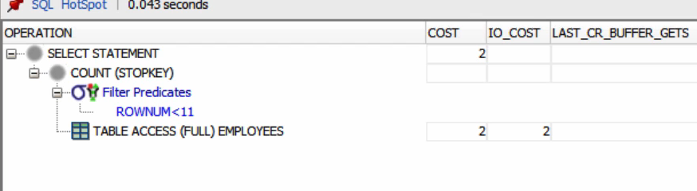

```sql
select * from employees where rownum < 11 order by employee_id desc;

select * from employees fetch first 10 rows only; -- Uses WINDOW (NOSORT STOPKEY); It read all the rows and used analytical function. So if you need to get some rows without any offset, recommened to use rownum < 11
```

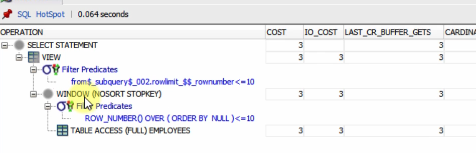

### First Row Operator

- If the selected column is indexed and if index is in ascending order, the first value in the index will be the minimum value and last value will be the maximum value and vice versa.
  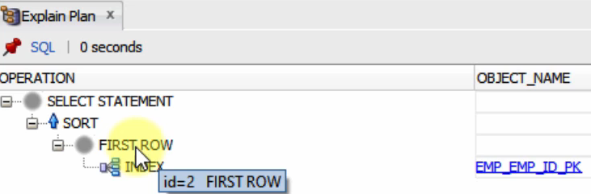

- If we use MIN or MAX function, it will show SORT operation even if they are not sorted. Indexed column no need to sort.
- If there are multiple MIN or MAX functions, it will not use FIRST ROW approach.
- So, don't add other columns along with MIN and MAX for indexed columns. So you can get the result faster.

```sql
select min(employee_id) from employees where employee_id < 140;-- Same execution plan as below. uses FIRST ROW approach.

select max(employee_id) from employees where employee_id < 140;-- Same execution plan as above. uses FIRST ROW approach.

select min(employee_id) from employees; -- Read all the index but cardinality is 1 only. So it read only 1 row here also.

select min(employee_id), max(employee_id) from employees where employee_id < 140;-- Here, cardinality is 40 at first. That means, it filtered out the rows with the condition and took min and max from that.

select min(commission_pct) from employees where commission_pct < 0.1;--Full table scan as there is no index on this column
```

### Filter Operator


### Concatenation Operator

```sql
select * from employees where employee_id = 103 or department_id = 80; -- Here, optimizer read full table and filtered it

select /*+ use_concat */* from employees where employee_id = 103 or department_id = 80;--Here, it reads the table two times and concat it together.
```

- LNNVL function returns TRUE if the predicate is NULL or FALSE. This is to eliminate the rows which are taken in the first step to avoid duplicates.
  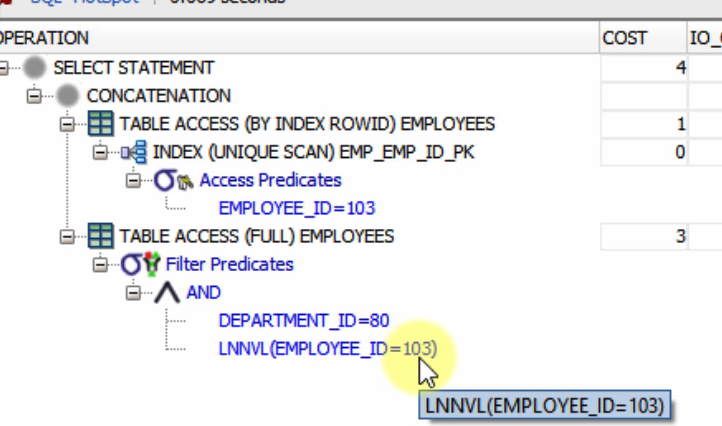

### UNION Operators

```sql
select * from employees where department_id = 80
union
select * from employees where first_name like 'A%'; -- eliminate duplicates; sorting needed. If there is index in the column, then sorting is not needed; it will take from index

select * from employees where department_id = 80
union all
select * from employees where first_name like 'A%'; -- does not eliminate duplicates; sorting is not needed
```

### Intersect Operator

- It need to sort to do the intersect.

```sql
SELECT * FROM employees WHERE department_id = 80
INTERSECT
SELECT * FROM employees WHERE first_name LIKE 'A%';

SELECT * FROM employees where employee_id between 145 and 179 -- Employee IDs in department 80 is between 145 and 179. In this way it can use the index on employee_id column
INTERSECT
SELECT * FROM employees WHERE first_name LIKE 'A%';

SELECT employee_id FROM employees where employee_id between 145 and 179
INTERSECT
SELECT employee_id FROM employees WHERE first_name LIKE 'A%'; -- Here, only indexed column is fetched, so faster than before

SELECT employee_id FROM employees e where employee_id between 145 and 179
and exists
(SELECT employee_id FROM employees t WHERE first_name LIKE 'A%' and e.employee_id = t.employee_id); -- using EXISTS clause is faster than INTERSECT as it is not sorting.
```

### Minus Operator

```sql
SELECT employee_id FROM employees where employee_id between 145 and 179
MINUS
SELECT employee_id FROM employees WHERE first_name LIKE 'A%'; -- Similar to INTERSECT. Needs sorting

SELECT employee_id FROM employees e where employee_id between 145 and 179
and not exists
(SELECT employee_id FROM employees t WHERE first_name LIKE 'A%' and e.employee_id = t.employee_id);-- using NOT EXISTS clause is faster than MINUS as it is not sorting.
```

## Tuning Star Queries

- A start schema is the simplest data warehouse schema. It is called star schea because the entity relationship diagram seems like a star. In the center, there is a table which is mostly the largest table or the most important table. They are called as fact table. All the tables are connected to this table. So it resembles start shape.
- Likewise, if this logic is used in our queries, ie; if we join multiple tables with one main table, we call that query as star query. Star queries are generally costly since there are lots of joins in such queries.

```sql
create table sales_temp as select * from sales;
create index sales_temp_pk on sales_temp (prod_id,cust_id,time_id,channel_id);

select sum(amount_sold) from sales_temp
where prod_id between 100 and 300
and cust_id between 100 and 300; -- Performed full table scan; Cost 1232

select sum(amount_sold) from sales_temp s, products p
where s.prod_id = p.prod_id
and p.prod_id between 100 and 300
and s.cust_id between 100 and 300; -- Cost 356; Used indexes

select /*+ index_rs ( sales_temp sales_temp_pk)*/sum(amount_sold) from sales_temp
where prod_id between 100 and 300
and cust_id between 100 and 300;-- Cost: 1406; Used skip scan instead of range scan

select c.cust_last_name,s.amount_sold, p.prod_name, c2.channel_desc
from sales s, products p, customers c, channels c2
where s.prod_id = p.prod_id
and s.cust_id = c.cust_id
and s.channel_id = c2.channel_id
and p.prod_id < 100
and c2.channel_id = 2
and c.cust_postal_code = 52773; -- Cost: 859

alter session set star_transformation_enabled = true; -- Generally enabled for data warehouse

select /*+ star_transformation fact(s)*/
c.cust_last_name,s.amount_sold, p.prod_name, c2.channel_desc
from sales s, products p, customers c, channels c2
where s.prod_id = p.prod_id
and s.cust_id = c.cust_id
and s.channel_id = c2.channel_id
and p.prod_id < 100
and c2.channel_id = 2
and c.cust_postal_code = 52773; -- Cost 478; fact(s) means Sales table is the fact table

drop table sales_temp;
```

## Using bind variables

- Using the BIND variables may increase the performance by decresing the parse counts.

```sql
-- Below queries will be considered as new query as the value is hardcoded. So hard parse is required
select avg(salary) from employees where department_id = 30;
select avg(salary) from employees where department_id = 40;
select avg(salary) from employees where department_id = 50;

select sql_id,executions,parse_calls,first_load_time,last_load_time,sql_text from v$sql
where sql_text like '%avg(salary) from employees%'
order by first_load_time desc;
--Below query is using bind variable. So if the query is executed earlier, it will not hard parse next time.
select avg(salary) from employees where department_id = :b;
```

```sql
declare
 v_dept_id number(2);
 v_count number(2);
begin
    for r1 in (select department_id from departments) loop
        select count(*) into v_count from employees where department_id = v_dept_id; --Oracle created bind variable for this to reduce hard parse
    end loop;
end;
/

--Below block made hard parses to fetch data.
declare
      type c1 is ref cursor;
      r1 c1;
      l_temp all_objects.object_name%type;
  begin
      for i in 1 .. 1000
      loop
          open r1 for
          'select object_name from all_objects where object_id = ' || i;
          fetch r1 into l_temp;
          close r1;
      end loop;
  end;
/

```

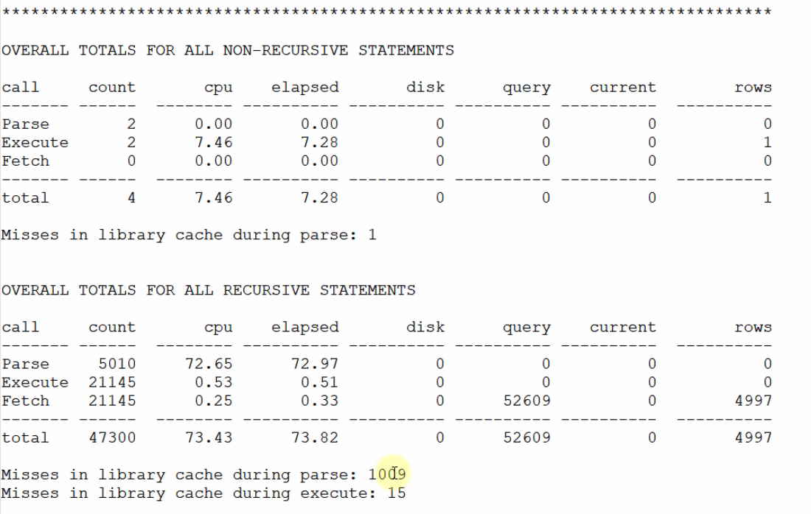

```sql
--Using bind variable to tune above query
declare
      type c1 is ref cursor;
      r1 c1;
      l_temp all_objects.object_name%type;
  begin
      for i in 1 .. 1000
      loop
          open r1 for
          'select object_name from all_objects where object_id = :x' using i;
          fetch r1 into l_temp;
          close r1;
      end loop;
end;
/
```


```sql
--Tuning further
declare
      l_temp all_objects.object_name%type;
  begin
      for r1 in (select object_name from all_objects where object_id < 1001) loop
        l_temp := r1.object_name;
      end loop;
  end;
```


## Bind Variable peeking

- The optimizer peeks the bind variable values for the first execution. It does not create the plan directly. Because the plan may change based on the value. Some values may be selective some may be not selective enough.
- After the first execution, plan is generated, it uses that plan for the next executions. This is called cursor sharing. So it does not peeks it for next executions until you restart the DB.
- This may cause the optimizer to select suboptimal plans for the next execution
- Why not it peeks for all the values?
  - To eliminate the hard parses
- When to use the bind variables then?
  - Don't use the bind variables if the cardinality of the values in the column is pretty different. Like for some values, it fetches 1000 rows and some values it fetches 5 rows etc.
  - If the cardinalities are pretty similar and they all will need the same plan, use bind variables

```sql
CREATE TABLE customers_temp AS SELECT * FROM customers;

SELECT COUNT(*),cust_credit_limit FROM customers_temp
GROUP BY cust_credit_limit
ORDER BY COUNT(*);
```


```sql
DELETE FROM customers_temp WHERE cust_credit_limit = 15000 AND ROWNUM < 1860;
COMMIT; -- Delete some rows to make the result more significant

CREATE INDEX c_temp_ix ON customers_temp(cust_credit_limit);

BEGIN
    dbms_stats.gather_table_stats(ownname => 'SH', tabname => 'CUSTOMERS_TEMP',
    method_opt  => 'for columns size 254 CUST_CREDIT_LIMIT', CASCADE=>TRUE);
END;

SELECT * FROM customers_temp WHERE cust_credit_limit = 1500;--Full table scan --Cost: 405
SELECT * FROM customers_temp WHERE cust_credit_limit = 15000;--Index range scan; Cost: 3

SELECT * FROM customers_temp WHERE cust_credit_limit = :b;
--For 1500, it used full table scan and cost is 405
--For 15000, it used full table scan and cost is 405

DROP TABLE customers_temp;
```

## Cursor sharing

- The lifecycle of a query:
  - Open : Allocates memory for that cursor
  - Parse: Syntax analysis, semantic analysis, privilege checks etc
  - Bind : Bind variable values are assigned
  - Define : Defines how you want to see the data
  - Execute
  - Fetch
- The data structure allocated in the database for that query is called as cursor in the server side
- Using these cursors by multiple executions is called as cursor sharing
- Parent cursor stores the SQL statement and child stores the information related to the differences
- When the database can share the cursors?
  - When Bind variables are used
  - Only if the literals are different
- CURSOR_SHARING parameter should be set to :
  - EXACT : The default cursor_sharing parameter. It allows cursor sharing only if the queries are exactly the same.
  - FORCE : Allows cursor sharing if everything but literals are the same. But it is not guaranteed.
    - Needs extra work to find a similar statements in the shared pool during the soft parse
    - It needs to use more memory
    - Star transformation is not supported
- The cursor sharing can be set by alter session or alter system commands

```sql
ALTER SYSTEM FLUSH SHARED_POOL;--Using SYS user

--Using HR schema user
ALTER SESSION SET cursor_sharing = 'EXACT';
--ALTER SESSION SET cursor_sharing = 'FORCE';

SELECT * FROM employees WHERE first_name = 'Alex';
SELECT * FROM employees WHERE first_name = 'Lex';
SELECT * FROM employees WHERE first_name = 'David';

SELECT * FROM employees WHERE first_name LIKE 'A%';
SELECT * FROM employees WHERE first_name LIKE 'B%';
SELECT * FROM employees WHERE first_name LIKE 'C%';

SELECT * FROM employees WHERE employee_id = 102;
SELECT * FROM employees WHERE employee_id = 125;
SELECT * FROM employees WHERE employee_id = 166;
SELECT * FROM employees WHERE employee_id = 102;

SELECT * FROM employees WHERE salary > 1500;
SELECT * FROM employees WHERE salary > 15000;
SELECT * FROM employees WHERE salary > 20000;

VARIABLE b NUMBER;
EXEC :b := 1000;
SELECT * FROM employees WHERE salary > :b;
EXEC :b := 20000;
SELECT * FROM employees WHERE salary > :b;

set linesize 2000;

SELECT sql_id,child_number,executions,loads,parse_calls,sql_text
FROM v$sql WHERE sql_text LIKE 'SELECT * FROM employees WHERE first_name =%';

SELECT sql_id,child_number,executions,loads,parse_calls,sql_text
FROM v$sql WHERE sql_text LIKE 'SELECT * FROM employees WHERE first_name LIKE%';

SELECT sql_id,child_number,executions,loads,parse_calls,sql_text
FROM v$sql WHERE sql_text LIKE 'SELECT * FROM employees WHERE employee_id =%';

SELECT sql_id,child_number,executions,loads,parse_calls,sql_text
FROM v$sql WHERE sql_text LIKE 'SELECT * FROM employees WHERE salary >%';
```

## Adaptive Cursor sharing

- Released on 11g
- The main goal of adaptive cursor sharing is, not to have a new cursor for each bind value, but not to use the same cursor for every query also.
- Enabled by default . You cannot disable it easily and not recommended to disable it also. (It is applied automatically if the query does not have over 14 bind variables)
- It is independent of CURSOR_SHARING parameter
- Benefits of adaptive cursor sharing :
  - It automatically detects if the query needs another execution plan or can use the existing one
  - Decreases the number of generated child cursors to minimum
  - It works automatically. You don't need to start it
- How it works:

  - When you first execute the query, it performs a hard parse as usual
  - If the cursor has histograms to compute the selectivity, the cursor is marked as bind sensitive cursor.
  - Bind sensitive cursor basically measn this cursor has a bind variable. So this is a candidate to adaptive cursor sharing.
  - So when you execute that query, the selectivity interval is stored in a table by database automatically.
  - When you execute the same query again with or without a new bind variable, it compares the new selectivity and the interval of previous plan which is stored in the table.
  - If the new selectivity is out of that interval, it marks that cursor as bind aware cursor
  - This means the selectivity of that query may vary based on different values.
  - So on the next execution, it do hard parsing and generates new plan. If the plan is same as previous plan, instead of keeping same plan twice, it enlarges the selectivity interval with max and min values. So the child cursor created for the hard parse is merged with the previous one.
  - If the plan does not matches, it create another interval and plan for that.

- Useful views for adaptive cursor sharing :
  - V$SQL- Stores if the query is bind sensitive or bind aware
  - V$SQL_CS_SELECTIVITY - Stores the lowest and highest acceptable selectivity values
  - V$SQL_CS_STATISTICS - Stores some extra info like buffer gets, CPU time, etc.
  - V$SQL_CS_HISTOGRAM - Stores the histogram statistics of the queries using bind variables
- Hints about adaptive cursor sharing :
  - BIND_AWARE - Makes the database skip monitoring that query to check bind-sensitivity
  - NO_BIND_AWARE - Makes the database ignore that query for bind-sensitiveness

```sql
ALTER SYSTEM FLUSH SHARED_POOL;


SELECT COUNT(*),country_id FROM customers GROUP BY country_id order by count(*);
CREATE TABLE customers_temp AS SELECT * FROM customers;
CREATE INDEX cost_temp_country_id ON customers_temp(country_id);

BEGIN
dbms_stats.gather_table_stats(ownname => 'SH', tabname => 'CUSTOMERS_TEMP',
method_opt => 'for columns size 254 COUNTRY_ID', CASCADE=>TRUE);
END;--This will create histograms also

VARIABLE country_id NUMBER;
EXEC :country_id := 52787;
SELECT * FROM customers_temp WHERE country_id = :country_id;
EXEC :country_id := 52790;
SELECT * FROM customers_temp WHERE country_id = :country_id;
EXEC :country_id := 52770;
SELECT * FROM customers_temp WHERE country_id = :country_id;
EXEC :country_id := 52788;
SELECT * FROM customers_temp WHERE country_id = :country_id;
EXEC :country_id := 52790;
SELECT * FROM customers_temp WHERE country_id = :country_id;

SELECT * FROM TABLE(dbms_xplan.display_cursor(NULL,NULL,'TYPICAL +PEEKED_BINDS')); -- +PEEKED_BINDS will show peeking bind variables

SELECT sql_id,child_number,executions,loads,parse_calls,is_bind_sensitive,is_bind_aware,sql_text
FROM v$sql WHERE sql_text LIKE 'SELECT * FROM customers_temp WHERE country_id =%';

SELECT hash_value,sql_id,child_number,range_id,LOW,HIGH,predicate
FROM v$sql_cs_selectivity;

DROP TABLE customers_temp;
```

## Adaptive Plans

The statistics used by the optimizer:

- Table Statistics: Uses this to determine the cost of table scans and joins. Stored in DBA_TAB_STATISTICS
  - Number of rows
  - Number of blocks
- Column Statistics: Generate cardinality of the columns. Stored in DBA_TAB_COL_STATISTICS
  - Number of distinct values in that column
  - Number of NULL values in that column
  - Data distribution statistics (Histograms)
  - Extended statistics
- Index Statistics: Number of index levels and relationship of index and table. Stored in DBA_IND_STATISTICS
  - Number of leaf blocks
  - Number of branch levels
  - Number of distinct keys
  - Index clustering factor
- System Statistics:

  - I/O performance
  - CPU performance

- Before database version 12c the execution plan was determined before the execution and this plan was applied
- Starting with 12c the optimizer can change the plan on runtime.
- While executing the query, the statistics collector gathers some new statistics about cardinality and histograms
- If the new statistics do not match with the first statistics, the optimizer picks one of its sub-plans it stored
- It writes 'This is an adaptive plan' on the execution plan to express that.
- Adaptive plans are enabled by default

```sql
ALTER SYSTEM FLUSH SHARED_POOL;

SELECT COUNT(*)
FROM sales S, products P, customers C
WHERE S.prod_id = P.prod_id
AND S.cust_id = C.cust_id;

SELECT * FROM TABLE(dbms_xplan.display_cursor());
```

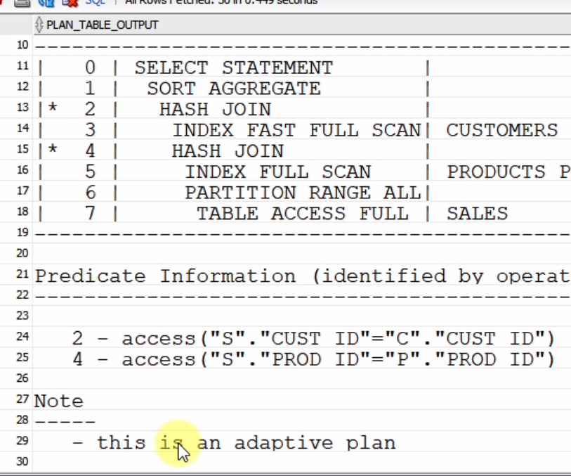

```sql
SELECT * FROM TABLE(dbms_xplan.display_cursor(FORMAT => 'adaptive'));
```

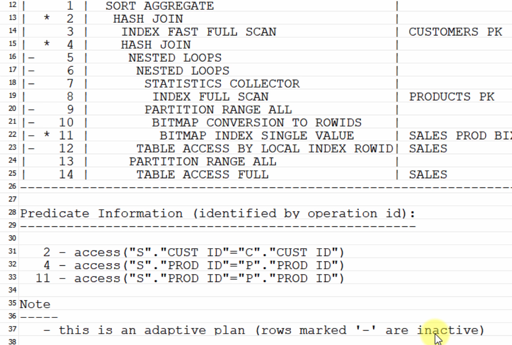

```sql
SELECT /*+ GATHER_PLAN_STATISTICS */COUNT(*)
FROM sales S, products P, customers C
WHERE S.prod_id = P.prod_id
AND S.cust_id = C.cust_id;--Hint make to calculate whole statistics

SELECT * FROM TABLE(dbms_xplan.display_cursor(FORMAT => 'adaptive allstats last'));
```


## Dynamic Statistics

- Starting with 10g, dynamic sampling is introduced. It allows the optimizer to gather additional information at the parse time. It is not same as adaptive plan.
- Dynamic sampling gathers the statistics by some recursive calls before generating the plan
- Scans a fraction of random samples from the table blocks and calculates the statistics based on these random blocks
- You can control the dynamic sampling with :

```sql
ALTER SYSTEM SET OPTIMIZER_DYNAMIC SAMPLING = 4;--not recommented
ALTER SESSION SET OPTIMIZER_DYNAMIC SAMPLING = 9;
/*+ DYNAMIC SAMPLING(11) */
```

- Before 12c, the dynamic sampling level can be set to between O to 10 (Default is 2)
- Dynamic sampling is renamed to dynamic statistics in 12C and beyond.
- New level 11 introduced in 12C has automatic sampling
- Why to use dynamic statistics?
  - If the current statistics are not enough to create an optimal plan
  - If the query is executed multiple times
  - If the time for gathering the dynamic statistics is ignorable compared to the overall execution time
- When to use dynamic statistics?
  - Statistics are missing
  - Statistics are stale (10% or more changes happened in the table after last statistics gathering)
  - Statistics are insufficient
  - There is a parallel execution
  - There is a SQL Plan directive - used in adaptive plan also

```sql
ALTER SYSTEM FLUSH SHARED_POOL;


CREATE TABLE customers_temp AS SELECT * FROM customers;
CREATE INDEX cost_prov_ix ON customers_temp(cust_city,cust_state_province);

SELECT /*+ GATHER_PLAN_STATISTICS */ * FROM customers_temp
WHERE cust_city='Los Angeles' AND cust_state_province='CA';

SELECT * FROM TABLE(dbms_xplan.display_cursor(FORMAT => 'allstats last'));
```

- SQL Developer fetched first 50 rows first. Without executing whole query, it wont generate the plan. So it will show below error if we try to do so.


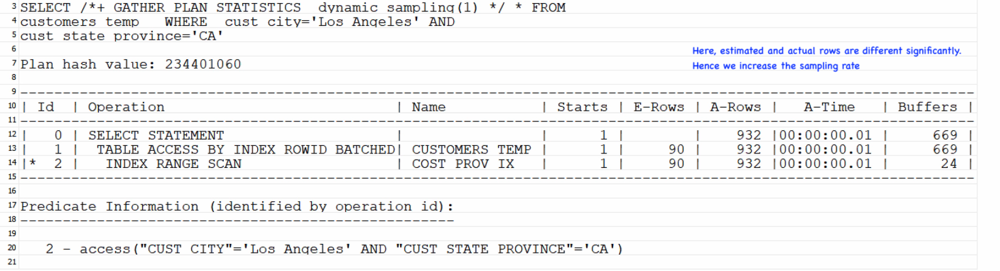

```sql
SELECT /*+ GATHER_PLAN_STATISTICS dynamic_sampling(1) */ * FROM customers_temp
WHERE cust_city='Los Angeles' AND cust_state_province='CA'; -- Estimated rows are very less than actual rows

SELECT /*+ GATHER_PLAN_STATISTICS dynamic_sampling(4) */ * FROM customers_temp
WHERE cust_city='Los Angeles' AND cust_state_province='CA';-- Estimated rows are higher than actual rows. So it chose full table scan


SELECT /*+ GATHER_PLAN_STATISTICS dynamic_sampling(7) */ * FROM customers_temp
WHERE cust_city='Los Angeles' AND cust_state_province='CA';-- Better than before. But not accurate.


SELECT /*+ GATHER_PLAN_STATISTICS dynamic_sampling(10) */ * FROM customers_temp
WHERE cust_city='Los Angeles' AND cust_state_province='CA'; -- Estimated rows are same as actual rows

SELECT /*+ GATHER_PLAN_STATISTICS dynamic_sampling(11) */ * FROM customers_temp
WHERE cust_city='Los Angeles' AND cust_state_province='CA'; -- Better than sampling 4. But not upto 7.

DROP TABLE customers_temp;
```

- Here it will show the level of the sampling.
  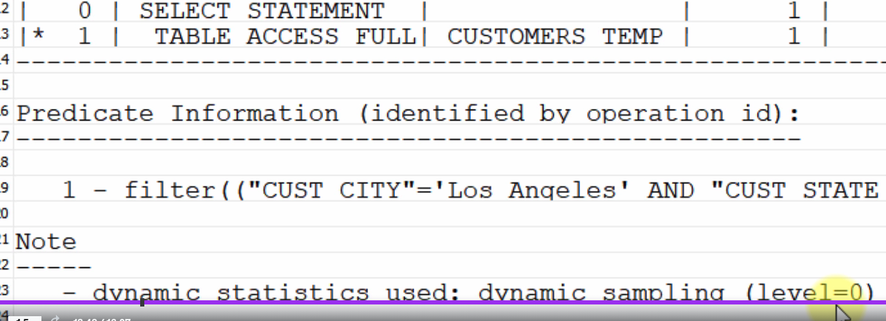

--The dynamic sampling levels and their meanings
https://docs.oracle.com/database/121/TGSQL/tgsql_astat.htm#TGSQL451
