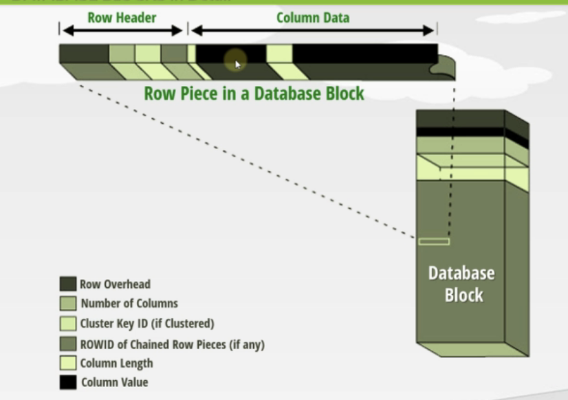

## What is a schema?

- Schemas are collections of objects for each user in Oracle database

## Logical Storage Structures

### 1. Data blocks

- All the data is stored in blocks.
- Data blocks are the smallest units of storage that oracle can use or allocate.
- A block and have 2KB to 32KB size(8KB default). This 8KB can contain 100 to 1000 of rows
- A block can store row data and index data
- One logical data block corresponds to a specific number of bytes of physical disk space.
- Each operating system has what is called a block size. Oracle requests data in multiples of Oracle blocks, not operating system blocks. Therefore, you should set the Oracle block size to a multiple of the operating system block size to avoid unnecessary I/O. Usually 8 kb
- A Block has block header and rows
- Block header includes:
  - Block type information(row data or index data)
  - Table information
  - Row directory (Address of each row) => ROWID
    
- Oracle leaves some space after each row to accomodate any updates or length increase on that row.
- If the updated row is not able to occupy in the free space oracle allocated for each row, it will delete from that place and keep in other free space in same block.
- If that block doesnt have free space, it will be written into another block
- We can use **PCTFREE** or **PCTUSE** paramters to specify the space size in blocks while creating a table.
- If we dont leave space after the row, each update will probably cause it to move to different place in same block or move to different block. This will cause performance issues. I/O operations will increase.
- If this row moved from its original place, address will change and indexes will also has to be updated.
- If two tables are clustered, another table's rows can come in the same block. Otherwise a block will contain only a single table's rows.
- Free spaces at the bottom in a block, will be used to accomodate new rows inserts.
- Reading a table's row from single block will be faster than reading from multiple blocks
- Row contains:
  - Row Overhead
  - Number of columns
  - Cluster Key ID(if clustered)
  - ROWID of Chained Row Pieces(if any)
  - Column length
  - Column value
    
- Before each column value, column length is defined. Reader process need to know where to start and where to end.

### 2. Extents

- Extents are the logical unit of database which is made of contiguous multiple numbers of the oracle data blocks.
- Default is 1 MB

### 3. Segments

- A segment is a set of extents which has been allocated for a specific data structure and all of which are stored in the same tablespace.
- For example, each table's data is stored in its own data segment, while each index's data is stored in its own index segment. If the table or index is partitioned, each partition is stored in its own segment.
- Whenever the existing space in a segment is completely used or full, oracle allocates a new extent for the segment.
- So the extents of a segment may or may not be contiguous on disk.
- The segments also can span datafiles, but the individual extents cannot.
- Types of segments: Data segments, Index segments, Undo segments, Temporary segments

### 4. Tablespaces

- Tablespaces are the bridge between physical and logical components of the Oracle database.
- A tablespace is made up of one or more database datafiles.
- You can make an individual tablespace online or offline and take backups individually. So it is better to create multiple tablespaces.
- The datafiles are created automatically when the tablespace is defined.
- When you create a tablespace, you define the initial size of the associated datafile.

```sql
SELECT PROPERTY_VALUE FROM DATABASE_PROPERTIES
WHERE PROPERTY_NAME = 'DEFAULT_PERMANENT_TABLESPACE';
----
SELECT PROPERTY_VALUE FROM DATABASE_PROPERTIES
WHERE PROPERTY_NAME = 'DEFAULT_TEMP_TABLESPACE';
----
ALTER DATABASE DEFAULT TABLESPACE tbs_perm_01;
ALTER DATABASE DEFAULT TEMPORARY TABLESPACE tbs_temp_01;
----
CREATE TABLE tbl_tblspace (value1 NUMBER(2))
TABLESPACE SYSTEM;
```

## Types of Tablespaces

- `SYSTEM` and `SYSAUX` tablespaces are always created when the database is created.
- The `SYSTEM` tablespace always contains the data dictionary tables for the entire database.
- The `SYSAUX` tablespace is an auxiliary tablespace to the `SYSTEM` tablespace.

### 1. Permanent Tablespace

- Contains persistent schema object. Data persist beyond the duration of a session or transaction.
- Objects in permanent tablespaces are stored in data files.

#### 1.1 Small-file Tablespace

- Default type of tablespace in Oracle database. Can have multiple data files. Maximum of 1022 data files are allowed.

#### 1.2 Big-file Tablespace

- Suited for storing large amount of data. Allows maximum 1 data file

### 2. Temporary Tablespace

- Temporary tablespaces are used for special operations, particularly for sorting data results on disk and for hash joins in SQL.
- For SQL with millions of rows returned, the sort operation is too large for the RAM area and must occur on disk.
- The temporary tablespace is where this takes place.

### 3. Undo Tablespace

- Oracle Database keeps records of actions of transactions, before they are committed. These information are used to rollback or undo the changes to the database. These records are called rollback or undo records.
- Undo data is not modified. Only data that is copied into buffer cache is modified.
- Undo tablespace can provide **flashback** feature
- When the instance starts up, the database automatically selects for use the first available undo tablespace. If there is no undo tablespace available, the instance starts, but uses the `SYSTEM` rollback segment for undo. This is not recommended, and an alert message is written to the alert log file to warn that the system is running without an undo tablespace.
- Committed undo information normally is lost when its undo space is overwritten by a newer transaction.
- Space occupied by unexpired undo data in undo segments can be consumed if necessary by ongoing transactions. This is the default.
- You can create more than one undo tablespace but only one of them can be active at any given time.

## High Water Mark

- This is a term used with table segments stored in the database.
- If you envision a table, for example, as a 'flat' structure or as a series of blocks laid one after the other in a line from left to right, the high-water mark (HWM) would be the rightmost block that ever contained data.
- HWM starts at the first block of a newly created table. As data is placed into the table over time and more blocks get used, the HWM rises.
- If we delete some (or even all) of the rows in the table, we might have many blocks that no longer contain data, but they are still under the HWM, and they will remain under the HWM until the object is rebuilt, truncated, or shrunk.


## Physical Storage Structures

### Data files

- Every Oracle database has one or more physical data files, which contain all the database data. The data of logical database structures, such as tables and indexes, is physically stored in the data files.

### Control files

- Control file is a binary file which contains metadata specifying the physical structure of the database, including the database name and the names and locations of the database files.

### Online redo log files

- It is a set of two(minimum) or more log files. Oracle will write every change made in the database into the first log file, and when the first log file is full, Oracle will switch to the second log file and write. We can have multiple group of redo log files to keep mirrored copies.

### Archived redo log files

- An Oracle database can run in one of two modes. By default, the database is created in NOARCHIVELOG mode. In this mode, it will overwrite the redo log file once they are filled. In ARCHIVELOG mode, database archive all redo log files once they are filled instead of overwriting them.

```sql
SQL> ARCHIVE LOG LIST; --To check whether Archive Log Mode is enabled or not
SQL> SELECT log_mode FROM v$database
SQL> SHUTDOWN IMMEDIATE; --To enable Archive Log Mode
SQL> STARTUP MOUNT;
SQL> ALTER DATABASE ARCHIVELOG;
SQL> ALTER DATABASE OPEN;
```

### Backup files

- Exact copy of Data files which will be stored in different place than Data files.
- Used for disaster recovery

### Parameter files

- To start a database instance, Oracle Database must read either a server parameter file (SPFILE - %ORACLE_HOME%\dbs\spfile%ORACLE_SID%.ora), which is recommended,
- or a text initialization parameter file (PFILE - %ORACLE_HOME%\database\init%ORACLE_SID%.ora).
- These files contain a list of configuration parameters like SGA size, name of database, name and location of database control files for that instance and database.
- `SPFILE` is binary file and only Oracle database can read or write into that file.
- You can modify the parameter's values with the `ALTER SYSTEM SET` command.
- `MAXDATAFILES` specifies the maximum number of datafiles that can be open in the database.
- `MAXINSTANCES` specifies that only one instance can have this database mounted and open.

```sql
SQL> STARTUP PFILE = 'C:\ora\pfile\init.ora'
SQL> CREATE SPFILE FROM PFILE = 'C:\ora\pfile\init.ora'
SQL> CREATE PFILE = 'C:\ora\pfile\init.ora' FROM SPFILE
SQL> CREATE SPFILE FROM MEMORY
```

### Password file

- Stores passwords for users with administrative privileges (SYSDBA, SYSOPER, SYSASM).
- Location: %ORACLE_HOME%\database\PWD%ORACLE_SID%.ora

### Networking files

- These files are used to configure the different network components of the Oracle database.
- These include files such as tnsnames.ora and listener.ora.
- The "listener.ora" file contains server side network configuration parameters.
- The "tnsnames.ora" file contains client side network configuration parameters.
- Location: %ORACLE_HOME%\network\ADMIN
- IO Error : The Network Adapter could not establish connection

```sql
CMD> lsnrctl status --to check the status of listener
CMD> lsnrctl start --to start listener
```

### Trace file (.trc)

- Trace File are trace (or dump) file that Oracle Database creates to help you diagnose and resolve operating problems.
- Each server and background process writes to a trace file.
- When a process detects an internal error, it writes information about the error to its trace file.

### Alert log

- The alert log file is a chronological log of messages and errors written out by an Oracle Database.
- Typical messages found in this file is: database startup, shutdown, log switches, space errors, etc.
- This file should constantly be monitored to detect unexpected messages and corruptions.
- Location:%ORACLE_BASE%\diag\rdbms\%ORACLE_SID%\%ORACLE_SID%\trace

```sql
SQL> SHOW PARAMETER background
```
