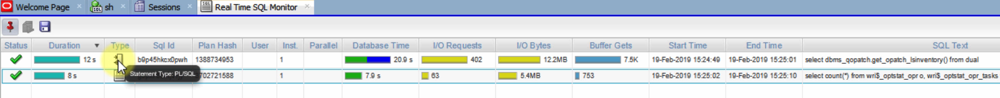
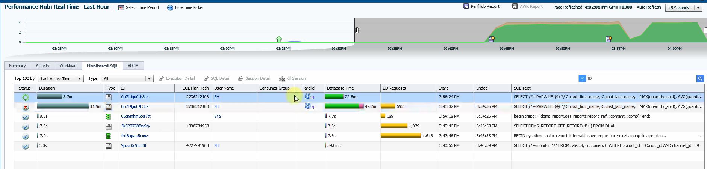
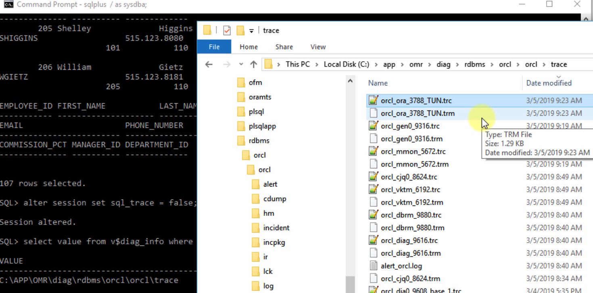
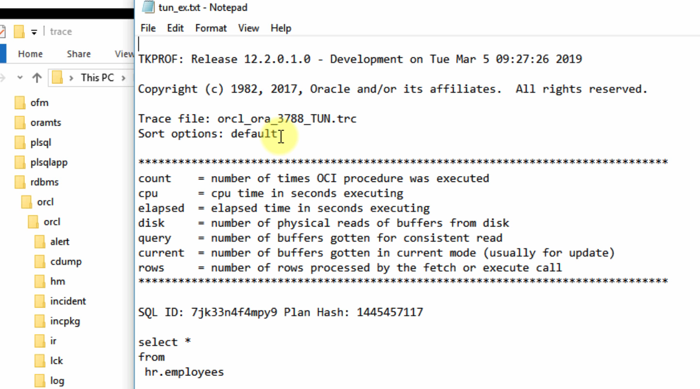

## Reason for performance loss

- Structural changes of table
- Changes in data volume
- Datatype change in application. (Ex: number changed to character) Implicit casting cause performance loss
- Aged statistics (stale)
- Database upgrades
- Database prameter changes (PGA, SGA sizes)
- OS and hardware changes

## Characteristics of Bad SQL

- Unnecessary parse time
- Unnecessary I/O operations. How many blocks read to get how many rows
- Unnecessary CPU time. Join, Sort will use CPU
- Unnecessary waits
- Time on Wait (CPU) + Time on Execution = DB Time

## Effective Schema Design

- Select the datatypes carefully
- Select exactly the same data type between parent-child keys
- Enforce data integrity using foreign key or triggers
- Use normalization. This will result in smaller table.
- Select right table type
- Create clusters with commonly joined tables
- Use indexes often and select index type carefully
- Create index-organized tables (IOT). Table that is stored in index. Useful for small tables and that is used frequently.

## SQL Tuning Techniques

### Common possible solutions:

- Make the statistics up to date
- Use dynamic statistics
- Create or modify indexes
- Rewrite the query to use an index
- Use hints
- Remove wrong hints
- Change the hints
- Eliminate implicit data type conversion
- Create function-based indexes
- Use index-organized tables
- Change the optimizer mode (ALL_ROWS, FIRST_ROWS(N))
- Use parallel execution
- Use materialized views
- Modify or disable triggers and constraints
- Check the Access paths
- Check join orders and join types
- Compare the actual & estimated number of rows
- Check the operations where the cost and logical reads differ significantly
- Do not use SELECT \* for all the queries. It may change the execution plan, it need to check the data dictionary to get the table structure, more I/O operations needed, overloads the network.
  

### There are 4 major tools to get the execution plan and the statistics :

- Autotrace
- SQL Monitor
- TKPROF
- DBMS_XPLAN

#### AUTOTRACE

- It is free.
- SQL Developer and SQL Plus may show different statistics because of execution plan changes or result is available in buffer cache in second execution.
- We can compare two different execution plans and statistics with SQL Developer.
- SQL Developer has a hotspot button which shows the problematic area of the plan.
- We can export a plan and use it later.
- By default, SQL Developer autotrace doesn't read the all of the rows. It is important to read all the rows to know the real execution plan. (Check Tools->Preferences->Database->Autotrace/Explain Plan in SQL Developer)
- Autotrace has to wait till the execution is finished to show the plan. But SQL monitoring can show real time execution plan

#### SQL Monitoring (Paid tool)

- Introduced in 11g
- It shows the execution plan and the statistics of the query being used right now with graphical views
- It can be viewed by SQL Developer or Enterprise Manager or by an SQL code
- It captures the queries running longer than 5 seconds or running in parallel mode
- If our query doesn't suit to these, we can add MONITOR hint to make it show on the list.
- Needs Diagnostics and Tuning packs to be licensed.
- We can view SQL Monitoring information from v$sql_monitor and v$sqL_plan_monitor database views.
- Using SQL Developer

  - Tools -> Monitor Sessions (Lightweight version of SQL monitoring tool. Not so useful for performance tuning)
  - Tools -> Real Time SQL Monitor (SQL monitoring tool)

    

    

- Using Enterprise Manager

  - Only for DBA
  - Performance -> Performance Hub

    

    

    

#### TKPROF

- It is a free tool.
- An SQL trace file include:
  - Performance information of our queries.
  - CPU Time and Elapsed Time
  - Wait Events
  - Execution Plans
  - Row Counts
  - Call Counts (Parse, Execute, Fetch)
  - Physical and Logical Reads
- Location of trace file:
  ```sql
  SELECT value FROM V$DIAG_INFO
  WHERE name = 'Diag Trace';
  ```
- You need to enable tracing for a specific user | specific sessions | entire database. Tracing entire database it will consume a lot of resources to track everything. So do not use that and close the tracing after what we need is taken.
- Can use below methods to enable tracing:
  ```sql
  dbms_monitor.database_trace_enable() ;
  dbms_session.set_sql_trace();
  ALTER SESSION SET SQL_TRACE = TRUE | FALSE; -- Trace current session; Cannot trace Waits or Bind variable
  DBMS_SESSION.SESSION_TRACE_ENABLE(waits => TRUE, binds =>FALSE); --Trace current session with Wait time trace and not with Bind variable trace
  DBMS_MONITOR.SESSION_TRACE_ENABLE(session_id=>27, serial_ num=>60, waits=›TRUE, binds=›FALSE); -- Trace a different session
  DBMS_SESSION.SESSION_TRACE DISABLE(); -- Disable current session tracing
  DBMS_MONITOR.SESSION_TRACE_DISABLE(session_id=›27, serial_num=›60); -- Disable different session tracing
  ```
- You can use `TRCESS` utility to merge multiple trace files
- TKPROF converts SQL trace files into a human readable format.
- In TKPROF, it does not show commit and rollback operations even if they are available in SQL trace file.

```sql
TKPROF trace_file_name output_file_name
                            [waits=yes|no] -- Show wait information in output or not; Default= YES
                            [sort=option] -- Sort by elapsed/CPU time etc; Default is by the execution time of the queries
                            [print=n] -- How many queries in the output file. Show only first 5 etc..
                            [aggregate=yes|no]
                            [insert=insert_file_name]
                            [sys=yes|no]
                            [table=schema.table]
                            [explain=user/password]
                            [record=record_file_name]
                            [width=n]:
```

- Generate and read one:

```sql
CMD> login as sysdba
SQL> ALTER SESSION SET TRACE_FILE_IDENTIFIER = TUN; -- This will apend this name after every trace file. So it will be easier to identify which trace file we created for that session
SQL> ALTER SESSION SET SQL_TRACE = TRUE;
SQL> SELECT * FROM EMPLOYEES;
SQL> ALTER SESSION SET SQL_TRACE = FALSE;
SQL> SELECT value FROM V$DIAG_INFO
  WHERE name = 'Diag Trace';
```



```sql
SQL> EXIT;
CMD> cd C:\app\omr\diag\rdbms\orcl\orcl\trace
CMD> tkprof orcl_ora_3788_TUN.trc tun_ex.txt
```



- You need to have the access privilege to the database server to use this.
- It includes all the SOL statements run between the tracing starts and ends. So you can find which all queries contributed to the bottle neck situation

#### DBMS_XPLAN

- It shows performance statistics for each step of the plan
- If the query has already run before, there is no need to run for DBMS_XPLAN.
- If it is deleted from the cache, the AWR tool can show earlier plans.
