## Hue, Tint, Shade, Tone, Saturation, Brightness, Color temperature

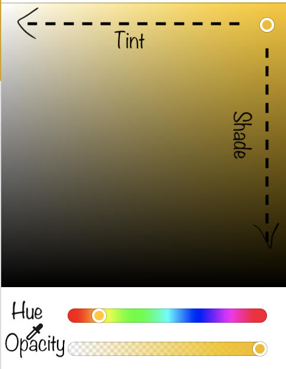

- Hue - Dominant(Purest) Color
- Tint - Mix a color with white
- Shade - Mix a color with black
- Tone - Mix a color with gray
- Saturation - How rich or dull a color is
- Brightness - Color closer to white (More bright) or closer to black (Less bright)
- Color temperature - Warm (Left side colors), Cold (Right side colors)
  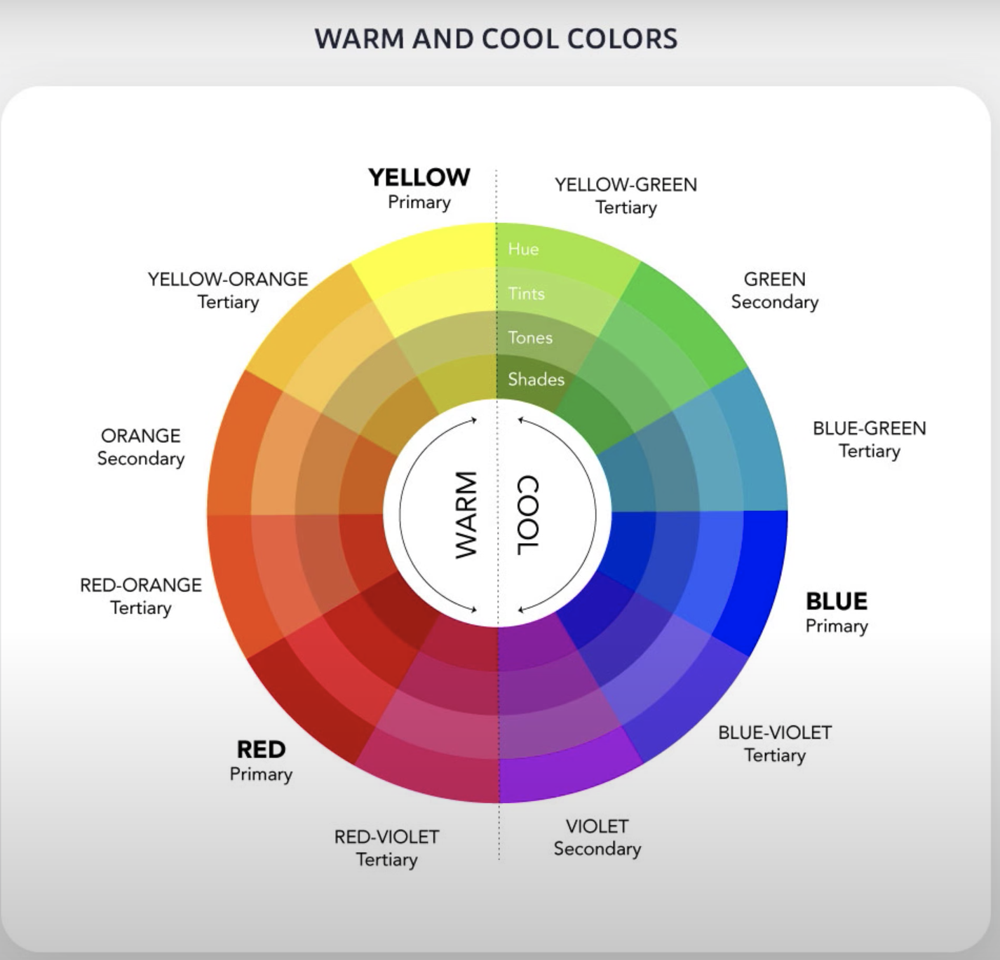

## Color Models

- RGB
  - Red, Green, Blue
  - Uses additive mixing
  - Used for digital media
  - Value -> 0 - 255
  - Secondary Colors
    - Red + Yellow = Orange
    - Red + Blue = Purple
    - Blue + Yellow = Green
  - Tertiary colors
    - Obtained by mixing primary and secondary colors
- CMYK
  - Cyan, Magenta, Yellow, Black
  - Uses subtractive mixing
  - Used for printing
- HSB
  - Hue, Saturation, Brightness
  - Used for digital media
  - Hue -> 0 - 360 (degree)
  - Saturation -> 0 - 100 (percent)
  - Brightness -> 0 - 100 (percent)
- Hexadecimal (HEX)
  - Friendlier way of displaying RGB colors
  - Red (first two letters)
  - Green (next two letters)
  - Blue (last two letters)
  - Values -> 0,1,2,3,4,5,6,7,8,9,A,B,C,D,E,F

## Color Psychology

- Red -> Passion, Intensity, Excitement, Energy, Sports related, Bold statement
  
- Blue (Most used in internet) -> Trust, Calm, Peace, Intelligence, Security, Tech brands, Financial Institutions, Political Parties
  
- Yellow -> Fun, Bold, Joy, Happiness, Warmth, Energy, Entertainment, Children's toys
  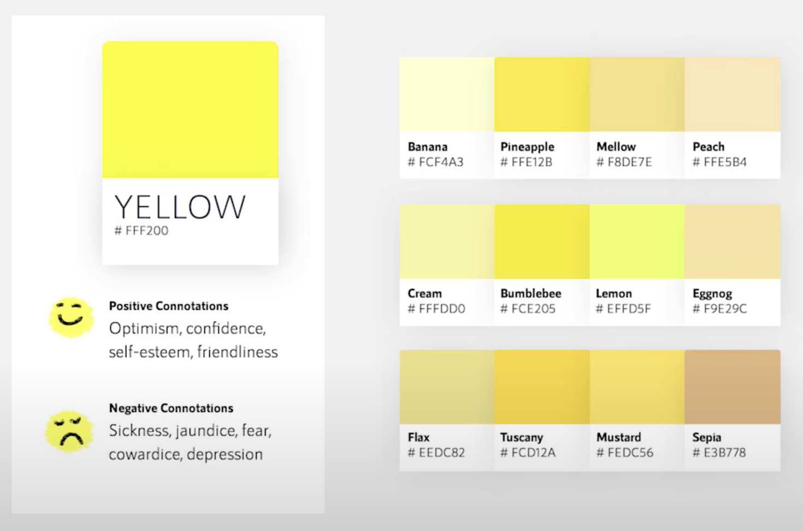
- Green -> Health, Well-being, Balance, Fertility, Safety, Health industry, Eco brands, Medical products, Landscaping, Gardening
  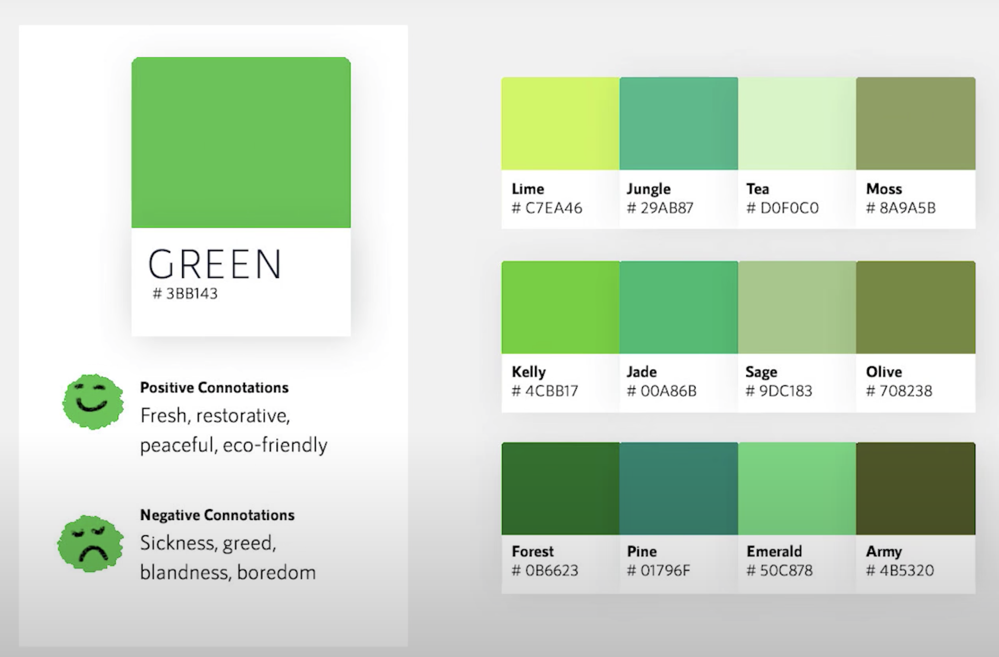
- Orange - Joy, Happiness, Confidence, Energy, Optimism, Color of communication
  
- Purple - Luxury, Royalty, Wealth, Sophistication, High-end products
  

  
  
  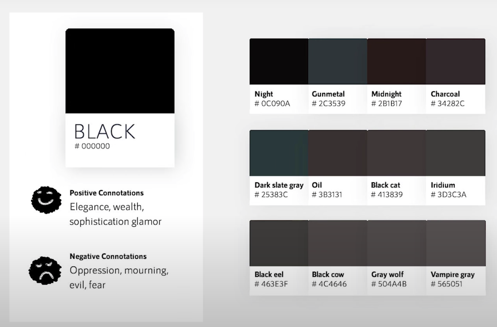
  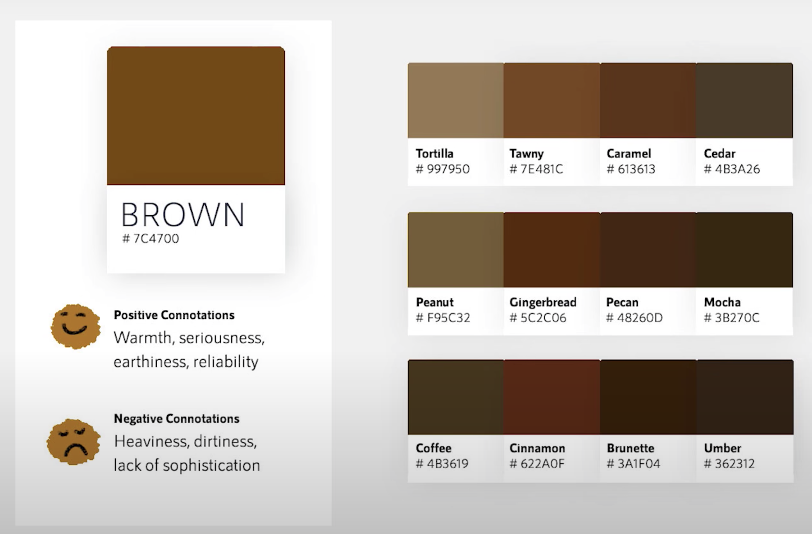
  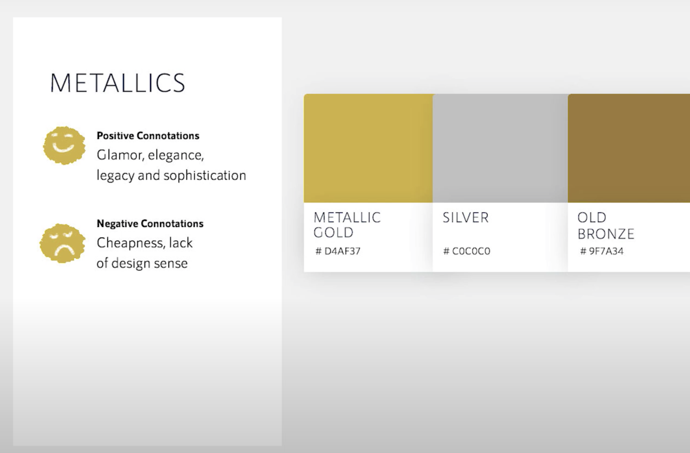

## Color Harmonies

- Pick a primary color
- Go to [color.adobe.com](https://color.adobe.com/create/color-wheel)
- Change the base color to your selected color
- Most used -> Analogous, Monochromatic, Complementary (use 80% - 20% split not 50% - 50%)
  
  
  
  
  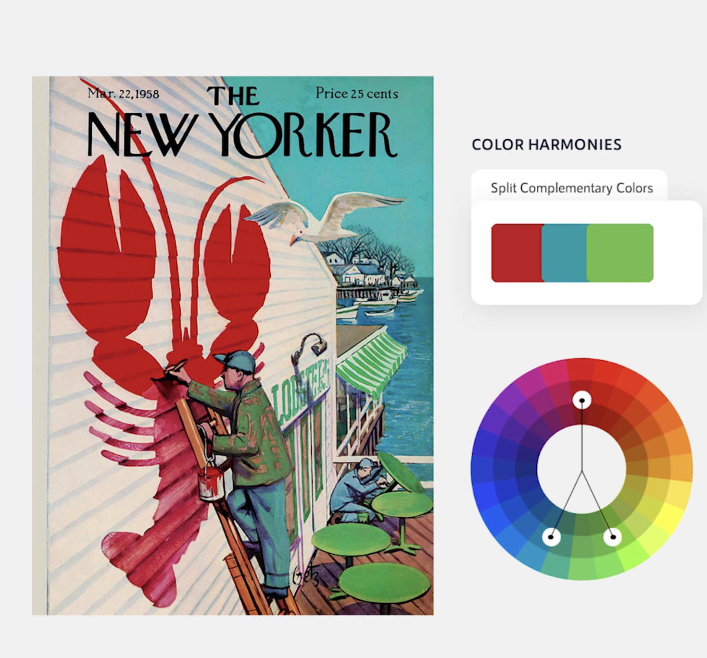
  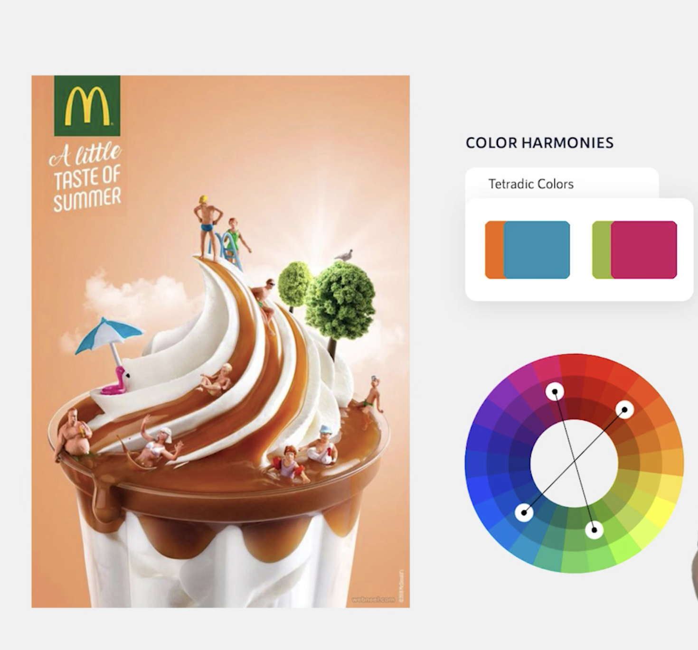
  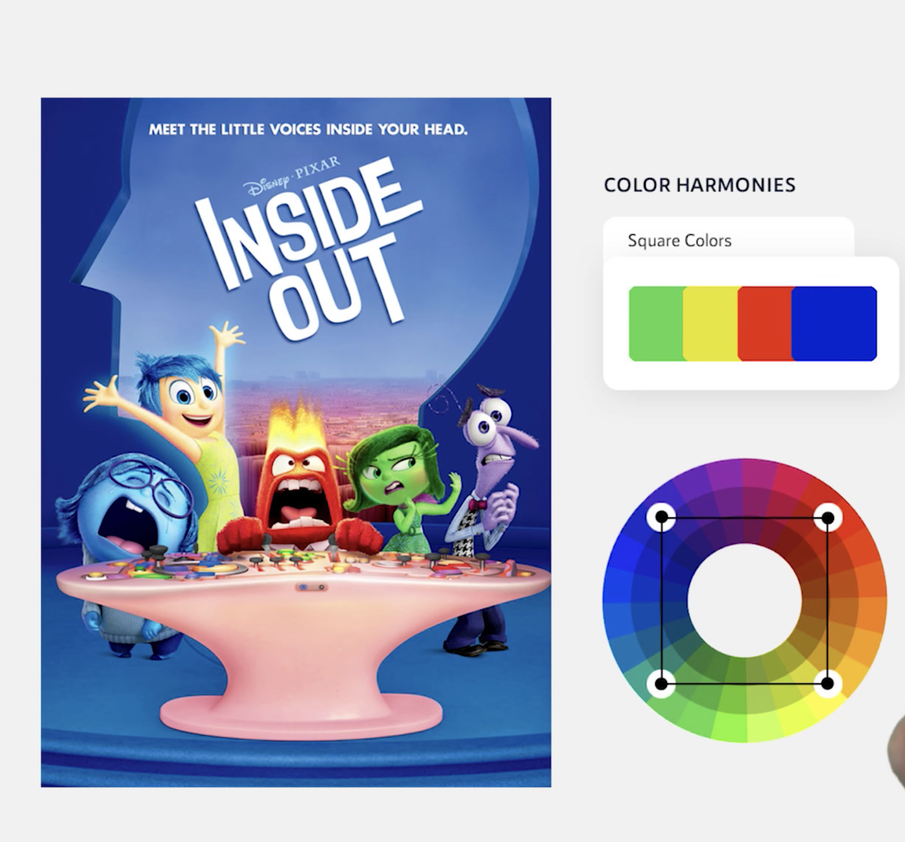

### Other tools

- [mycolor.space](https://mycolor.space/)
- [colorhunt.co](https://colorhunt.co/)
- [colors.muz.li](https://colors.muz.li/)
- [webgradients.com](https://webgradients.com/)
- [dribble.com](https://dribble.com/)
- Colorsnapper (app)
- [Contraste (app)](https://contrasteapp.com/)

## Create color palette for project

- Choose primary, secondary etc. color presets from harmony and save it as preset
  
- Create linear gradient with primary and secondary as brand color
  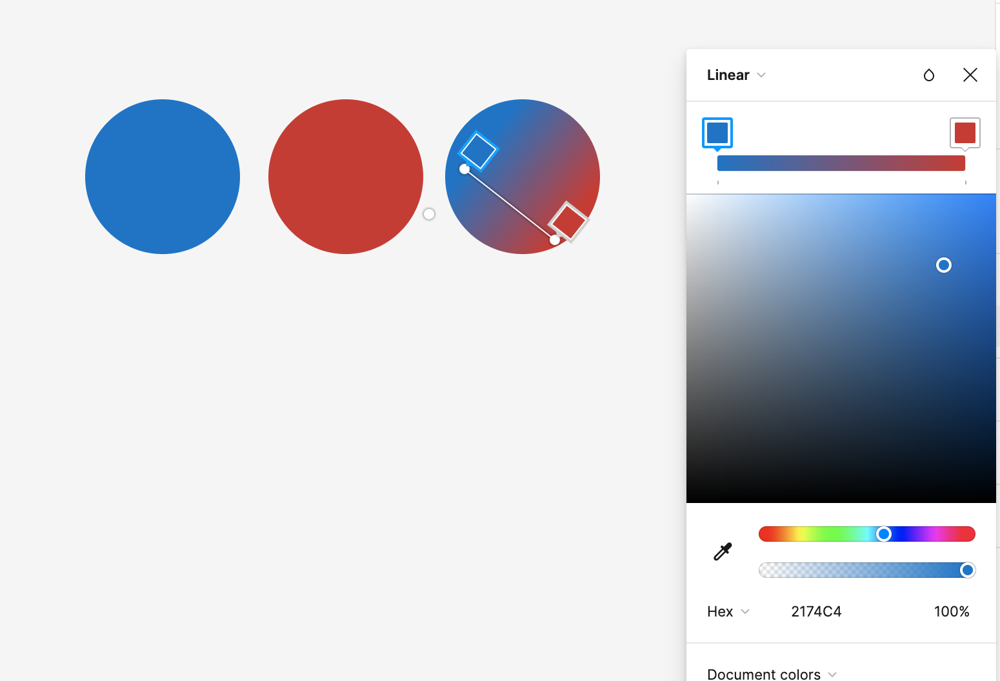
- Don't use black for text; use darker gray. Mix the primary color with gray.
- Create variation of the black created above with percentage of color (100%, 75%, 50%, 25%, 10%, 5%). Can use it for border, section breaks etc.
- Take error message color from harmony
- Check color contrast with primary, secondary and blacks
