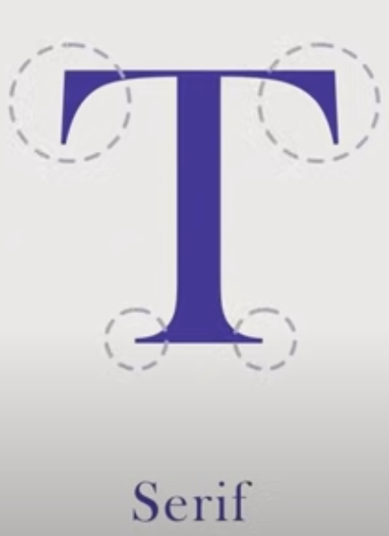
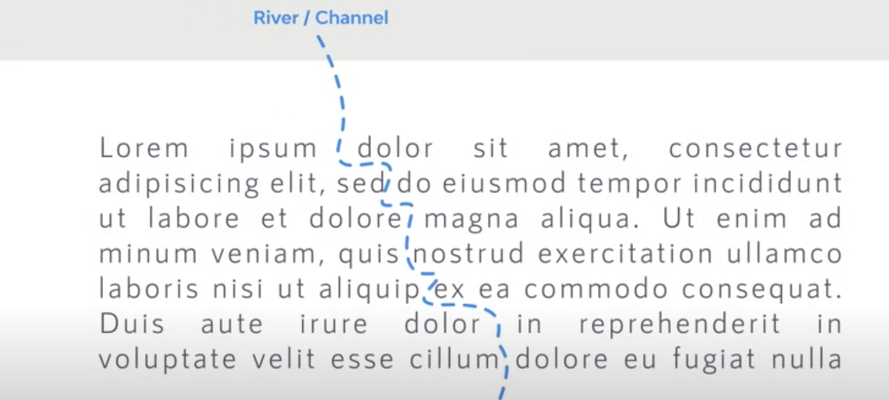
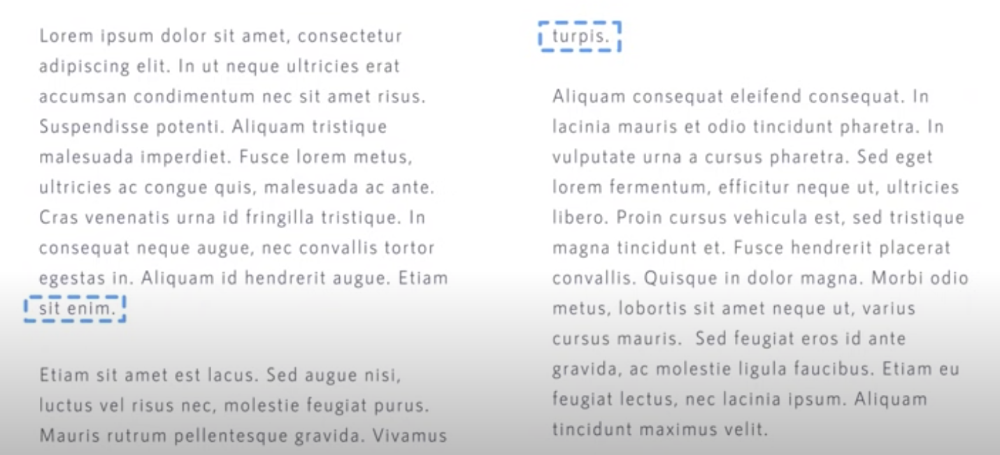

## Typeface vs Font

- Typeface => Font Family
- Font => Weight,Size difference in a Typeface

## Type Classifications

- Serif
  - Small feet at the end of each stroke
  - Used in books, magazines & newspapers
    
  - Serif Old Style
    - Ex: Goudy Bookletter
  - Serif Transitional
    - Ex: Baskerville
  - Serif Modern
    - Ex: LTC Bodoni-175
  - Slab Serif
    - Ex: Arkibal Serif
- Sans Serif
  - Sans means without; ie without Serifs
  - Used in display, long form copy, resume
  - Grotesque
    - Ex:Bw Glenn Sans
  - Neo Grotesque
    - Ex: Physis
  - Humanist
    - Ex: Gill Sans Nova
  - Geometric
    - Ex: Futura
- Script
  - Used to diaply text, headlines,titles,short copy. Not used for body copy.
  - Formal
    - Used in Wedding invitations & diplomas
    - Ex: Bickham Script Pro
  - Casual
    - Inspired from wood strokes
    - Ex: Castinos
- Calligraphic
  - Ex: Billow
- Handwriting
  - Ex: Summer
- Blackletter/Gothic
  - Based on medival calligraphy
  - Used in Gutenburg 42 aligned Bible
- Display/Decorative
  - Ex: Sea Horse, The Crow, Southsider

## How to choose?

- Long Copy/Body Copy (Blooks, Blogs, Magazine, Newspaper)
  - Use Serif (Except Slab) or Sans Serif (Except Geometric)
- Display (To attract attention)
  - Script, Calligraphic, Handwriting, Blackletter, Decorative

## Font File Types

- PostScript (PS)
  - Developed by Adobe
  - Two Files; 1 for printing and 1 for displaying on screen
  - Different files needed to use in different OS platforms
  - Held upto 220 glyphs
- TrueType (ttf)
  - Developed by Microsoft & Apple
  - Single file used for display and printing
  - Held upto 65000 glyphs
- OpenType (otf)
  - Unicode technology
  - Supports multiple languages
  - Held 65000+ glyphs
- Scalable Vector Graphics (SVG)
  - Can be displayed in multiple colors, transparencies
  - Sometimes can be animated
- Variable Fonts

  - Developed by Microsoft, Google, Adobe & Apple
  - Allows for animation

  ## Legibility of a font

  - X-Height (Height of lowercase characters proportionate to the uppercase letters). More the X-Height more it will be readable
  - Character width - Average width are more readable than condensed and extended width characters
  - Weight - Very light and very heavy weights are hard to read. Use normal.
  - Design Traits - Should be neutral not quirky
  - Stroke contrast - Use medium contrast
  - Normal font size - 8pts to 11pts
  - All uppercase text are harder to read. Use sentence case.
  - Line spacing/Leading - 1.25rem or 1.5rem
  - Column width - 45 to 70 characters in a line
  - Kerning (Space between two letters) & Tracking (Letter spacing)
  - Color & Contrast (Use opposite colors in color wheel)
  - Mistakes
    - Rags - uneven vertical margin in a block of text. - Use hyphen to break the line
      
    - Rivers - Gaps that appear to run through a block of text - Unjustify and use hyphens
      
    - Orphans & Widows -
      - Orphans - Word or a short line at the begining or end of a column that is seperated from rest of the paragraph
      - Widow - Word or a short line at the end of a paragraph
      - Adjust kerning, tracking or add manual line breaks
      - 
